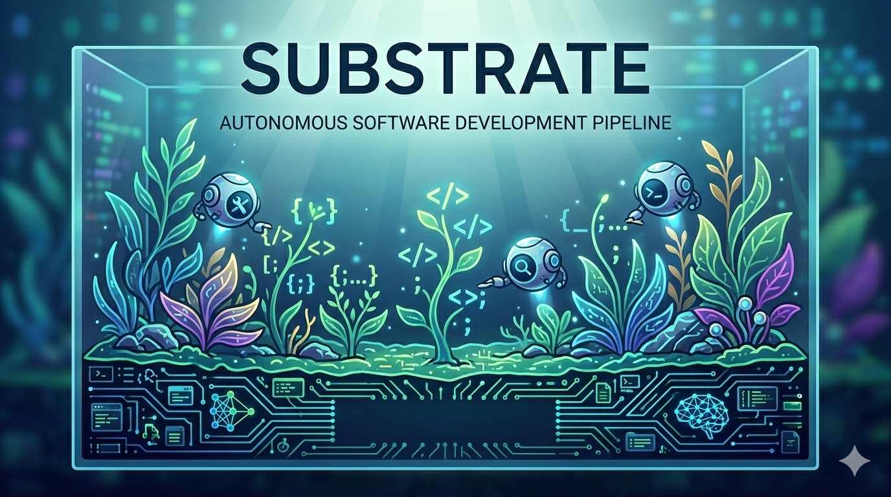

<p align="center">
  
</p>

# Substrate

Autonomous software development pipeline powered by multi-agent orchestration. Substrate takes a project idea from concept through analysis, planning, architecture, implementation, and code review — coordinating CLI-based AI agents (Claude Code, Codex, Gemini CLI) to do the work.

Substrate follows a modular monolith pattern running as a single Node.js process. The orchestrator never calls LLMs directly — all intelligent work is delegated to CLI agents running as child processes in isolated git worktrees. The autonomous pipeline compiles BMAD methodology workflows into token-efficient agent dispatches.

## Prerequisites

- **Node.js** 22.0.0 or later
- **git** 2.20 or later
- At least one supported AI CLI agent installed:
  - [Claude Code](https://docs.anthropic.com/en/docs/claude-code) (`claude`)
  - [Codex CLI](https://github.com/openai/codex) (`codex`)
  - Gemini CLI (`gemini`)

## Installation

Install as a project dependency:

```bash
npm install substrate-ai
```

Or install globally:

```bash
npm install -g substrate-ai
```

Verify the installation:

```bash
npx substrate --version   # project install
substrate --version        # global install
```

> Examples below use `[npx] substrate` — include `npx` for project installs, omit for global.

## Quick Start

### Autonomous Pipeline (recommended)

Got an idea? Substrate can take it from concept to working code.

1. **Brainstorm** — explore your idea with a multi-persona AI session:

```bash
[npx] substrate brainstorm
```

2. **Initialize the pipeline** — set up the methodology pack and decision store:

```bash
[npx] substrate auto init
```

3. **Run the full pipeline** — analysis, planning, solutioning, and implementation:

```bash
[npx] substrate auto run
```

Substrate walks through the entire software development lifecycle autonomously:
- **Analysis** — generates a product brief from your brainstorm
- **Planning** — creates a PRD with requirements
- **Solutioning** — produces architecture, epics, and stories
- **Implementation** — dispatches agents to build, test, and code-review each story

You can start from any phase or resume an interrupted run:

```bash
[npx] substrate auto run --from solutioning   # Skip to a specific phase
[npx] substrate auto resume                    # Pick up where you left off
[npx] substrate auto status                    # Check pipeline progress
```

### Pick Up an Existing BMAD Project

Already have a project with BMAD artifacts (vanilla BMAD or the Beads-based ai-toolkit)? Substrate can pick up the remaining implementation work. It reads one directory — `_bmad-output/` — and doesn't care which tool created it.

**What Substrate needs from your project:**

| File | Required? | Purpose |
|------|-----------|---------|
| `_bmad-output/planning-artifacts/epics.md` | Yes | Parsed into per-epic context shards |
| `_bmad-output/planning-artifacts/architecture.md` | Yes | Tech stack and constraints for agents |
| `_bmad-output/implementation-artifacts/*.md` | Optional | Existing story files — Substrate skips create-story for any it finds |
| `package.json` | Optional | Test framework detection |

**Three commands:**

```bash
npm install substrate-ai
[npx] substrate auto init                          # Seeds context from _bmad-output/
[npx] substrate auto run --stories 5-3,5-4,6-1    # Only the unfinished story keys
```

For each story, Substrate runs: **create-story** (skipped if story file exists) → **dev-story** (implement) → **code-review** (adversarial review). Non-conflicting stories run in parallel automatically.

Substrate does not read `sprint-status.yaml` or `.beads/` — you decide what's left by choosing which story keys to pass.

## Supported Agents

| Agent ID | CLI Tool | Billing |
|----------|----------|---------|
| `claude-code` | Claude Code | Subscription (Max) or API key |
| `codex` | Codex CLI | Subscription (ChatGPT Plus/Pro) or API key |
| `gemini` | Gemini CLI | Subscription or API key |

## Commands

### Pipeline

| Command | Description |
|---------|-------------|
| `substrate brainstorm` | Interactive multi-persona ideation session |
| `substrate auto init` | Initialize methodology pack for autonomous pipeline |
| `substrate auto run` | Run the full pipeline (analysis → implement) |
| `substrate auto run --from <phase>` | Start from a specific phase |
| `substrate auto resume` | Resume an interrupted pipeline run |
| `substrate auto status` | Show pipeline run status |

### Monitoring

| Command | Description |
|---------|-------------|
| `substrate monitor status` | View task metrics and agent performance |
| `substrate monitor report` | Generate a detailed performance report |
| `substrate cost-report` | View cost and token usage summary |

### Setup

| Command | Description |
|---------|-------------|
| `substrate init` | Initialize project configuration |
| `substrate --help` | Show all available commands |

## Configuration

Substrate reads configuration from `.substrate/config.yaml` in your project root. Run `[npx] substrate init` to generate a default config.

## Development

```bash
# Clone and install
git clone https://github.com/johnplanow/substrate.git
cd substrate
npm install

# Build
npm run build

# Run tests
npm test

# Development mode (watch)
npm run dev

# Type check
npm run typecheck

# Lint
npm run lint
```

## Manual Task Graphs

For fine-grained control, you can define exactly what agents should do in a YAML task graph:

```yaml
version: "1"
session:
  name: "my-tasks"
tasks:
  write-tests:
    name: "Write unit tests"
    prompt: |
      Look at the src/utils/ directory.
      Write comprehensive unit tests for all exported functions.
    type: testing
    agent: claude-code
  update-docs:
    name: "Update README"
    prompt: |
      Read the README.md and verify it accurately describes
      the project. Fix any inaccuracies.
    type: docs
    agent: codex
    depends_on:
      - write-tests
```

```bash
[npx] substrate start --graph tasks.yaml              # Execute the graph
[npx] substrate plan --graph tasks.yaml               # Preview without running
```

Tasks without dependencies run in parallel. Each agent gets its own isolated git worktree.

## License

MIT
