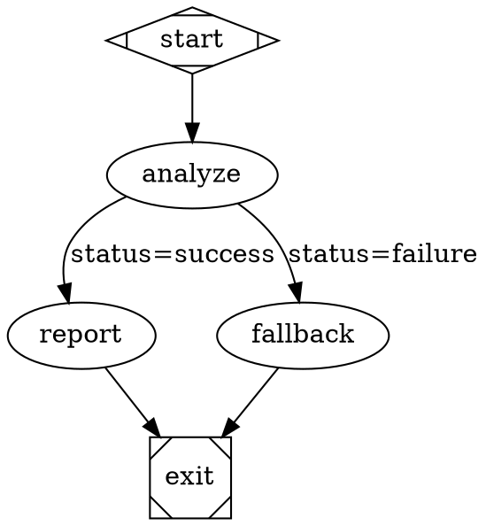

# Story 42-15: Graph Engine Integration Tests

## Story

As a graph engine developer,
I want a comprehensive integration test suite that exercises the full graph engine pipeline end-to-end,
so that I can verify that parsing, validation, stylesheet application, execution, checkpointing, and resume all work correctly together with real DOT inputs.

## Acceptance Criteria

### AC1: 5-Node Conditional Pipeline — Parse, Validate, Execute End-to-End
**Given** a DOT string defining a 5-node conditional pipeline: `start → analyze → [status=success] report → exit` and `analyze → [status=failure] fallback → exit`, with a mock registry returning `SUCCESS` for `analyze` and `report` nodes, and `context.set('status', 'success')` seeded before the run
**When** the DOT string is parsed with `parseGraph()`, validated with `GraphValidator.validate()`, and executed via `createGraphExecutor().run()`
**Then** the executor returns `{ status: 'SUCCESS' }`, `graph:node-started` events are emitted in the order `['start', 'analyze', 'report', 'exit']`, and `graph:checkpoint-saved` is emitted once per completed node (4 times total)

### AC2: 10-Node Multi-Type Graph — All Node Types Execute with Mock Handlers
**Given** a DOT graph with 10 nodes covering all implemented handler types (`start`, `exit`, `codergen` ×2, `tool` ×2, `conditional` ×1, `wait.human` ×1, and 2 intermediate routing nodes), and a mock registry where every handler returns `SUCCESS` (the `wait.human` handler returns `preferredLabel: 'Yes'` to simulate user selection)
**When** the graph is executed via `createGraphExecutor().run()`
**Then** all 10 nodes appear in the `graph:node-started` event stream, the `completedNodes` array captured from the last checkpoint save has length 9 (all nodes except exit), and the final outcome is `{ status: 'SUCCESS' }`

### AC3: Error-Rule Violations Block Execution
**Given** a DOT string whose graph violates two error-level lint rules: `reachability` (an orphaned node with no path from start) and `start_no_incoming` (an edge pointing into the start node)
**When** `GraphValidator.validate()` is called and the result is inspected
**Then** the result contains at least two entries with `severity === 'error'` naming rules `'reachability'` and `'start_no_incoming'`; and when `createGraphExecutor().run()` is called (using a wrapper that checks for errors first), it throws or returns an outcome with a `failureReason` containing "validation errors"

### AC4: Warning-Rule Violations Allow Execution
**Given** a DOT graph where a `codergen` node has no `prompt` attribute (triggers `prompt_on_llm_nodes` warning) and a node has an unrecognized `fidelity` value (triggers `fidelity_valid` warning)
**When** `GraphValidator.validate()` is called and then `createGraphExecutor().run()` is executed with mock handlers
**Then** the validation result contains at least two entries with `severity === 'warning'`, and the executor still runs the graph and returns `{ status: 'SUCCESS' }` — warning-level violations are non-blocking

### AC5: Checkpoint Resume — Skip Completed Nodes, Restore Context
**Given** a 5-node linear graph (`start → node1 → node2 → node3 → exit`) and a real checkpoint file on disk written by `CheckpointManager.save()` with `completedNodes: ['start', 'node1']`, `currentNode: 'node1'`, and `contextValues: { step: '2', result: 'hello' }`
**When** `createGraphExecutor().run()` is called with `config.checkpointPath` pointing to that checkpoint file
**Then** `graph:node-started` events do NOT include `'start'` or `'node1'` (they were skipped), events DO include `'node2'`, `'node3'`, and `'exit'` in order, the mock handler for `node2` receives a context where `context.getString('step') === '2'`, and the final outcome is `{ status: 'SUCCESS' }`

### AC6: Model Stylesheet Properties Applied Before Handler Dispatch
**Given** a DOT graph whose `graph` attribute block includes `modelStylesheet="* { llm_model: claude-3-haiku-20240307 } #analyze { llm_model: claude-opus-4-5 }"` and two `codergen` nodes — one with `id=analyze` and one with `id=summarize` — neither having an explicit `llm_model` attribute
**When** the graph is parsed (stylesheet applied via the resolver) and executed with a spy handler registry that captures each `GraphNode` received
**Then** the node received by the `analyze` handler has `llm_model === 'claude-opus-4-5'` (id-level specificity wins), and the node received by the `summarize` handler has `llm_model === 'claude-3-haiku-20240307'` (universal selector default)

### AC7: Epic Test Coverage Meets 100+ New-Test Goal
**Given** all tests written across stories 42-1 through 42-15 are collected by running `npm run test:fast`
**When** the test suite completes
**Then** the "Tests" counter in the Vitest summary shows at least 100 passing tests across the full suite, the "Test Files" line confirms all test files passed with zero failures, and no test is left in `.skip` state without an explanatory comment

## Tasks / Subtasks

- [ ] Task 1: Create integration test infrastructure — fixture DOTs and shared helpers (AC: #1–#6)
  - [ ] Create directory `packages/factory/src/__tests__/integration/`
  - [ ] Create `packages/factory/src/__tests__/integration/helpers.ts`:
    - `makeTmpDir(): Promise<string>` — `os.tmpdir()` + `crypto.randomUUID()` + `mkdir(dir, { recursive: true })`
    - `cleanDir(dir: string): Promise<void>` — `rm(dir, { recursive: true, force: true })`
    - `makeMockHandler(outcome?: Partial<Outcome>): NodeHandler` — returns `vi.fn()` resolving to `{ status: 'SUCCESS', ...outcome }`
    - `makeMockRegistry(overrides?: Record<string, Partial<Outcome>>): IHandlerRegistry` — returns object `{ resolve(node) { return makeMockHandler(overrides?.[node.id]) } }`; spy captures the node argument for each call
    - `makeEventSpy()` — returns `{ bus, events }` where `bus` is a mock `TypedEventBus<FactoryEvents>` whose `emit` pushes `{ event, payload }` to the `events` array
  - [ ] Create `packages/factory/src/__tests__/integration/graphs.ts` with DOT fixture strings as named exports:
    - `FIVE_NODE_CONDITIONAL_DOT` — 5-node conditional pipeline (start → analyze → report/fallback → exit)
    - `TEN_NODE_MULTI_TYPE_DOT` — 10-node graph covering all handler types
    - `ERROR_RULE_VIOLATION_DOT` — graph with `reachability` + `start_no_incoming` violations
    - `WARNING_RULE_VIOLATION_DOT` — graph with `prompt_on_llm_nodes` + `fidelity_valid` warning violations
    - `FIVE_NODE_LINEAR_DOT` — 5-node linear chain for checkpoint resume (start → node1 → node2 → node3 → exit)
    - `STYLESHEET_DOT` — graph with `modelStylesheet` attribute and two `codergen` nodes (`analyze`, `summarize`)
  - [ ] Read `packages/factory/src/graph/types.ts` to confirm all `GraphNode` attribute names before writing fixture DOTs
  - [ ] All imports use ESM `.js` extensions; use `node:` prefix for Node built-ins (e.g., `import os from 'node:os'`)

- [ ] Task 2: Write AC1 integration test — 5-node conditional pipeline (AC: #1)
  - [ ] Create `packages/factory/src/__tests__/integration/conditional-pipeline.test.ts`
  - [ ] Import `parseGraph` from graph barrel; `GraphValidator`; `createGraphExecutor`; helpers and fixtures
  - [ ] In `beforeEach`: create temp `logsRoot` via `makeTmpDir()`; in `afterEach`: `cleanDir(logsRoot)`
  - [ ] Parse `FIVE_NODE_CONDITIONAL_DOT` with `parseGraph()`; call `GraphValidator.validate(graph)`; assert zero error-level violations before running
  - [ ] Build mock registry (all nodes return `SUCCESS`); create event spy; seed initial context `status='success'` by using `GraphContext` pre-seeded OR configure executor's initial context parameter
  - [ ] Call `createGraphExecutor().run(graph, { runId: 'test-run-1', logsRoot, handlerRegistry, eventBus: spy.bus })`
  - [ ] Assert: outcome `status === 'SUCCESS'`
  - [ ] Assert: `graph:node-started` events are exactly `['start', 'analyze', 'report', 'exit']` (extract `nodeId` from payloads in order)
  - [ ] Assert: `graph:checkpoint-saved` event count equals 4

- [ ] Task 3: Write AC2 integration test — 10-node multi-type graph (AC: #2)
  - [ ] Create `packages/factory/src/__tests__/integration/multi-type-graph.test.ts`
  - [ ] Use `TEN_NODE_MULTI_TYPE_DOT`; parse, validate (assert no errors), then execute
  - [ ] `wait.human` node mock returns `{ status: 'SUCCESS', preferredLabel: 'Yes' }`
  - [ ] Capture every `GraphNode` received by each handler call using `vi.fn()` spies
  - [ ] Assert: `graph:node-started` payload `nodeId` values include all 10 node IDs
  - [ ] Capture `completedNodes` from the last `graph:checkpoint-saved` event payload (or spy on `CheckpointManager.save` calls); assert length is 9
  - [ ] Assert: final outcome `status === 'SUCCESS'`

- [ ] Task 4: Write AC3 integration test — error rules block execution (AC: #3)
  - [ ] Create `packages/factory/src/__tests__/integration/validation-errors.test.ts`
  - [ ] Parse `ERROR_RULE_VIOLATION_DOT` with `parseGraph()`; call `GraphValidator.validate()`
  - [ ] Assert: result contains ≥2 entries with `severity === 'error'`
  - [ ] Assert: at least one entry has `rule === 'reachability'` and one has `rule === 'start_no_incoming'`
  - [ ] Write a `runWithValidation(dotString, config)` helper in this test file (or in `helpers.ts`) that calls `parseGraph()` → `validate()` → throws `Error('Graph has validation errors: ...')` if any errors exist, otherwise calls `createGraphExecutor().run()`
  - [ ] Assert: `runWithValidation(ERROR_RULE_VIOLATION_DOT, ...)` throws (use `await expect(...).rejects.toThrow(/validation errors/)`)

- [ ] Task 5: Write AC4 integration test — warning rules allow execution (AC: #4)
  - [ ] Add a describe block to `validation-errors.test.ts` for warning-level tests
  - [ ] Parse `WARNING_RULE_VIOLATION_DOT`; call `GraphValidator.validate()`
  - [ ] Assert: result contains ≥2 entries with `severity === 'warning'`
  - [ ] Assert: result contains zero entries with `severity === 'error'`
  - [ ] Run `createGraphExecutor().run()` directly (no pre-flight error check for this test)
  - [ ] Assert: outcome `status === 'SUCCESS'` — warnings do not block execution

- [ ] Task 6: Write AC5 integration test — checkpoint resume (AC: #5)
  - [ ] Create `packages/factory/src/__tests__/integration/checkpoint-resume.test.ts`
  - [ ] Parse `FIVE_NODE_LINEAR_DOT`; validate; confirm no errors
  - [ ] In `beforeEach`: create `logsRoot` via `makeTmpDir()`, write seed checkpoint using real `CheckpointManager.save()`:
    ```ts
    const cm = new CheckpointManager()
    await cm.save(logsRoot, {
      currentNode: 'node1',
      completedNodes: ['start', 'node1'],
      nodeRetries: {},
      context: new GraphContext({ step: '2', result: 'hello' }),
      logs: [],
    })
    const checkpointPath = path.join(logsRoot, 'checkpoint.json')
    ```
  - [ ] Build spy registry that captures the `IGraphContext` argument passed to each handler
  - [ ] Run executor with `config.checkpointPath = checkpointPath`
  - [ ] Assert: `graph:node-started` events do NOT include `nodeId === 'start'` or `nodeId === 'node1'`
  - [ ] Assert: `graph:node-started` events include `'node2'`, `'node3'`, `'exit'` in that order
  - [ ] Assert: the context captured by the `node2` handler has `getString('step') === '2'` and `getString('result') === 'hello'`
  - [ ] Assert: final outcome `status === 'SUCCESS'`
  - [ ] `afterEach`: `cleanDir(logsRoot)`

- [ ] Task 7: Write AC6 integration test — stylesheet application (AC: #6)
  - [ ] Create `packages/factory/src/__tests__/integration/stylesheet-application.test.ts`
  - [ ] Parse `STYLESHEET_DOT` — which includes `modelStylesheet="* { llm_model: claude-3-haiku-20240307 } #analyze { llm_model: claude-opus-4-5 }"` in graph attributes
  - [ ] Confirm `graph.nodes.get('analyze').llm_model` equals `'claude-opus-4-5'` after parsing (pre-execution check that stylesheet was applied during parse/transform)
  - [ ] Confirm `graph.nodes.get('summarize').llm_model` equals `'claude-3-haiku-20240307'`
  - [ ] Build a spy registry that records the `GraphNode` argument for each handler invocation
  - [ ] Execute the graph; assert handler for `'analyze'` was called with a node whose `llm_model === 'claude-opus-4-5'`
  - [ ] Assert handler for `'summarize'` was called with a node whose `llm_model === 'claude-3-haiku-20240307'`

- [ ] Task 8: Verify 100+ test count and confirm full suite passes (AC: #7)
  - [ ] Run `pgrep -f vitest` — confirm no concurrent test process is running
  - [ ] Run `npm run test:fast` with `timeout: 300000`
  - [ ] Confirm output contains "Test Files" summary line with zero failures
  - [ ] Check the "Tests" counter shows ≥100 passing tests
  - [ ] If fewer than 100, add edge-case unit tests to under-tested areas (parser, condition evaluator, edge selector, or handler registry) until the total reaches 100+; document added tests in the Dev Agent Record

## Dev Notes

### Architecture Constraints
- **New files (tests only — no source modifications):**
  - `packages/factory/src/__tests__/integration/helpers.ts`
  - `packages/factory/src/__tests__/integration/graphs.ts`
  - `packages/factory/src/__tests__/integration/conditional-pipeline.test.ts`
  - `packages/factory/src/__tests__/integration/multi-type-graph.test.ts`
  - `packages/factory/src/__tests__/integration/validation-errors.test.ts`
  - `packages/factory/src/__tests__/integration/checkpoint-resume.test.ts`
  - `packages/factory/src/__tests__/integration/stylesheet-application.test.ts`
- No source files are modified in this story — this is a pure test-authoring story
- All relative imports within `packages/factory/src/` use ESM `.js` extensions (e.g., `import { parseGraph } from '../../graph/parser.js'`)
- Node built-ins use `node:` prefix (e.g., `import os from 'node:os'`, `import path from 'node:path'`)
- Test framework: Vitest — import only from `'vitest'`

### Key APIs to Read Before Writing Tests
Read these files before implementing to confirm exported names and exact signatures:
- `parseGraph` → `packages/factory/src/graph/parser.ts`
- `GraphValidator` → `packages/factory/src/graph/validator.ts`
- `createGraphExecutor`, `GraphExecutorConfig` → `packages/factory/src/graph/executor.ts`
- `CheckpointManager` → `packages/factory/src/graph/checkpoint.ts`
- `IHandlerRegistry`, `NodeHandler` → `packages/factory/src/handlers/types.ts`
- `GraphContext`, `IGraphContext` → `packages/factory/src/graph/context.ts`
- `Graph`, `GraphNode`, `Outcome` → `packages/factory/src/graph/types.ts`
- `FactoryEvents` → `packages/factory/src/events.ts`
- `TypedEventBus` → `@substrate-ai/core`
- Prefer barrel imports via `packages/factory/src/graph/index.ts` where available

### DOT Fixture Design Guidelines
Follow the attribute conventions established in stories 42-1 through 42-3:
- `start` node: `shape=Mdiamond` or `id=start`
- `exit` node: `shape=Msquare` or `id=exit`
- Node types: `type=codergen`, `type=tool`, `type=conditional`, `type=wait.human`
- Edge conditions use the `label` attribute with condition syntax: `label="status=success"` (parsed by condition-parser from story 42-6)
- Graph-level stylesheet: `graph [modelStylesheet="..."]`

Example for `FIVE_NODE_CONDITIONAL_DOT`:


### Mock Handler Strategy
Never use real handler implementations in integration tests (no real LLM calls, no shell commands). Mock handlers must conform to the `NodeHandler` signature: `(node: GraphNode, context: IGraphContext, graph: Graph) => Promise<Outcome>`. The `makeMockRegistry()` helper should:
1. Accept `overrides?: Record<string, Partial<Outcome>>` keyed by node ID
2. Return an object implementing `IHandlerRegistry` with a `resolve(node)` method
3. Each returned handler is a `vi.fn()` so call counts and arguments can be asserted

### Seeding Initial Context for Conditional Routing (AC1)
The executor in story 42-14 initializes `GraphContext` from scratch (or from a checkpoint). To pre-seed context before the run starts (for the conditional routing test in AC1), check if `GraphExecutorConfig` accepts an `initialContext` parameter. If not, use an alternative approach: configure the mock `analyze` handler to call `context.set('status', 'success')` via `contextUpdates` in its return value — the executor applies `contextUpdates` before selecting the outgoing edge:
```ts
analyze: { status: 'SUCCESS', contextUpdates: { status: 'success' } }
```
Read `packages/factory/src/graph/executor.ts` to confirm how `contextUpdates` is applied, then choose the approach that matches the actual implementation.

### Checkpoint Resume — Writing the Seed Checkpoint
For AC5, use `CheckpointManager.save()` directly to write the seed checkpoint (not hand-crafted JSON). This ensures format compatibility with what the executor loads:
```ts
const cm = new CheckpointManager()
await cm.save(logsRoot, {
  currentNode: 'node1',
  completedNodes: ['start', 'node1'],
  nodeRetries: {},
  context: new GraphContext({ step: '2', result: 'hello' }),
  logs: [],
})
const checkpointPath = path.join(logsRoot, 'checkpoint.json')
```

### Stylesheet Application — Where to Assert
The stylesheet resolver in story 42-7 applies properties to `GraphNode` attributes during parsing or a post-parse transform. To confirm the integration point, read `packages/factory/src/stylesheet/resolver.ts` before writing the stylesheet test. The test should assert both:
1. The parsed `graph.nodes` map contains the resolved attribute (pre-execution sanity check)
2. The spy handler receives the node with the resolved attribute at handler-dispatch time

### Testing Requirements
- Test framework: Vitest (`import { describe, it, expect, vi, beforeEach, afterEach } from 'vitest'`)
- Run `npm run test:fast` — never pipe output; confirm "Test Files" summary line appears
- Never run tests concurrently: `pgrep -f vitest` must return nothing before starting
- Use real `node:fs/promises` for the checkpoint resume test (AC5) — do not mock fs
- Clean up all temp dirs in `afterEach` using `cleanDir()`
- Verify build compiles with `npm run build` before running the full test suite

## Interface Contracts

- **Import**: `parseGraph` @ `packages/factory/src/graph/parser.ts` (from stories 42-1/42-2)
- **Import**: `GraphValidator` @ `packages/factory/src/graph/validator.ts` (from stories 42-4/42-5)
- **Import**: `createGraphExecutor`, `GraphExecutorConfig` @ `packages/factory/src/graph/executor.ts` (from story 42-14)
- **Import**: `CheckpointManager` @ `packages/factory/src/graph/checkpoint.ts` (from story 42-13)
- **Import**: `IHandlerRegistry`, `NodeHandler` @ `packages/factory/src/handlers/types.ts` (from story 42-9)
- **Import**: `GraphContext`, `IGraphContext` @ `packages/factory/src/graph/context.ts` (from story 42-8)
- **Import**: `Graph`, `GraphNode`, `Outcome` @ `packages/factory/src/graph/types.ts` (from stories 42-1/42-2/42-8)
- **Import**: `FactoryEvents` @ `packages/factory/src/events.ts` (already defined)
- **Import**: `TypedEventBus` @ `@substrate-ai/core` (core package)

## Dev Agent Record

### Agent Model Used
### Completion Notes List
### File List

## Change Log
