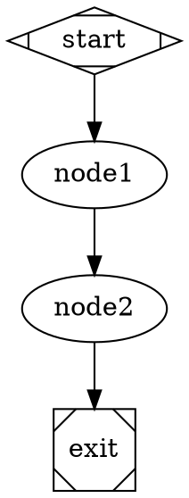

# Story 42.17: Attractor Spec Compliance Test Suite

## Story

As a graph engine developer,
I want a spec compliance test suite that replays pseudocode examples from the Attractor spec through the graph engine's `selectEdge()`, `evaluateGates()`, and checkpoint resume APIs,
so that I can verify the implementation faithfully follows the Attractor spec and detect any behavioral drift during future development.

## Acceptance Criteria

### AC1: Edge Selection — Condition-Matching Edges Win Over Unconditional
**Given** a node with two outgoing edges: one conditional (`label="outcome=success"`) and one unconditional (with `weight=10`), and the current context has `outcome=success`
**When** `selectEdge()` is called with this node, outcome, and context
**Then** the conditional edge is returned — condition matching (Step 1 of spec Section 3.3) takes priority over weight (Step 4), regardless of the weight value

### AC2: Edge Selection — Preferred Label Normalization with Accelerator Prefix Stripping
**Given** a node with two unconditional edges labeled `"[Y] Yes"` and `"No"` (no conditions), and the outcome includes `preferredLabel: 'yes'`
**When** `selectEdge()` is called
**Then** the edge labeled `"[Y] Yes"` is returned — label normalization strips the `[Y] ` accelerator prefix, lowercases, and trims whitespace before matching (Step 2 of spec Section 3.3)

### AC3: Edge Selection — Weight with Lexical Tiebreak Among Unconditional Edges
**Given** a node with three unconditional edges to nodes `"charlie"` (weight 5), `"alpha"` (weight 5), and `"bravo"` (weight 3), with no conditions, preferred label, or suggested IDs
**When** `selectEdge()` is called
**Then** the edge targeting `"alpha"` is returned — weight 5 ties between `"charlie"` and `"alpha"`, and `"alpha"` precedes `"charlie"` lexicographically (Step 5 of spec Section 3.3)

### AC4: Goal Gate — PARTIAL_SUCCESS Satisfies, FAILURE and Unrecorded Outcomes Do Not
**Given** a graph with three `goalGate=true` nodes: one with recorded outcome `PARTIAL_SUCCESS`, one with `FAILURE`, and one with no recorded outcome (never executed)
**When** `evaluateGates()` from `ConvergenceController` (story 42-16) is called
**Then** only the `PARTIAL_SUCCESS` node's gate is satisfied; the `FAILURE` node and the unrecorded node both appear in `failingNodes`, and `satisfied` is `false` — matching spec Section 3.4 pseudocode

### AC5: Checkpoint Resume — Completed Nodes Skipped and Context Restored
**Given** a checkpoint file with `completedNodes: ['start', 'node1']`, `currentNode: 'node1'`, and `contextValues: { result: 'ok', attempt: '3' }`
**When** the executor resumes from that checkpoint file
**Then** `graph:node-started` events are NOT emitted for `start` or `node1` (they are skipped per spec Section 5.3 steps 2–3); the first resumed node receives a context where `getString('result') === 'ok'` and `getString('attempt') === '3'`

### AC6: Structural Conformance — Attribute Coverage, Lint Rule Coverage, and Determinism
**Given** the Attractor spec's defined attribute tables (17 node attributes, 6 edge attributes) and the 13 lint rules (8 error-level + 5 warning-level from stories 42-4 and 42-5)
**When** the compliance tests parse DOT fixtures covering all attributes and validate graphs triggering each lint rule
**Then** all attributes are extracted with correct defaults, all 13 lint rules fire with the correct `rule` ID and `severity`; additionally `selectEdge()` is deterministic — identical inputs always produce the same output (no randomness)

### AC7: All Compliance Tests Pass Under npm test
**Given** the full compliance test suite in `attractor-compliance.test.ts`
**When** `npm test` is run (after verifying no concurrent vitest process via `pgrep -f vitest`)
**Then** all compliance tests pass with zero failures, the "Test Files" summary line confirms success, and no test is in `.skip` state without an explanatory comment (tests awaiting Phase B implementation may use `it.todo` with a comment)

## Tasks / Subtasks

- [ ] Task 1: Create `attractor-compliance.test.ts` with shared helpers and DOT fixtures (AC: all)
  - [ ] Create `packages/factory/src/graph/__tests__/attractor-compliance.test.ts`
  - [ ] Read `packages/factory/src/graph/edge-selector.ts` (story 42-12) to confirm the exported function/class name (`selectEdge`, `EdgeSelector`, or similar) and exact call signature before importing
  - [ ] Read `packages/factory/src/convergence/controller.ts` (story 42-16) to confirm `createConvergenceController` and `evaluateGates` signatures
  - [ ] Read `packages/factory/src/graph/types.ts` to confirm `Graph`, `GraphNode`, `GraphEdge`, `Outcome`, `OutcomeStatus`, and `GraphContext` shapes
  - [ ] Read `packages/factory/src/graph/checkpoint.ts` to confirm `CheckpointManager.save()` signature and checkpoint file format
  - [ ] Define shared helper `makeNode(id: string, overrides?: Partial<GraphNode>): GraphNode` returning a node with sensible defaults (type `codergen`, no goal gate, no conditions)
  - [ ] Define shared helper `makeEdge(fromId: string, toId: string, overrides?: Partial<GraphEdge>): GraphEdge` returning an edge with defaults (no condition, no label, weight 0)
  - [ ] Define shared helper `makeGraph(nodes: GraphNode[], edges: GraphEdge[]): Graph` assembling a minimal `Graph` object (use a `Map` for nodes keyed by ID)
  - [ ] Define DOT fixture `COMPLIANCE_RESUME_DOT` (linear 4-node graph: `start → node1 → node2 → exit`) for use in AC5 resume tests
  - [ ] All imports use ESM `.js` extensions; import test utilities from `'vitest'` only

- [ ] Task 2: Write edge selection compliance tests — Steps 1–5 of spec Section 3.3 (AC: #1, #2, #3)
  - [ ] Create a `describe('selectEdge compliance — spec Section 3.3')` block
  - [ ] **Step 1 — condition matching beats weight**: build a node with 2 edges: conditional edge `e1` (`condition: 'outcome=success'`, weight 0) and unconditional `e2` (weight 10); set context `outcome='success'`; assert `selectEdge()` returns `e1`
  - [ ] **Step 1 variant — no condition match**: set context `outcome='failure'`; assert `selectEdge()` returns `e2` (falls through to Step 4)
  - [ ] **Step 2 — preferred label with `[Y] ` prefix**: node has 2 unconditional edges labeled `"[Y] Yes"` and `"No"`; outcome `preferredLabel: 'yes'`; assert returns `"[Y] Yes"` edge
  - [ ] **Step 2 variant — `Y) ` accelerator prefix**: edge labeled `"Y) Confirm"` matches `preferredLabel: 'confirm'`; assert correct edge returned
  - [ ] **Step 3 — suggested next IDs**: node has 3 unconditional unlabeled edges to `"a"`, `"b"`, `"c"`; outcome `suggestedNextIds: ['b']`; assert returns edge to `"b"`
  - [ ] **Steps 4 & 5 — weight with lexical tiebreak**: node has 3 unconditional edges to `"charlie"` (weight 5), `"alpha"` (weight 5), `"bravo"` (weight 3); assert returns edge to `"alpha"`
  - [ ] **Empty edges**: when node has no outgoing edges, `selectEdge()` returns `null`, `undefined`, or a falsy sentinel (confirm which from the implementation)

- [ ] Task 3: Write goal gate compliance tests — spec Section 3.4 pseudocode (AC: #4)
  - [ ] Create a `describe('evaluateGates compliance — spec Section 3.4')` block
  - [ ] Use `createConvergenceController()` from story 42-16 for all tests (not the full executor)
  - [ ] **SUCCESS satisfies**: record `SUCCESS` for a `goalGate=true` node; `evaluateGates()` → `{ satisfied: true, failingNodes: [] }`
  - [ ] **PARTIAL_SUCCESS satisfies**: record `PARTIAL_SUCCESS` for a `goalGate=true` node; `evaluateGates()` → `{ satisfied: true, failingNodes: [] }` (key spec requirement per Section 3.4)
  - [ ] **FAILURE does not satisfy**: record `FAILURE`; assert `failingNodes` contains the node ID and `satisfied === false`
  - [ ] **Unrecorded outcome fails gate**: call `createConvergenceController()`, then `evaluateGates()` without calling `recordOutcome()` for a `goalGate=true` node; assert the node appears in `failingNodes`
  - [ ] **Mixed SUCCESS + PARTIAL_SUCCESS**: two goal gate nodes, both outcomes recorded; assert `{ satisfied: true, failingNodes: [] }`
  - [ ] **Mixed SUCCESS + FAILURE**: two goal gate nodes, one `SUCCESS`, one `FAILURE`; assert `satisfied === false` and only the failing node is in `failingNodes`
  - [ ] **No goal gate nodes**: graph with no nodes having `goalGate=true`; assert `{ satisfied: true, failingNodes: [] }` (vacuously satisfied)

- [ ] Task 4: Write checkpoint resume compliance tests — node skip and context restore (AC: #5)
  - [ ] Create a `describe('checkpoint resume compliance — spec Section 5.3')` block
  - [ ] In `beforeEach`: create a temp dir via `os.tmpdir()` + `crypto.randomUUID()` + `mkdir`; in `afterEach`: `rm(tmpDir, { recursive: true, force: true })`
  - [ ] Write seed checkpoint using `CheckpointManager.save()` (NOT hand-crafted JSON) with `completedNodes: ['start', 'node1']`, `currentNode: 'node1'`, `contextValues: { result: 'ok', attempt: '3' }`, `nodeRetries: {}`
  - [ ] Parse `COMPLIANCE_RESUME_DOT` with `parseGraph()`; validate with `GraphValidator.validate()` (assert zero errors)
  - [ ] Build a mock handler registry that captures the `IGraphContext` argument passed to each node handler
  - [ ] Attach an event spy tracking `graph:node-started` payloads
  - [ ] Execute via `createGraphExecutor().run()` with `config.checkpointPath` pointing to the seed checkpoint
  - [ ] Assert: `graph:node-started` events do NOT include `'start'` or `'node1'`
  - [ ] Assert: `graph:node-started` events DO include `'node2'` and `'exit'` in that order
  - [ ] Assert: handler captured for `node2` has context where `getString('result') === 'ok'` and `getString('attempt') === '3'`
  - [ ] Assert: final outcome `status === 'SUCCESS'`

- [ ] Task 5: Write fidelity degradation compliance test (AC: #5 / Phase B deferral)
  - [ ] Create a `describe('fidelity degradation on resume — spec Section 5.3 step 6')` block
  - [ ] **Before implementing**: read `packages/factory/src/graph/executor.ts` (story 42-14) to determine if fidelity resolution is implemented in Phase A
  - [ ] **If implemented**: write a test that resumes from a checkpoint where `currentNode` had `fidelity='full'`; assert the first resumed node's effective fidelity is `'summary:high'`; assert subsequent nodes resolve their configured fidelity normally
  - [ ] **If NOT implemented**: write `it.todo('fidelity degradation — full→summary:high on resume (Phase B requirement per spec Section 5.3 step 6)')` and document the gap in the Dev Agent Record under "Completion Notes List"
  - [ ] Do not block the story on this test — Phase A does not require behavioral fidelity implementation

- [ ] Task 6: Write structural conformance parity tests (AC: #6)
  - [ ] Create a `describe('structural conformance — AttractorBench parity')` block with top-level comment `// AttractorBench structural conformance parity — Phase A mandatory`
  - [ ] **Attribute coverage — nodes**: parse a DOT with all 17 node attributes set explicitly (read spec Section 2.2 table and `types.ts` for the full list); assert each attribute is extracted on the parsed `GraphNode` with the correct value
  - [ ] **Attribute coverage — edges**: parse a DOT with all 6 edge attributes set; assert each is extracted on the parsed `GraphEdge`
  - [ ] **Lint rule coverage — errors**: for each of the 8 error-level rules (from stories 42-4), validate a DOT that violates exactly that rule; assert the result contains an entry with the correct `rule` ID and `severity === 'error'`
  - [ ] **Lint rule coverage — warnings**: for each of the 5 warning-level rules (from stories 42-5), validate a DOT that triggers that warning; assert `severity === 'warning'` and correct `rule` ID
  - [ ] **Edge selection determinism**: call `selectEdge()` twice with identical inputs (same node, outcome, context, graph); assert both calls return the same edge object (same `to_node` at minimum)
  - [ ] Read `packages/factory/src/graph/validator.ts` (stories 42-4/42-5) to get the exact rule IDs before writing rule-coverage tests; do NOT guess rule names from the story titles

- [ ] Task 7: Run the compliance suite and verify all tests pass (AC: #7)
  - [ ] Run `pgrep -f vitest` — confirm no concurrent test process is running
  - [ ] Run `npm run build` to catch type errors before running tests
  - [ ] Run `npm run test:fast` with `timeout: 300000`; do NOT pipe output through `grep`, `head`, `tail`, or any other command
  - [ ] Confirm output contains "Test Files" summary line with zero failures
  - [ ] Verify every test is either passing or `it.todo` with an explanatory comment — no unexplained `.skip`
  - [ ] Record the final test count and any `it.todo` entries in the Dev Agent Record

## Dev Notes

### Architecture Constraints
- **Package**: `packages/factory/` — all new files live here
- **Primary test file**: `packages/factory/src/graph/__tests__/attractor-compliance.test.ts`
- **No source file modifications**: this story is a pure test-authoring story; the only exception is writing `it.todo` comments for spec behaviors not yet implemented (fidelity degradation)
- **ESM `.js` extensions**: all relative imports use `.js` (e.g., `import { createConvergenceController } from '../../convergence/controller.js'`)
- **Node built-ins**: use `node:` prefix (e.g., `import os from 'node:os'`, `import path from 'node:path'`, `import { mkdir, rm } from 'node:fs/promises'`)
- **Test framework**: Vitest only — import all test utilities from `'vitest'`

### Key APIs to Read Before Implementing
Read these source files first to confirm exported names and exact call signatures (do not assume from story titles):
- **Edge selector**: `packages/factory/src/graph/edge-selector.ts` (story 42-12) — confirm whether `selectEdge` is a standalone function or a class method, and what the return type is for empty edges
- **Convergence controller**: `packages/factory/src/convergence/controller.ts` (story 42-16) — confirm `ConvergenceController` interface, `createConvergenceController()`, `recordOutcome()`, `evaluateGates()` signatures
- **Graph types**: `packages/factory/src/graph/types.ts` — confirm `Graph`, `GraphNode`, `GraphEdge`, `Outcome`, `OutcomeStatus`, `GraphContext` shapes and field names (camelCase)
- **Checkpoint manager**: `packages/factory/src/graph/checkpoint.ts` (story 42-13) — confirm `save()` parameter shape and whether it accepts a `GraphContext` object or a plain map
- **Executor**: `packages/factory/src/graph/executor.ts` (story 42-14) — confirm `createGraphExecutor()` API and `GraphExecutorConfig` fields, especially `checkpointPath`
- **Validator**: `packages/factory/src/graph/validator.ts` (stories 42-4/42-5) — confirm exact rule IDs and the structure of validation results (`{ rule: string, severity: 'error' | 'warning', message: string }`)

### Edge Selection — Label Normalization Rules (Spec Section 3.3 Step 2)
The Attractor spec defines label normalization as: lowercase, trim whitespace, strip accelerator prefixes. Accelerator prefix patterns:
- `[Y] ` — e.g., `"[Y] Yes"` → `"yes"`
- `Y) ` — e.g., `"Y) Confirm"` → `"confirm"`
- `Y - ` — e.g., `"Y - Cancel"` → `"cancel"`

Confirm that `EdgeSelector` (story 42-12) implements this normalization. If `normalizeLabel` is exported as a separate utility, test it directly in addition to testing via `selectEdge()`.

### Goal Gate Tests — Use ConvergenceController Directly
For AC4, test `ConvergenceController.evaluateGates()` in isolation (not via the full executor). This verifies the pure spec logic independently of executor wiring:
```typescript
const controller = createConvergenceController()
controller.recordOutcome('nodeA', 'PARTIAL_SUCCESS')
// nodeB has no recorded outcome
const graph = makeGraph([
  makeNode('nodeA', { goalGate: true }),
  makeNode('nodeB', { goalGate: true }),
], [])
const result = controller.evaluateGates(graph)
// expect: { satisfied: false, failingNodes: ['nodeB'] }
```

### Checkpoint Resume — Write Seed Checkpoint via CheckpointManager
For AC5, always use `CheckpointManager.save()` to write the seed checkpoint (not hand-crafted JSON). This ensures format compatibility with what the executor loads. Inspect `checkpoint.ts` to determine the exact parameter shape before calling `save()`.

### Fidelity Degradation — Phase A vs. Phase B
Fidelity resolution (spec Section 5.4) and the one-hop degradation on resume (Section 5.3 step 6) may not be implemented until Phase B. Before writing the fidelity test:
1. Read `packages/factory/src/graph/executor.ts` to check for fidelity resolution logic
2. If not present, use `it.todo('...')` — do NOT block the story or write a failing test
3. Document the Phase B deferral in Dev Agent Record → Completion Notes

### AttractorBench Structural Conformance
The planning artifact references `github.com/strongdm/attractorbench` as a structural conformance suite. For Phase A, this story implements equivalent inline structural conformance tests that verify the same properties. Annotate the describe block:
```typescript
// AttractorBench structural conformance parity — Phase A mandatory
// See: https://github.com/strongdm/attractorbench
// Behavioral conformance tests are advisory in Phase A; required by Phase B exit.
```
The structural tests focus on: attribute completeness (all spec-defined attributes parsed), lint rule coverage (all 13 rules implemented and triggered correctly), and edge selection determinism.

### DOT Fixture for Resume Tests


### Testing Requirements
- **Never pipe test output** — run `npm run test:fast` without `| grep`, `| head`, `| tail`, or any filter
- **Check for concurrent vitest**: `pgrep -f vitest` must return nothing before running tests
- **Confirm results** by looking for the "Test Files" line in output — exit code 0 alone is insufficient
- **Build first**: run `npm run build` to catch TypeScript errors before the test run
- **Cleanup**: remove temp dirs in `afterEach` — never rely on test framework teardown for filesystem cleanup

## Interface Contracts

- **Import**: `selectEdge` or `EdgeSelector` @ `packages/factory/src/graph/edge-selector.ts` (from story 42-12)
- **Import**: `ConvergenceController`, `createConvergenceController` @ `packages/factory/src/convergence/controller.ts` (from story 42-16)
- **Import**: `CheckpointManager` @ `packages/factory/src/graph/checkpoint.ts` (from story 42-13)
- **Import**: `createGraphExecutor`, `GraphExecutorConfig` @ `packages/factory/src/graph/executor.ts` (from story 42-14)
- **Import**: `Graph`, `GraphNode`, `GraphEdge`, `Outcome`, `OutcomeStatus`, `GraphContext` @ `packages/factory/src/graph/types.ts` (from stories 42-1/42-2/42-8)
- **Import**: `GraphValidator` @ `packages/factory/src/graph/validator.ts` (from stories 42-4/42-5)
- **Import**: `parseGraph` @ `packages/factory/src/graph/parser.ts` (from stories 42-1/42-2)

## Dev Agent Record

### Agent Model Used
### Completion Notes List
### File List

## Change Log
