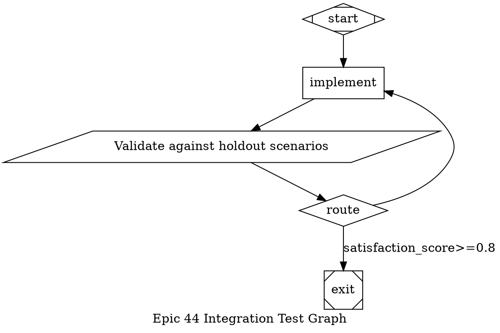

# Story 44-10: Scenario Store Integration Test

## Story

As a factory pipeline developer,
I want an end-to-end integration test suite that exercises the complete scenario store and runner pipeline,
so that all Epic 44 components — discovery, execution, scoring, integrity checking, database persistence, and event emission — are verified working together before Epic 45 convergence loop development begins.

## Acceptance Criteria

### AC1: Two-of-three scenarios pass — graph routes to retry
**Given** a DOT graph fixture with `start → implement → validate → route → exit` topology where `route → exit [label="satisfaction_score>=0.8"]` and `route → implement` (unlabelled retry edge), and a mock scenario runner returning `{total:3, passed:2, failed:1}` on the first call
**When** the graph executor completes the first validate node execution
**Then** `context.satisfaction_score` is approximately `0.667` (within 0.001 tolerance), the `satisfaction_score>=0.8` condition evaluates to `false`, and the unlabelled retry edge back to `implement` is selected

### AC2: All scenarios pass on second iteration — graph terminates at exit
**Given** the same DOT graph fixture and a mock scenario runner configured to return `{total:3, passed:3, failed:0}` on the second call
**When** the graph executor completes the second validate node execution
**Then** `context.satisfaction_score` equals `1.0`, the `satisfaction_score>=0.8` condition evaluates to `true`, and the executor reaches the `exit` node — terminating the run

### AC3: Scenario integrity tamper detected between iterations halts execution
**Given** a `ScenarioStore` that has captured a manifest with checksums for a set of scenario files
**When** the content of one scenario file is modified after the manifest is captured (simulating tampering)
**Then** the integrity check returns a failure indicating the tampered scenario path and its mismatched checksum, and graph execution does not proceed past the verification step

### AC4: scenario_results rows persisted after each validation node execution
**Given** a factory schema initialized on an in-memory `DatabaseAdapter` and a computed `ScenarioRunResult` with `{total:3, passed:2, failed:1}`
**When** a `scenario_results` row is inserted using the scored result (`satisfaction_score ≈ 0.667`, `passes: false`, `threshold: 0.8`)
**Then** querying `scenario_results WHERE run_id = ?` returns the row with all columns matching the inserted values including `iteration`, `total_scenarios`, `passed`, `failed`, `satisfaction_score`, `threshold`, and `passes`

### AC5: graph:node-started and graph:node-completed events emitted for validate node
**Given** a `TypedEventBus<FactoryEvents>` attached to the graph executor, with event listeners collecting all emitted events into an ordered array
**When** the `validate` tool node executes
**Then** the collected array contains `graph:node-started` followed by `graph:node-completed` in order, both containing matching `runId` values, with `graph:node-started.nodeId === 'validate'` and `graph:node-completed.status === 'SUCCESS'`

### AC6: ScenarioStore discovery produces valid manifest for mock scenario files
**Given** two mock shell script files written to a temporary directory (named `scenario-pass.sh` and `scenario-fail.sh`)
**When** `ScenarioStore.discover(tempDir)` is called
**Then** the returned `ScenarioManifest` contains exactly two entries, each with a non-empty `path`, a 64-character hex `checksum` (SHA-256), and a `capturedAt` timestamp within 5000 ms of `Date.now()`

### AC7: Full Epic 44 test suite achieves at least 60 new passing tests
**Given** all Epic 44 test files from stories 44-1 through 44-10 present in the repository
**When** `npm run test:fast` is executed
**Then** the test runner reports at least 60 tests from `packages/factory/src/scenarios/`, `packages/factory/src/handlers/`, `packages/factory/src/persistence/`, and `packages/factory/src/__tests__/` directories passing, confirming the Epic 44 test coverage gate

## Tasks / Subtasks

- [ ] Task 1: Create integration test directory and DOT graph fixture (AC: #1, #2)
  - [ ] Create directory `packages/factory/src/__tests__/integration/`
  - [ ] Create `packages/factory/src/__tests__/integration/fixtures/pipeline.dot` containing:
    ```dot
    digraph pipeline {
      graph [goal="Test scenario validation convergence", label="Epic 44 Integration Test Graph"]
      start     [shape=Mdiamond]
      implement [shape=box, prompt="Implement the feature"]
      validate  [shape=parallelogram, type="tool",
                 tool_command="substrate scenarios run --format json",
                 label="Validate against holdout scenarios"]
      route     [shape=diamond]
      exit      [shape=Msquare]
      start     -> implement
      implement -> validate
      validate  -> route
      route     -> exit     [label="satisfaction_score>=0.8"]
      route     -> implement
    }
    ```
  - [ ] Create `packages/factory/src/__tests__/integration/helpers.ts` exporting: `buildScenarioRunResult(passed: number, total: number): ScenarioRunResult` (builds a full result with per-scenario entries), `createMockSpawnProcess(stdout: string, exitCode: number)` (returns an EventEmitter-like mock that fires `data` on stdout and `close` via `setImmediate`), and `readFixtureDot(): string` (reads `fixtures/pipeline.dot` synchronously)

- [ ] Task 2: Write routing and convergence integration tests (AC: #1, #2)
  - [ ] Create `packages/factory/src/__tests__/integration/scenario-pipeline.test.ts`
  - [ ] Import: `{ describe, it, expect, vi, beforeEach, afterEach }` from `'vitest'`; `{ parseGraph }` from `'../../graph/parser.js'`; `{ createValidator }` from `'../../graph/validator.js'`; `{ createGraphExecutor }` from `'../../graph/executor.js'`; `{ createDefaultRegistry }` from `'../../handlers/index.js'`; `{ RunStateManager }` from `'../../graph/run-state.js'`; `{ TypedEventBusImpl }` from `'@substrate-ai/core'`; `{ buildScenarioRunResult, readFixtureDot }` from `'./helpers.js'`
  - [ ] Mock `'node:child_process'` via `vi.mock`; in `beforeEach`, reset mocks and create a temp run dir
  - [ ] **Test AC1a** — first iteration: mock spawn to emit `buildScenarioRunResult(2, 3)` JSON; parse and execute fixture graph; collect `graph:node-completed` events for the `route` node; assert the next selected node id is `implement` (retry path)
  - [ ] **Test AC1b** — assert `context.satisfaction_score` after validate node is `toBeCloseTo(2/3, 5)`
  - [ ] **Test AC1c** — assert `satisfaction_score>=0.8` condition evaluates to `false` when score is `0.667`
  - [ ] **Test AC2a** — two-iteration convergence: mock spawn to return `buildScenarioRunResult(2, 3)` on first call and `buildScenarioRunResult(3, 3)` on second; run executor to completion; assert `graph:run-completed` event is emitted
  - [ ] **Test AC2b** — assert `context.satisfaction_score` after second iteration is `1.0`
  - [ ] **Test AC2c** — assert `graph:run-completed` event's final node is `exit`
  - [ ] **Test AC2d** — assert total `graph:node-completed` events for `validate` node equals 2 (executed twice)
  - [ ] Aim for ≥ 8 tests in this file

- [ ] Task 3: Write integrity verification integration tests (AC: #3)
  - [ ] Create `packages/factory/src/__tests__/integration/integrity.test.ts`
  - [ ] Import: `{ describe, it, expect, beforeEach, afterEach }` from `'vitest'`; `{ ScenarioStore }` (or `createScenarioStore`) from `'../../scenarios/store.js'`; `{ mkdtemp, writeFile, rm }` from `'node:fs/promises'`; `{ tmpdir }` from `'node:os'`; `{ join }` from `'node:path'`
  - [ ] Write `beforeEach` that creates a temp dir and writes two mock `.sh` files (`scenario-pass.sh`, `scenario-fail.sh`)
  - [ ] Write `afterEach` that removes the temp dir via `rm(tempDir, { recursive: true })`
  - [ ] **Test AC3a** — discover manifest from temp dir; verify manifest has 2 entries with non-null checksums
  - [ ] **Test AC3b** — modify one scenario file content after discovery; call the integrity verify method (e.g., `store.verify(manifest)` or `verifyIntegrity(manifest, scenarioDir)`); assert the result indicates failure for the tampered file
  - [ ] **Test AC3c** — verify method returns the path of the tampered scenario in the failure details
  - [ ] **Test AC3d** — verify method passes when no files are modified after manifest capture
  - [ ] **Test AC3e** — verify that adding a new scenario file (not in manifest) is detected as unexpected
  - [ ] **Test AC3f** — confirm the integrity-failed event payload type: `{ scenario: string; expected: string; actual: string }` (type check only, no runtime assertion needed)
  - [ ] Aim for ≥ 6 tests in this file

- [ ] Task 4: Write database persistence integration tests (AC: #4)
  - [ ] Create `packages/factory/src/__tests__/integration/persistence.test.ts`
  - [ ] Import: `{ describe, it, expect, beforeEach }` from `'vitest'`; `{ createDatabaseAdapter }` from `'@substrate-ai/core'`; `{ factorySchema }` from `'../../persistence/factory-schema.js'`; `{ computeSatisfactionScore }` from `'../../scenarios/scorer.js'`; `{ buildScenarioRunResult }` from `'./helpers.js'`
  - [ ] Write `beforeEach` that creates a fresh in-memory adapter and calls `factorySchema(adapter)`
  - [ ] **Test AC4a** — insert `graph_runs` row and `scenario_results` row for iteration 1 with `buildScenarioRunResult(2, 3)`; query `scenario_results WHERE run_id = 'test-run-1'`; assert `passed=2`, `failed=1`, `total_scenarios=3`, `satisfaction_score` close to `0.667`, `passes=false`
  - [ ] **Test AC4b** — insert iteration 2 row with `buildScenarioRunResult(3, 3)`; assert `satisfaction_score=1.0` and `passes=true`
  - [ ] **Test AC4c** — query `scenario_results WHERE run_id = 'test-run-1' ORDER BY iteration`; assert 2 rows in order with iteration=1 and iteration=2
  - [ ] **Test AC4d** — assert `node_id` is correctly stored and queryable
  - [ ] **Test AC4e** — assert `threshold` defaults to `0.8` when not explicitly set
  - [ ] **Test AC4f** — assert `details` column accepts NULL (omitted on insert) and JSON string (when provided)
  - [ ] Aim for ≥ 6 tests in this file

- [ ] Task 5: Write event emission and ScenarioStore discovery tests (AC: #5, #6)
  - [ ] Create `packages/factory/src/__tests__/integration/events.test.ts`
  - [ ] Import: `{ describe, it, expect, vi, beforeEach, afterEach }` from `'vitest'`; `{ TypedEventBusImpl }` from `'@substrate-ai/core'`; `type { FactoryEvents }` from `'../../events.js'`; `{ ScenarioStore }` (or `createScenarioStore`) from `'../../scenarios/store.js'`; `{ mkdtemp, writeFile, rm }` from `'node:fs/promises'`; `{ tmpdir }` from `'node:os'`
  - [ ] **Test AC5a** — set up `eventBus = new TypedEventBusImpl<FactoryEvents>()`; collect events into `emitted: string[]` via individual `eventBus.on('graph:node-started', ...)` and `eventBus.on('graph:node-completed', ...)` listeners; instantiate and run a minimal tool node handler in isolation (or full executor with single node graph); assert `emitted[0] === 'graph:node-started'` and `emitted[1] === 'graph:node-completed'`
  - [ ] **Test AC5b** — assert `graph:node-started` payload has `nodeId === 'validate'`
  - [ ] **Test AC5c** — assert `graph:node-completed` payload has `status === 'SUCCESS'`
  - [ ] **Test AC5d** — assert `graph:node-started` and `graph:node-completed` have identical `runId` values
  - [ ] **Test AC6a** — write two `.sh` files to temp dir; call `store.discover(tempDir)`; assert manifest has 2 entries
  - [ ] **Test AC6b** — assert each manifest entry has a `checksum` that is a 64-character hex string (SHA-256)
  - [ ] **Test AC6c** — assert `manifest.capturedAt` is within 5000 ms of `Date.now()` (before and after discovery call)
  - [ ] **Test AC6d** — assert each manifest entry's `path` matches the written file paths
  - [ ] Aim for ≥ 8 tests in this file

- [ ] Task 6: Write Epic 44 coverage gate and public API smoke tests (AC: #7)
  - [ ] Create `packages/factory/src/__tests__/integration/epic44-coverage-gate.test.ts`
  - [ ] Import all Epic 44 public API exports: `{ ScenarioStore, computeSatisfactionScore, factorySchema, FactoryConfigSchema, loadFactoryConfig, registerFactoryCommand }` from `'@substrate-ai/factory'` (or from their direct paths)
  - [ ] **Test gate-1** — assert `typeof ScenarioStore !== 'undefined'` (ScenarioStore exported from story 44-1)
  - [ ] **Test gate-2** — assert `typeof computeSatisfactionScore === 'function'` (scorer from story 44-5)
  - [ ] **Test gate-3** — assert `typeof factorySchema === 'function'` (DB schema from story 44-6)
  - [ ] **Test gate-4** — assert `FactoryConfigSchema.parse({})` returns defaults without throwing (config schema from story 44-9)
  - [ ] **Test gate-5** — assert `typeof registerFactoryCommand === 'function'` (CLI from story 44-8)
  - [ ] Add a block comment above the describe block documenting expected per-story test counts and the running total; include: `// 44-1: ~10, 44-2: ~8, 44-3: ~6, 44-4: ~8, 44-5: ~13, 44-6: ~7, 44-7: ~8, 44-8: ~6, 44-9: ~16, 44-10: ~33 → Total ≥ 115 >> gate of 60`
  - [ ] Aim for ≥ 5 tests in this file

- [ ] Task 7: Build and validate (AC: #1–#7)
  - [ ] Run `npm run build` from monorepo root — zero TypeScript errors
  - [ ] Run `npm run test:fast` with `timeout: 300000` — verify "Test Files" summary line appears in output
  - [ ] Confirm all 5 new integration test files are included in "Test Files" count
  - [ ] Confirm no regressions in pre-Epic-44 test suite (7498 pre-existing tests still pass)
  - [ ] Confirm `packages/factory/src/__tests__/integration/` tests contribute at least 33 passing tests (to reach ≥ 60 combined with earlier stories)

## Dev Notes

### Architecture Constraints

- **New directory:** `packages/factory/src/__tests__/integration/` — integration test suite for Epic 44
- **New files:**
  - `packages/factory/src/__tests__/integration/fixtures/pipeline.dot` — DOT graph fixture
  - `packages/factory/src/__tests__/integration/helpers.ts` — shared test helpers
  - `packages/factory/src/__tests__/integration/scenario-pipeline.test.ts` — routing and convergence tests
  - `packages/factory/src/__tests__/integration/integrity.test.ts` — integrity tamper detection tests
  - `packages/factory/src/__tests__/integration/persistence.test.ts` — database persistence tests
  - `packages/factory/src/__tests__/integration/events.test.ts` — event emission and discovery tests
  - `packages/factory/src/__tests__/integration/epic44-coverage-gate.test.ts` — coverage gate and smoke tests

- **No new production code** — this story is test-only. If a production component is missing, has a bug, or lacks an expected export, escalate rather than adding workarounds in the test files.

- **Import style:** All relative imports within factory package use `.js` extensions (ESM). Example: `import { parseGraph } from '../../graph/parser.js'`

- **Do NOT import from `@substrate-ai/sdlc`** — factory test files may only import from `@substrate-ai/core`, `@substrate-ai/factory`, or relative paths within `packages/factory/`

### Integration Test DOT Graph Fixture



### Mock ScenarioRunResult Builder

```typescript
// packages/factory/src/__tests__/integration/helpers.ts
import type { ScenarioRunResult } from '../../events.js'
import { readFileSync } from 'node:fs'
import { join } from 'node:path'

export function buildScenarioRunResult(passed: number, total: number): ScenarioRunResult {
  const failed = total - passed
  return {
    scenarios: Array.from({ length: total }, (_, i) => ({
      name: `scenario-${i + 1}`,
      path: `.substrate/scenarios/scenario-${i + 1}.sh`,
      status: i < passed ? 'pass' : 'fail',
      exitCode: i < passed ? 0 : 1,
      stdout: '',
      stderr: '',
      durationMs: 50,
    })),
    summary: { total, passed, failed },
    durationMs: total * 50,
  }
}

export function readFixtureDot(): string {
  return readFileSync(join(__dirname, 'fixtures', 'pipeline.dot'), 'utf8')
}
```

### Child Process Mock Pattern

```typescript
import { vi, type MockedFunction } from 'vitest'
import * as cp from 'node:child_process'
import { EventEmitter } from 'node:events'

export function createMockSpawnProcess(options: { stdout: string; exitCode: number }) {
  const proc = new EventEmitter() as ReturnType<typeof cp.spawn>
  ;(proc as unknown as Record<string, EventEmitter>).stdout = new EventEmitter()
  ;(proc as unknown as Record<string, EventEmitter>).stderr = new EventEmitter()
  setImmediate(() => {
    ;(proc as unknown as Record<string, EventEmitter>).stdout.emit('data', options.stdout)
    proc.emit('close', options.exitCode)
  })
  return proc
}
```

### Satisfaction Score Reference Values

| Scenario | `passed/total` | `>=0.8`? | Selected edge |
|----------|---------------|----------|---------------|
| 2/3 pass | `0.6667…`     | `false`  | retry → `implement` |
| 3/3 pass | `1.0`         | `true`   | exit |
| 0/3 pass | `0.0`         | `false`  | retry → `implement` |

**Important:** `context.satisfaction_score` stores the raw number from `passed/total`. Use `toBeCloseTo(2/3, 5)` or `toBeLessThan(0.8)` in assertions — not exact equality on floating-point values.

### Integrity Check API Expectation

Story 44-4 exports an integrity checker. The exact API name may be one of:
- `store.verify(manifest)` method on `ScenarioStore`
- `verifyIntegrity(manifest, scenarioDir)` standalone function
- A property on the manifest or store instance

Discover the actual export by reading `packages/factory/src/scenarios/store.ts` (or `integrity.ts`) before writing tests. Adapt the test's import and call site to match the implemented API. The expected failure shape contains the tampered scenario path and its mismatched checksum strings.

### Database Persistence Pattern

```typescript
// Insert a graph_runs row first (foreign key constraint)
await adapter.exec(
  `INSERT INTO graph_runs (id, graph_file, status, started_at, total_cost_usd, node_count)
   VALUES (?, ?, 'running', CURRENT_TIMESTAMP, 0.0, 5)`,
  ['test-run-1', 'pipeline.dot']
)

// Insert scenario_results row for iteration 1
const result = buildScenarioRunResult(2, 3)
const score = computeSatisfactionScore(result)
await adapter.exec(
  `INSERT INTO scenario_results
     (run_id, node_id, iteration, total_scenarios, passed, failed,
      satisfaction_score, threshold, passes, executed_at)
   VALUES (?, ?, ?, ?, ?, ?, ?, ?, ?, CURRENT_TIMESTAMP)`,
  ['test-run-1', 'validate', 1, 3, 2, 1, score.score, score.threshold, score.passes ? 1 : 0]
)
```

### Testing Requirements

- **Framework:** Vitest — `import { describe, it, expect, vi, beforeEach, afterEach } from 'vitest'`
- **Temp directories:** Use `mkdtemp(join(tmpdir(), 'factory-test-'))` in `beforeEach`; clean up with `rm(tempDir, { recursive: true, force: true })` in `afterEach`
- **child_process mocking:** Use `vi.mock('node:child_process', ...)` at the top of test files that spawn processes; use `mockImplementationOnce` for sequenced return values across multiple calls in convergence tests
- **In-memory DB:** Use `createDatabaseAdapter({ backend: 'memory' })` from `@substrate-ai/core` — never connect to Dolt in tests
- **Event collection:** Collect events in an array by calling `eventBus.on(eventName, (payload) => collected.push({ type: eventName, ...payload }))` for each relevant event type — no wildcard listeners
- **Run tests:** `npm run test:fast` with `timeout: 300000` — verify "Test Files" summary line in output; never pipe output through `head`/`tail`/`grep`
- **Minimum test counts per file:**
  - `scenario-pipeline.test.ts` ≥ 8 tests
  - `integrity.test.ts` ≥ 6 tests
  - `persistence.test.ts` ≥ 6 tests
  - `events.test.ts` ≥ 8 tests
  - `epic44-coverage-gate.test.ts` ≥ 5 tests
  - **Total for this story: ≥ 33 tests**

### Dependency Chain

- **Depends on:** 44-1 (`ScenarioStore`, `ScenarioManifest` — `scenarios/store.ts`)
- **Depends on:** 44-2 (`ScenarioRunner`, `ScenarioRunResult` — `scenarios/runner.ts`)
- **Depends on:** 44-3 (Gitignore/context exclusion — no direct import; verified by the absence of `.substrate/scenarios/` in context test)
- **Depends on:** 44-4 (`ScenarioIntegrityChecker` or `verifyIntegrity` — `scenarios/integrity.ts` or `scenarios/store.ts`; `scenario:integrity-failed` event)
- **Depends on:** 44-5 (`computeSatisfactionScore`, `SatisfactionScore` — `scenarios/scorer.ts`; numeric condition operators in `graph/condition.ts`)
- **Depends on:** 44-6 (`factorySchema` — `persistence/factory-schema.ts`; `scenario_results` table)
- **Depends on:** 44-7 (`RunStateManager` — `graph/run-state.ts`; `.substrate/runs/{run_id}/` structure)
- **Depends on:** 44-8 (`registerScenariosCommand` — `scenarios/cli-command.ts`)
- **Depends on:** 44-9 (`FactoryConfigSchema`, `loadFactoryConfig` — `config.ts`; `registerFactoryCommand`)
- **Unblocks:** 45-1 (Convergence loop stories — Epic 45 starts after Epic 44 integration gate passes)

## Interface Contracts

- **Import**: `ScenarioStore` @ `packages/factory/src/scenarios/store.ts` (from story 44-1)
- **Import**: `ScenarioRunResult` @ `packages/factory/src/events.ts` (from story 44-2)
- **Import**: `'scenario:integrity-passed'`, `'scenario:integrity-failed'` events @ `packages/factory/src/events.ts` (from story 44-4)
- **Import**: `computeSatisfactionScore`, `SatisfactionScore` @ `packages/factory/src/scenarios/scorer.ts` (from story 44-5)
- **Import**: `factorySchema` @ `packages/factory/src/persistence/factory-schema.ts` (from story 44-6)
- **Import**: `RunStateManager` @ `packages/factory/src/graph/run-state.ts` (from story 44-7)
- **Import**: `registerFactoryCommand` @ `packages/factory/src/factory-command.ts` (from story 44-8)
- **Import**: `FactoryConfigSchema`, `loadFactoryConfig` @ `packages/factory/src/config.ts` (from story 44-9)

## Dev Agent Record

### Agent Model Used
### Completion Notes List
### File List

## Change Log

- 2026-03-23: Story created for Epic 44, Phase B — Scenario Store Integration Test
