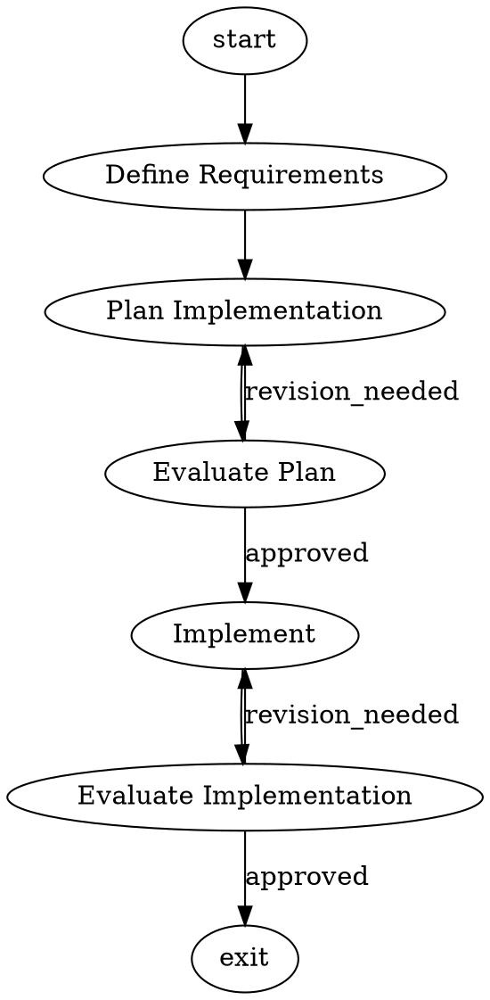

# Story 50-10: Advanced Graph — Pipeline Templates Library

## Story

As a pipeline author,
I want to browse and initialize pre-built DOT graph pipeline templates,
so that I can quickly create well-structured pipelines implementing proven patterns without writing DOT syntax from scratch.

## Acceptance Criteria

### AC1: `factory templates list` Command Displays All Templates
**Given** the `substrate factory templates list` command is run
**When** the command executes
**Then** it prints a formatted list of all available pipeline templates — `trycycle`, `dual-review`, `parallel-exploration`, and `staged-validation` — each with its name and a one-line description; exit code is 0

### AC2: `trycycle` Template Produces Valid Trycycle Pipeline
**Given** `substrate factory templates init --template trycycle` is run in a directory
**When** the command executes
**Then** a file named `pipeline.dot` is created containing a parseable DOT graph that includes at minimum: a `start` node, a `define` node, a `plan` node, an `eval_plan` node, an `implement` node, an `eval_impl` node, and an `exit` node; the eval nodes must have outgoing conditional back-edges enabling iterative refinement (e.g., `eval_plan` can route back to `plan`, `eval_impl` can route back to `implement`)

### AC3: `dual-review` Template Produces Fan-Out/Fan-In Review Pipeline
**Given** `substrate factory templates init --template dual-review` is run
**When** the command executes
**Then** `pipeline.dot` is created containing a parseable DOT graph that includes: an `implement` node, a parallel fan-out node (type matching the handler registered by story 50-1), two independent reviewer branch nodes, and a fan-in node (type matching the handler registered by story 50-2); edges encode the two-reviewer branch structure and the merge back to a single path

### AC4: `parallel-exploration` Template Produces Fan-Out/Fan-In Exploration Pipeline
**Given** `substrate factory templates init --template parallel-exploration` is run
**When** the command executes
**Then** `pipeline.dot` is created with a parseable DOT graph containing: a parallel fan-out node dispatching at least two independent implementation approach branches, a fan-in node that selects the best candidate, and a path to exit; the fan-in node must use the winner-selection mode so the best-scoring branch propagates its context forward

### AC5: `staged-validation` Template Produces Sequential Stage Pipeline
**Given** `substrate factory templates init --template staged-validation` is run
**When** the command executes
**Then** `pipeline.dot` is created with a parseable DOT graph with sequential stages: `implement → lint → test → validate → exit`; each stage is a separate codergen node; there are no parallel nodes in this template

### AC6: Unknown Template Name Exits with Error and Help
**Given** `substrate factory templates init --template nonexistent-template` is run
**When** the command executes
**Then** the process exits with a non-zero exit code, prints an error message that names the unknown template, and lists the available template names so the user can correct their command

### AC7: Unit Tests Cover Template Registry and DOT Content Validity (≥10 cases)
**Given** `packages/factory/src/templates/__tests__/templates.test.ts`
**When** `npm run test:fast` executes
**Then** at least 10 `it(...)` cases pass covering: `listPipelineTemplates()` returns exactly 4 entries; `getPipelineTemplate('trycycle')` returns a defined entry; `getPipelineTemplate('dual-review')` returns a defined entry; `getPipelineTemplate('parallel-exploration')` returns a defined entry; `getPipelineTemplate('staged-validation')` returns a defined entry; `getPipelineTemplate('nonexistent')` returns `undefined`; `parseGraph(trycycle.dotContent)` succeeds without throwing and the parsed graph contains a node with id `eval_plan`; `parseGraph(dual-review.dotContent)` succeeds and the parsed graph has a node whose type matches the parallel handler type string; `parseGraph(parallel-exploration.dotContent)` succeeds and the parsed graph has a fan-in node; `parseGraph(staged-validation.dotContent)` succeeds and the parsed graph contains a node with id `lint`

## Tasks / Subtasks

- [ ] Task 1: Create `packages/factory/src/templates/index.ts` — `PipelineTemplate` interface and registry (AC: #1, #2, #3, #4, #5)
  - [ ] Define and export `interface PipelineTemplate { name: string; description: string; dotContent: string }`
  - [ ] Export `function listPipelineTemplates(): PipelineTemplate[]` that returns all templates from the registry in insertion order
  - [ ] Export `function getPipelineTemplate(name: string): PipelineTemplate | undefined` that looks up by `name` (case-sensitive)
  - [ ] Declare a `const PIPELINE_TEMPLATES: Map<string, PipelineTemplate>` that will hold all four entries; populate it by calling each template builder function defined in subsequent subtasks
  - [ ] All relative imports within the file must use `.js` extensions (ESM)

- [ ] Task 2: Implement the four DOT template string definitions (AC: #2, #3, #4, #5)
  - [ ] Before writing any DOT content, read the actual node type strings registered by stories 50-1 and 50-2: `grep -rn "stack\." packages/factory/src/handlers/registry.ts` and `grep -rn "registerHandler\|'parallel'\|'fan_in'\|stack\." packages/factory/src/handlers/` — record the exact type strings used for parallel fan-out and fan-in nodes
  - [ ] **trycycle** (`pipeline.dot`): `digraph` with nodes `start` (type=start), `define`, `plan`, `eval_plan`, `implement`, `eval_impl` (all type=codergen), `exit` (type=exit); edges form a linear forward path `start→define→plan→eval_plan→implement→eval_impl→exit` with conditional back-edges `eval_plan→plan [label="revision_needed"]` and `eval_impl→implement [label="revision_needed"]`; include a DOT comment block at the top describing the pattern
  - [ ] **dual-review**: nodes `start`, `implement` (codergen), `review_parallel` (type matching story 50-1's parallel handler), `reviewer_a` (codergen), `reviewer_b` (codergen), `review_merge` (type matching story 50-2's fan-in handler), `exit`; edges: `start→implement→review_parallel`; `review_parallel→reviewer_a`, `review_parallel→reviewer_b`; `reviewer_a→review_merge`, `reviewer_b→review_merge`; `review_merge→exit`
  - [ ] **parallel-exploration**: nodes `start`, `explore_parallel` (fan-out, type matching 50-1), `approach_a` (codergen), `approach_b` (codergen), `select_best` (fan-in with winner selection, type matching 50-2), `refine` (codergen), `exit`; edges encode the fan-out and fan-in structure; include a `selection="best"` or equivalent attribute on the fan-in node (check story 50-2 implementation for the correct attribute name)
  - [ ] **staged-validation**: nodes `start`, `implement` (codergen), `lint` (codergen), `test` (codergen), `validate` (codergen), `exit`; purely sequential edges; no parallel nodes; include a DOT comment block describing the pattern

- [ ] Task 3: Create `packages/factory/src/templates/__tests__/templates.test.ts` (AC: #7)
  - [ ] Import `listPipelineTemplates`, `getPipelineTemplate` from `'../index.js'`
  - [ ] Import `parseGraph` from `'../../graph/parser.js'`
  - [ ] Test: `listPipelineTemplates()` returns an array of length 4
  - [ ] Test: `getPipelineTemplate('trycycle')` is defined and has `name === 'trycycle'`
  - [ ] Test: `getPipelineTemplate('dual-review')` is defined and has `name === 'dual-review'`
  - [ ] Test: `getPipelineTemplate('parallel-exploration')` is defined and has `name === 'parallel-exploration'`
  - [ ] Test: `getPipelineTemplate('staged-validation')` is defined and has `name === 'staged-validation'`
  - [ ] Test: `getPipelineTemplate('nonexistent')` returns `undefined`
  - [ ] Test: `parseGraph(trycycle.dotContent)` does not throw; parsed graph contains a node with `id === 'eval_plan'`
  - [ ] Test: `parseGraph(dual_review.dotContent)` does not throw; parsed graph has at least one node whose `type` matches the fan-out parallel type string
  - [ ] Test: `parseGraph(parallel_exploration.dotContent)` does not throw; parsed graph has at least one node whose `type` matches the fan-in type string
  - [ ] Test: `parseGraph(staged_validation.dotContent)` does not throw; parsed graph has a node with `id === 'lint'`
  - [ ] Use `vitest` (`describe`, `it`, `expect`) — no Jest globals; run `npm run test:fast` with `timeout: 300000` and confirm "Test Files" summary line; NEVER pipe output

- [ ] Task 4: Export templates module from package barrel (AC: #1)
  - [ ] Read `packages/factory/src/index.ts` to see what is currently exported
  - [ ] Add an export line: `export { listPipelineTemplates, getPipelineTemplate } from './templates/index.js'` — append after the existing exports, do not alter any existing export lines

- [ ] Task 5: Register `templates` subcommand group in factory-command.ts (AC: #1, #2, #6)
  - [ ] Read `packages/factory/src/factory-command.ts` to locate the last top-level subcommand registration (likely after `context` subcommand); identify the import section at the top of the file
  - [ ] Add import: `import { listPipelineTemplates, getPipelineTemplate } from './templates/index.js'`
  - [ ] After the last existing subcommand registration block, add a `const templatesCmd = factoryCmd.command('templates').description('Manage reusable DOT graph pipeline templates')`
  - [ ] Register `templatesCmd.command('list').description('List available pipeline templates').action(() => { ... })` — the action renders each template as `  <name>  <description>` (padded for alignment) and then exits; no async needed
  - [ ] Register `templatesCmd.command('init').description('Create a pipeline.dot from a template').requiredOption('--template <name>', 'Template name (see: factory templates list)').option('--output <path>', 'Output file path (default: pipeline.dot)', 'pipeline.dot').action(async (opts) => { ... })` — the action calls `getPipelineTemplate(opts.template)`, and if undefined, prints an error listing available names via `listPipelineTemplates()` and calls `process.exit(1)`; otherwise writes `opts.output` with the template's `dotContent` using `writeFile` from `'node:fs/promises'`, then prints a confirmation message

- [ ] Task 6: Run build and tests (AC: all)
  - [ ] Run `npm run build`; confirm zero TypeScript errors
  - [ ] Run `npm run test:fast` with `timeout: 300000`; confirm "Test Files" summary line shows zero failures; NEVER pipe output through `tail`, `head`, `grep`, or any filtering command

## Dev Notes

### Architecture Constraints
- All relative imports within `packages/factory/` MUST use `.js` extensions (ESM): e.g., `import { ... } from './templates/index.js'`
- Factory package MUST NOT import from `@substrate-ai/sdlc` (ADR-003: no circular dependency)
- Template DOT strings are stored inline in TypeScript (not read from disk at runtime), following the same pattern as `packages/factory/src/twins/templates.ts`
- The `PipelineTemplate` type is local to the templates module — do NOT reuse `TwinTemplateEntry` from the twins module; these are parallel but independent
- Do NOT modify any existing handler, graph engine, or event types — this story is purely additive

### Node Type String Discovery
Before writing DOT template content, the dev agent MUST discover the exact type strings used by the parallel and fan-in handlers. Run:
```bash
grep -rn "registerHandler\|'stack\.\|\"stack\." packages/factory/src/handlers/registry.ts
grep -rn "type.*parallel\|type.*fan" packages/factory/src/handlers/
```
Use the exact type strings found (e.g., `stack.parallel`, `stack.fan_in`, etc.) in the DOT template nodes. Guessing the wrong type string will cause templates to fail at runtime.

### DOT Template Format Reference
DOT files used in this project follow this structural pattern (from existing graph engine tests):


Verify this syntax matches the parser by checking existing `.dot` fixture files:
```bash
find packages/factory/src -name "*.dot" | head -5
```

### Fan-In Selection Attribute
For the `parallel-exploration` template's fan-in node, check story 50-2's implementation for the correct attribute name for winner-selection mode. Likely one of:
```
[type="stack.fan_in", selection="best"]
[type="stack.fan_in", mode="best_candidate"]
```
Run: `grep -rn "selection\|best_candidate\|fan.in" packages/factory/src/handlers/fan-in.ts`

### factory-command.ts Subcommand Registration Pattern
Follow the same pattern used by the `context` subcommand group (around line 428 in factory-command.ts). The `templates` command group is top-level under `factory`, not nested under another group. The `writeFile` import should be added alongside any existing `node:fs/promises` imports at the top of the file (or added if not present):
```typescript
import { writeFile } from 'node:fs/promises'
```

### New File Paths
```
packages/factory/src/templates/index.ts                        — template registry and interface
packages/factory/src/templates/__tests__/templates.test.ts     — unit tests (≥10 cases)
```

### Modified File Paths
```
packages/factory/src/factory-command.ts   — add templates subcommand group (list + init)
packages/factory/src/index.ts             — export listPipelineTemplates, getPipelineTemplate
```

### Testing Requirements
- Framework: `vitest` with `describe`, `it`, `expect` — no Jest globals
- Test file lives at `packages/factory/src/templates/__tests__/templates.test.ts`
- Import `parseGraph` from `'../../graph/parser.js'` to validate DOT content
- Do NOT mock the file system or the parser — templates contain inline strings, no I/O required
- Run `npm run build` first (catches TypeScript errors); then `npm run test:fast` with `timeout: 300000`; confirm "Test Files" summary line; NEVER pipe output

## Interface Contracts

- **Export**: `listPipelineTemplates`, `getPipelineTemplate` @ `packages/factory/src/templates/index.ts` (consumed by story 50-11 integration tests)
- **Import**: `parseGraph` @ `packages/factory/src/graph/parser.ts` (used in unit tests to validate template DOT content)

## Dev Agent Record

### Agent Model Used
### Completion Notes List
### File List

## Change Log
