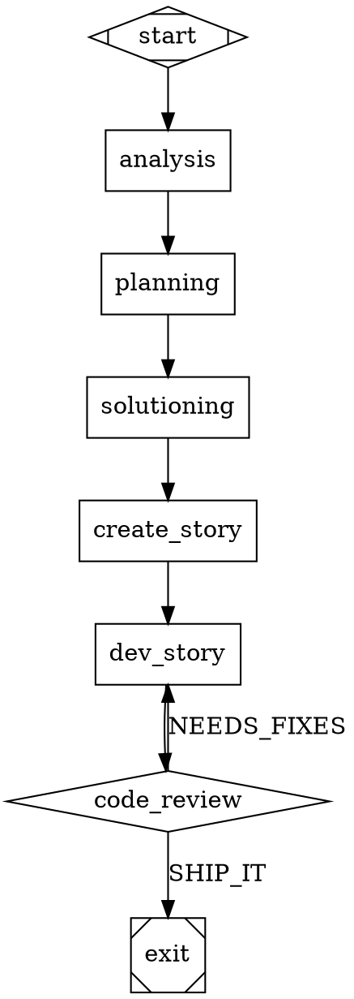

# Technical Architecture: Substrate Software Factory

**Version:** 1.1
**Date:** 2026-03-22
**Author:** John Planow
**Status:** Draft
**Informed by:** PRD v1.0, Product Brief, Phase 0 Technical Research, Attractor Spec, Coding Agent Loop Spec, Unified LLM Spec, Substrate codebase analysis

---

## 1. Extraction Boundary: Module-to-Package Mapping

The most critical architectural decision is where to draw the line between `substrate-core` (general-purpose agent infrastructure), `substrate-sdlc` (existing linear pipeline), and `substrate-factory` (graph engine + factory capabilities). Every module in the current codebase was examined for domain-specific assumptions.

### 1.1 Module Analysis and Package Assignment

| Current Module | Target Package | Rationale | Refactoring Needed |
|---|---|---|---|
| `src/core/event-bus.ts` | **core** | The `TypedEventBus` interface (`emit`, `on`, `off`) is domain-agnostic. However, the `OrchestratorEvents` type map in `event-bus.types.ts` (605 lines) contains SDLC-specific event types: `orchestrator:story-phase-start`, `orchestrator:story-escalated`, `orchestrator:zero-diff-escalation`, etc. alongside genuinely general events (`task:ready`, `task:complete`, `agent:spawned`). | **MAJOR** — Split `OrchestratorEvents` into `CoreEvents` (task, worker, budget, agent, config, routing, provider, version events) and `SdlcEvents` (orchestrator:story-*, plan:*, graph:loaded/complete). Make `TypedEventBus` generic: `TypedEventBus<E extends EventMap>`. SDLC creates `TypedEventBus<CoreEvents & SdlcEvents>`, factory creates `TypedEventBus<CoreEvents & FactoryEvents>`. **Requires updating 17+ call sites across the codebase. Estimated 2-3 stories (covered by 41-1 and associated shim work).** |
| `src/core/types.ts` | **core** | Pure type definitions (`TaskId`, `WorkerId`, `TaskStatus`, `SessionStatus`, `TaskNode`). No domain coupling. | None |
| `src/core/di.ts` | **core** | `BaseService` interface for DI. Domain-agnostic. | None |
| `src/core/errors.ts` | **core** | Base error types. Domain-agnostic. | None |
| `src/modules/routing/` (14 files) | **core** | `RoutingEngine`, `RoutingPolicy`, `ModelRoutingConfig`, `RoutingDecision`, `ProviderStatus`. The routing engine routes tasks to agents — this is pipeline-model-agnostic. `ModelRoutingConfig` uses phase names (`explore`, `generate`, `review`) that are SDLC-flavored but generalize as task-type categories. | **MINOR** — `ModelRoutingConfig.phases` keys are SDLC-named but consumed via `resolveModel(taskType)` which already does string lookup. Keep as-is; factory uses `overrides` for per-node routing. Model stylesheet is a factory-only layer that composes with RoutingPolicy, not replaces it. |
| `src/modules/agent-dispatch/` | **core** | `Dispatcher` interface, `DispatcherImpl`, `DispatchRequest`, `DispatchResult`. Spawns CLI agents as subprocesses. `DEFAULT_TIMEOUTS` and `DEFAULT_MAX_TURNS` contain SDLC task types (`create-story`, `dev-story`, `code-review`) but these are config data, not structural coupling. The `Dispatcher` interface itself is domain-agnostic. | **MINOR** — Move `DEFAULT_TIMEOUTS` and `DEFAULT_MAX_TURNS` SDLC entries to `substrate-sdlc` config. Core provides the `Dispatcher` interface and `DispatcherImpl` with empty defaults; SDLC registers its task-type defaults at startup. |
| `src/modules/telemetry/` (20+ files) | **core** | OTEL pipeline: `EfficiencyScorer`, `Categorizer`, `ConsumerAnalyzer`, `TelemetryNormalizer`, `TurnAnalyzer`, `LogTurnAnalyzer`, `Recommender`, `TelemetryPipeline`, `TelemetryAdvisor`, `IngestionServer`, `BatchBuffer`. The `Categorizer` classifies task types by name — it uses SDLC names (`dev-story` → `generate`) but this is a mapping table, not structural. | **MINOR** — Extract category mapping table to a configurable `TaskCategoryMap`. Core provides the pipeline; SDLC and factory provide their own category maps. |
| `src/modules/supervisor/` | **core** | `analyzeTokenEfficiency`, `analyzeReviewCycles`, `analyzeTimings`, `generateRecommendations`, `Experimenter`. `analyzeReviewCycles` is SDLC-specific (expects `StoryPhase` semantics). The rest is general analysis over telemetry data. | **MINOR** — Move `analyzeReviewCycles` to SDLC. Keep efficiency analysis, timing analysis, recommendations, experimenter in core. |
| `src/persistence/` | **core** | `DatabaseAdapter` interface (query, exec, transaction, close), `InMemoryDatabaseAdapter`, `DoltDatabaseAdapter`, `initSchema`, all query modules. The schema DDL (`schema.ts`) creates SDLC-flavored tables (`sessions`, `tasks`, `pipeline_runs`, `decisions`) but these are general enough for any pipeline model. | **MINOR** — `initSchema` stays in core (tables are general). Factory adds new tables (`graph_runs`, `scenario_results`) via extension DDL, not by modifying core schema. **Required change:** `queryReadyStories()` must move out of core `DatabaseAdapter` — it is SDLC-specific. Move to an SDLC-specific query layer or adapter extension in `packages/sdlc/src/persistence/`. |
| `src/modules/config/` | **core** | `ConfigSystem`, `config-schema.ts` (SubstrateConfig with providers, global, budget, cost_tracker, telemetry). The `TokenCeilingsSchema` has SDLC workflow keys (`create-story`, `dev-story`, `code-review`). | **YES** — Move `TokenCeilingsSchema` to SDLC. Core `SubstrateConfig` contains only provider-agnostic fields (global, providers, cost_tracker, budget, telemetry). SDLC and factory extend with their own config sections via `z.intersection` or a plugin config pattern. |
| `src/modules/context-compiler/` | **core** | `ContextCompiler` interface with `compile(descriptor)` and `registerTemplate(template)`. The interface is task-type-agnostic — templates are registered externally. | None |
| `src/modules/repo-map/` | **core** | Repository map generation, symbol parsing, storage. Language-agnostic code intelligence. No SDLC coupling. | None |
| `src/modules/cost-tracker/` | **core** | `CostTracker`, `CostEntry`, token rate tables. Domain-agnostic cost accounting. | None |
| `src/modules/budget/` | **core** | `BudgetTracker`. Domain-agnostic budget enforcement. | None |
| `src/modules/monitor/` | **core** | `MonitorAgent`, performance aggregates, recommendation engine. General telemetry monitoring. | None |
| `src/modules/worker/` | **core** | `WorkerManager`. General subprocess lifecycle management. | None |
| `src/modules/git/` | **core** | `GitManager`. General git operations. | None |
| `src/modules/project-profile/` | **core** | Project language/stack detection. Used by both SDLC and factory for language-agnostic operation. | None |
| `src/adapters/` | **core** | `AdapterRegistry`, `WorkerAdapter`, `ClaudeCodeAdapter`, `CodexCLIAdapter`, `GeminiCLIAdapter`. CLI agent adapters are pipeline-agnostic. | None |
| `src/modules/phase-orchestrator/` | **sdlc** | `PhaseOrchestrator`, `PhaseDefinition` with entry/exit gates, `built-in-phases.ts` (analysis, planning, solutioning). This IS the linear pipeline. Entirely SDLC-specific. | None — moves whole. |
| `src/modules/implementation-orchestrator/` (~2,700 lines) | **sdlc** | `ImplementationOrchestrator`, `OrchestratorConfig` (with `maxReviewCycles`), `StoryPhase` state machine, escalation diagnosis, conflict detection, contract verification, package snapshot. The heart of the SDLC story loop. | None — moves whole. |
| `src/modules/compiled-workflows/` | **sdlc** | `create-story.ts`, `dev-story.ts`, `code-review.ts`, `test-plan.ts`, `test-expansion.ts`, `prompt-assembler.ts`, `story-complexity.ts`, `interface-contracts.ts`, schemas. SDLC workflow definitions. | None — moves whole. |
| `src/modules/methodology-pack/` | **sdlc** | BMAD methodology pack loading and types. SDLC-specific. | None — moves whole. |
| `src/modules/work-graph/` | **sdlc** | Epic ingestion, story dependency detection, cycle detection. SDLC-specific story dependency management. | None — moves whole. |
| `src/modules/state/` | **sdlc** | Dolt state store, file store, work graph repository. `StoryRecord`, `ContractRecord` types are SDLC-specific. | **SPLIT** — `DoltClient`, `dolt-init.ts` to core (general Dolt operations). `dolt-store.ts` (story-record-shaped), `file-store.ts` (story-record-shaped), `work-graph-repository.ts` to SDLC. **Note:** The `StateStore` interface is coupled to `StoryPhase`. Factory uses a parallel `GraphStateStore` interface in the factory package, not the SDLC `StateStore`. |
| `src/modules/quality-gates/` | **core** | Gate registry, gate pipeline, gate types. The gate pattern (register check, evaluate, report) is general-purpose. | None |
| `src/modules/stop-after/` | **sdlc** | Stop-after-phase logic. SDLC phase-sequence-specific. | None — moves whole. |
| `src/modules/export/` | **sdlc** | Pipeline result export. SDLC-specific output format. | None — moves whole. |
| `src/modules/git-worktree/` | **core** | Git worktree management for parallel execution. General-purpose. | None |
| `src/modules/version-manager/` | **core** | CLI version checking. Domain-agnostic. | None |
| `src/modules/amendment-handlers/` | **sdlc** | Story amendment handling. SDLC-specific. | None — moves whole. |
| `src/modules/debate-panel/` | **sdlc** | Multi-agent debate for quality. SDLC-specific. | None — moves whole. |
| `src/modules/delta-document/` | **sdlc** | Document diffing for story changes. SDLC-specific. | None — moves whole. |
| `src/modules/hello-world/` | **core** | Smoke test module. | None |

### 1.2 Summary Table

| Package | Module Count | Key Modules |
|---------|-------------|-------------|
| **substrate-core** | ~20 | event-bus, routing, agent-dispatch, telemetry, supervisor (partial), persistence, config, context-compiler, repo-map, cost-tracker, budget, monitor, worker, git, git-worktree, project-profile, adapters, quality-gates, version-manager |
| **substrate-sdlc** | ~12 | phase-orchestrator, implementation-orchestrator, compiled-workflows, methodology-pack, work-graph, state (partial), stop-after, export, amendment-handlers, debate-panel, delta-document |
| **substrate-factory** | New | graph-engine, scenario-store, scenario-runner, satisfaction-scorer, convergence-controller, codergen-backend, model-stylesheet, factory-cli |

---

## 2. Package Structure

### 2.1 Monorepo Directory Layout

```
substrate/
├── packages/
│   ├── core/                          # @substrate-ai/core
│   │   ├── src/
│   │   │   ├── adapters/              # AdapterRegistry, WorkerAdapter, CLI adapters
│   │   │   ├── config/                # ConfigSystem, base config schema
│   │   │   ├── context/               # ContextCompiler, repo-map, token-counter
│   │   │   ├── dispatch/              # Dispatcher interface and impl
│   │   │   ├── events/                # TypedEventBus, CoreEvents
│   │   │   ├── persistence/           # DatabaseAdapter, schema, queries
│   │   │   ├── routing/               # RoutingEngine, RoutingPolicy, ModelRoutingConfig
│   │   │   ├── supervisor/            # Analysis, experimenter (no review-cycle analysis)
│   │   │   ├── telemetry/             # OTEL pipeline, cost tracking, efficiency scoring
│   │   │   ├── quality-gates/         # Gate registry, pipeline, types
│   │   │   ├── git/                   # GitManager, git-worktree
│   │   │   ├── budget/                # BudgetTracker
│   │   │   ├── monitor/               # MonitorAgent, recommendations
│   │   │   ├── worker/                # WorkerManager
│   │   │   ├── project-profile/       # Language/stack detection
│   │   │   ├── types.ts               # TaskId, WorkerId, TaskNode, etc.
│   │   │   ├── errors.ts              # Base error types
│   │   │   ├── di.ts                  # BaseService interface
│   │   │   └── index.ts               # Public API barrel export
│   │   ├── package.json
│   │   └── tsconfig.json
│   │
│   ├── sdlc/                          # @substrate-ai/sdlc
│   │   ├── src/
│   │   │   ├── orchestrator/          # Phase + Implementation orchestrators
│   │   │   ├── workflows/             # create-story, dev-story, code-review, prompts
│   │   │   ├── packs/                 # Methodology packs (BMAD)
│   │   │   ├── state/                 # Dolt store, file store, work-graph repo
│   │   │   ├── work-graph/            # Epic ingestion, story deps, cycle detection
│   │   │   ├── events.ts              # SdlcEvents type map
│   │   │   ├── config.ts              # SDLC config extensions (TokenCeilings, etc.)
│   │   │   └── index.ts
│   │   ├── graphs/
│   │   │   └── sdlc-pipeline.dot      # SDLC pipeline expressed as DOT graph
│   │   ├── package.json
│   │   └── tsconfig.json
│   │
│   └── factory/                       # @substrate-ai/factory
│       ├── src/
│       │   ├── graph/                 # Parser, validator, executor, edge-selector
│       │   │   ├── parser.ts          # DOT parser (ts-graphviz wrapper)
│       │   │   ├── validator.ts       # 13 lint rules
│       │   │   ├── transformer.ts     # Stylesheet, variable expansion
│       │   │   ├── executor.ts        # Core execution loop
│       │   │   ├── edge-selector.ts   # 5-step edge selection algorithm
│       │   │   ├── checkpoint.ts      # Checkpoint manager
│       │   │   └── types.ts           # Graph, Node, Edge, Outcome, Context
│       │   ├── handlers/              # Node type handlers
│       │   │   ├── registry.ts        # Handler registry
│       │   │   ├── start.ts
│       │   │   ├── exit.ts
│       │   │   ├── codergen.ts
│       │   │   ├── conditional.ts
│       │   │   ├── wait-human.ts
│       │   │   ├── parallel.ts
│       │   │   ├── fan-in.ts
│       │   │   ├── tool.ts
│       │   │   └── manager-loop.ts
│       │   ├── backend/               # CodergenBackend implementations
│       │   │   ├── types.ts           # CodergenBackend interface
│       │   │   ├── cli-backend.ts     # CLICodergenBackend (wraps Dispatcher)
│       │   │   └── direct-backend.ts  # DirectCodergenBackend (Phase C)
│       │   ├── scenarios/             # Scenario validation
│       │   │   ├── store.ts           # Scenario discovery, integrity checking
│       │   │   ├── runner.ts          # Shell-script execution, structured results
│       │   │   └── scorer.ts          # Satisfaction scoring algorithm
│       │   ├── convergence/           # Convergence controller
│       │   │   ├── controller.ts      # Goal gate evaluation, retry routing
│       │   │   ├── budget.ts          # Per-node, per-pipeline, per-session budgets
│       │   │   └── plateau.ts         # Diminishing returns detection
│       │   ├── stylesheet/            # Model stylesheet parser
│       │   │   ├── parser.ts          # CSS-like syntax parser
│       │   │   └── resolver.ts        # Specificity resolution
│       │   ├── events.ts              # FactoryEvents type map
│       │   ├── config.ts              # Factory config extensions
│       │   └── index.ts
│       ├── package.json
│       └── tsconfig.json
│
├── src/                               # Shim layer (re-exports for backward compat)
│   ├── core/
│   │   ├── event-bus.ts               # re-exports from @substrate-ai/core
│   │   └── types.ts                   # re-exports from @substrate-ai/core
│   └── modules/
│       └── ...                        # re-exports from @substrate-ai/sdlc
│
├── package.json                       # Root workspace config
├── tsconfig.json                      # Root project references
└── tsconfig.base.json                 # Shared compiler options
```

### 2.2 Workspace Configuration

**Root `package.json`:**
```json
{
  "name": "substrate-ai",
  "private": true,
  "workspaces": ["packages/core", "packages/sdlc", "packages/factory"],
  "scripts": {
    "build": "tsc --build",
    "test": "vitest run",
    "test:fast": "vitest run --exclude '**/e2e/**'"
  }
}
```

**Root `tsconfig.json`:**
```json
{
  "files": [],
  "references": [
    { "path": "packages/core" },
    { "path": "packages/sdlc" },
    { "path": "packages/factory" }
  ]
}
```

**`packages/factory/tsconfig.json`:**
```json
{
  "extends": "../../tsconfig.base.json",
  "compilerOptions": {
    "outDir": "dist",
    "rootDir": "src",
    "composite": true
  },
  "references": [
    { "path": "../core" }
  ],
  "include": ["src/**/*.ts"]
}
```

### 2.3 Import Strategy and Backward Compatibility

**Cross-package imports use package names:**
```typescript
// In packages/factory/src/backend/cli-backend.ts
import type { Dispatcher, DispatchRequest, DispatchResult } from '@substrate-ai/core'
import type { TypedEventBus } from '@substrate-ai/core'
```

**Re-export shims maintain existing import paths during migration:**
```typescript
// src/core/event-bus.ts (shim)
export { TypedEventBus, TypedEventBusImpl } from '@substrate-ai/core'
export type { TypedEventBus } from '@substrate-ai/core'
```

Shims are kept for one major version after extraction. TypeScript project references enforce that `@substrate-ai/sdlc` and `@substrate-ai/factory` import only from `@substrate-ai/core`, never from each other and never from core internals.

---

## 3. Graph Engine Architecture

### 3.1 Core Type Definitions

```typescript
// packages/factory/src/graph/types.ts

/** Status of a node handler execution */
type StageStatus = 'SUCCESS' | 'FAIL' | 'PARTIAL_SUCCESS' | 'RETRY' | 'SKIPPED'

/** Context fidelity mode controlling how much prior state carries forward */
type FidelityMode =
  | 'full' | 'truncate' | 'compact'
  | 'summary:low' | 'summary:medium' | 'summary:high'

/** Parsed graph node */
interface GraphNode {
  id: string
  label: string
  shape: string
  type: string                           // Explicit handler type (overrides shape)
  prompt: string
  maxRetries: number
  goalGate: boolean
  retryTarget: string
  fallbackRetryTarget: string
  fidelity: FidelityMode | ''
  threadId: string
  class: string                          // Comma-separated class names
  timeout: number | undefined            // Milliseconds
  llmModel: string
  llmProvider: string
  reasoningEffort: 'low' | 'medium' | 'high'
  autoStatus: boolean
  allowPartial: boolean
  attributes: Record<string, string>     // All raw attributes for custom handlers
}

/** Parsed graph edge */
interface GraphEdge {
  fromNode: string
  toNode: string
  label: string
  condition: string
  weight: number
  fidelity: FidelityMode | ''
  threadId: string
  loopRestart: boolean
}

/** Parsed graph with metadata */
interface Graph {
  id: string
  goal: string
  label: string
  modelStylesheet: string
  defaultMaxRetries: number
  retryTarget: string
  fallbackRetryTarget: string
  defaultFidelity: FidelityMode | ''
  nodes: Map<string, GraphNode>
  edges: GraphEdge[]
  outgoingEdges(nodeId: string): GraphEdge[]
  startNode(): GraphNode
  exitNode(): GraphNode
}

/** Thread-safe key-value context shared across nodes */
interface GraphContext {
  get(key: string, defaultValue?: unknown): unknown
  getString(key: string, defaultValue?: string): string
  set(key: string, value: unknown): void
  applyUpdates(updates: Record<string, unknown>): void
  snapshot(): Record<string, unknown>
  clone(): GraphContext
  appendLog(entry: string): void
  logs(): readonly string[]
}

/** Result of a node handler execution */
interface Outcome {
  status: StageStatus
  preferredLabel?: string
  suggestedNextIds?: string[]
  contextUpdates?: Record<string, unknown>
  notes?: string
  failureReason?: string
}

/** Serializable execution snapshot */
interface Checkpoint {
  timestamp: string                      // ISO 8601
  currentNode: string
  completedNodes: string[]
  nodeRetries: Record<string, number>
  contextValues: Record<string, unknown>
  logs: string[]
}

/** LLM execution backend interface */
interface CodergenBackend {
  run(node: GraphNode, prompt: string, context: GraphContext): Promise<string | Outcome>
}

/** Node handler interface */
interface NodeHandler {
  execute(
    node: GraphNode,
    context: GraphContext,
    graph: Graph,
    logsRoot: string
  ): Promise<Outcome>
}
```

### 3.2 DOT Parser Integration

The parser wraps `ts-graphviz` to produce the `Graph` model:

```
DOT source (string)
  → ts-graphviz.fromDOT()           // Raw AST
  → extractGraphAttributes()         // goal, stylesheet, defaults
  → expandChainedEdges()             // A -> B -> C → (A→B, B→C)
  → flattenSubgraphs()               // Derive class names from subgraph labels
  → applyNodeDefaults()              // node [...] blocks
  → applyEdgeDefaults()              // edge [...] blocks
  → Graph model                      // Typed Graph, GraphNode[], GraphEdge[]
```

**ADR-001: Use ts-graphviz, do not build a custom parser.** The library is actively maintained (Feb 2026), fully typed, and handles DOT syntax parsing including subgraphs, attribute blocks, and chained edges. Substrate adds a typed attribute extraction layer on top — the parser focuses on DOT syntax, substrate focuses on semantic interpretation of Attractor-specific attributes.

### 3.3 Graph Validator (13 Lint Rules)

The validator produces a diagnostics list. Error-severity diagnostics block execution; warning-severity diagnostics are logged but allow execution.

```typescript
interface ValidationDiagnostic {
  ruleId: string
  severity: 'error' | 'warning'
  message: string
  nodeId?: string
  edgeIndex?: number
}

interface GraphValidator {
  validate(graph: Graph): ValidationDiagnostic[]
  validateOrRaise(graph: Graph): void    // Throws on any error-level diagnostic
  registerRule(rule: LintRule): void      // Custom rule extension point
}

interface LintRule {
  id: string
  severity: 'error' | 'warning'
  check(graph: Graph): ValidationDiagnostic[]
}
```

**Error rules (8):** `start_node`, `terminal_node`, `reachability`, `edge_target_exists`, `start_no_incoming`, `exit_no_outgoing`, `condition_syntax`, `stylesheet_syntax`.

**Warning rules (5):** `type_known`, `fidelity_valid`, `retry_target_exists`, `goal_gate_has_retry`, `prompt_on_llm_nodes`.

Each rule is a standalone `LintRule` implementation. The validator iterates all registered rules and collects diagnostics. Custom rules can be registered for project-specific validation.

### 3.4 Graph Transformer Pipeline

Applied after parsing, before validation:

1. **Model stylesheet** — Parse CSS-like syntax from `model_stylesheet` attribute. Resolve selectors by specificity (`*` < shape < `.class` < `#id`). Apply `llm_model`, `llm_provider`, `reasoning_effort` to matching nodes. Explicit node attributes override stylesheet values.

2. **Variable expansion** — Replace `$goal` in node `prompt` attributes with `graph.goal`. Simple string replacement, not a templating engine.

3. **Custom transforms** — Extension point for user-defined AST transforms (future).

### 3.5 Graph Executor (Core Loop)

The executor implements the pseudocode from Attractor spec Section 3.2 as an async TypeScript function:

```typescript
interface GraphExecutorConfig {
  logsRoot: string
  backend: CodergenBackend
  handlerRegistry: HandlerRegistry
  eventBus: TypedEventBus<CoreEvents & FactoryEvents>
  checkpointPath?: string               // Resume from checkpoint
}

interface GraphExecutor {
  run(graph: Graph, config: GraphExecutorConfig): Promise<Outcome>
}
```

**Execution steps per iteration:**
1. Check if current node is terminal → evaluate goal gates
2. Resolve handler from registry (explicit type → shape → default codergen)
3. Execute handler with retry policy (exponential backoff + jitter)
4. Record completion, apply context updates
5. Write checkpoint
6. Select next edge (5-step algorithm)
7. Handle `loop_restart` if set
8. Advance to next node

**Concurrency model:** Single-threaded graph traversal. Parallelism exists only inside the `parallel` handler, which clones contexts and executes branches concurrently with bounded parallelism.

### 3.6 Handler Registry

```typescript
interface HandlerRegistry {
  register(typeString: string, handler: NodeHandler): void
  resolve(node: GraphNode): NodeHandler
}
```

Resolution order: (1) explicit `type` attribute, (2) shape-to-handler mapping, (3) default codergen handler. This matches the Attractor spec Section 4.2 exactly.

### 3.7 Checkpoint Manager

```typescript
interface CheckpointManager {
  save(checkpoint: Checkpoint, path: string): Promise<void>
  load(path: string): Promise<Checkpoint>
  resume(graph: Graph, checkpoint: Checkpoint): GraphContext  // Restores context, sets up skip list
}
```

Checkpoints are file-backed JSON at `{logsRoot}/checkpoint.json`. Written after every node completion — never mid-node. On resume, the first resumed node degrades from `full` to `summary:high` fidelity (in-memory LLM sessions are not serializable), then subsequent nodes may use `full` again.

---

## 4. SDLC-as-Graph Mapping

This section proves the graph engine can express the existing linear pipeline with zero behavioral change.

### 4.1 Current Linear Pipeline Flow

```
PhaseOrchestrator.startRun()
  → analysis phase (entry gates → dispatch → exit gates)
  → planning phase (entry gates → dispatch → exit gates)
  → solutioning phase (entry gates → dispatch → exit gates)
  → ImplementationOrchestrator.start()
      → for each story:
          create-story → dev-story → code-review
          → SHIP_IT? → complete
          → NEEDS_FIXES? → dev-story → code-review (up to maxReviewCycles)
          → exhausted? → escalate
```

### 4.2 DOT Graph Equivalent



### 4.3 Mapping Details

| SDLC Concept | Graph Equivalent | Notes |
|---|---|---|
| `PhaseOrchestrator.advancePhase()` | Edge traversal between phase nodes | Entry/exit gates become pre/post checks in custom `sdlc.phase` handler |
| `StoryPhase` state machine | Node traversal sequence | PENDING → current node, IN_DEV → `dev_story`, IN_REVIEW → `code_review` |
| `maxReviewCycles` | `max_retries=2` on `dev_story` | `max_retries=2` means 3 total attempts (1 initial + 2 retries), same as `maxReviewCycles=2` |
| SHIP_IT verdict | Condition edge `outcome=success` → exit | Code review handler returns SUCCESS or FAIL |
| NEEDS_FIXES verdict | Condition edge `outcome=fail` → dev_story | Retry loop via edge, not imperative code |
| Escalation | Goal gate unsatisfied, retries exhausted → FAIL | `goal_gate=true` on dev_story blocks exit until SUCCESS |
| Concurrent stories | Outer loop (not in graph) | The graph represents a single story. Multi-story concurrency is managed by the SDLC orchestrator that runs one graph instance per concurrent slot |

### 4.4 Custom SDLC Handlers

The SDLC-as-graph uses custom handler types registered by `substrate-sdlc`:

```typescript
// packages/sdlc/src/handlers/sdlc-phase-handler.ts
class SdlcPhaseHandler implements NodeHandler {
  async execute(node, context, graph, logsRoot): Promise<Outcome> {
    // Delegates to existing PhaseOrchestrator logic for entry/exit gates
    // and phase dispatch
  }
}

// packages/sdlc/src/handlers/sdlc-dev-story-handler.ts
class SdlcDevStoryHandler implements NodeHandler {
  async execute(node, context, graph, logsRoot): Promise<Outcome> {
    // Wraps existing runDevStory() compiled workflow
    // Returns Outcome with SUCCESS/FAIL mapped from DevStoryResult
  }
}
```

These handlers are thin adapters that delegate to the existing compiled workflow functions, preserving behavioral parity.

---

## 5. Scenario Validation Architecture

### 5.1 Scenario Store

**Location:** `.substrate/scenarios/` within the project root. Gitignored. Excluded from agent context by the ContextCompiler (scenario directory added to exclusion list).

**Discovery:** The runner finds all executable files matching `scenario-*.sh`, `scenario-*.py`, `scenario-*.js`, or `scenario-*.ts` in the scenario directory.

**Isolation mechanism:**
1. Scenario directory is added to `.gitignore` during `substrate init`
2. ContextCompiler's file exclusion list includes `.substrate/scenarios/`
3. Agent dispatch working directories never include the scenario path
4. SHA-256 checksums computed before pipeline run, verified before each scenario execution. Modification triggers a pipeline error (not a false pass).

```typescript
interface ScenarioStore {
  discover(scenarioDir: string): Promise<ScenarioFile[]>
  computeChecksums(scenarios: ScenarioFile[]): Promise<ScenarioManifest>
  verifyIntegrity(manifest: ScenarioManifest): Promise<boolean>
}

interface ScenarioFile {
  path: string
  name: string                           // e.g., "scenario-login-flow"
  extension: string                      // sh, py, js, ts
  checksum: string                       // SHA-256
  weight?: number                        // From optional YAML frontmatter
}

interface ScenarioManifest {
  scenarios: ScenarioFile[]
  computedAt: string                     // ISO 8601
  checksums: Record<string, string>      // path → SHA-256
}
```

### 5.2 Scenario Runner

Executes scenarios in a separate process and returns structured results.

```typescript
interface ScenarioRunner {
  run(manifest: ScenarioManifest, workingDir: string): Promise<ScenarioRunResult>
}

interface ScenarioRunResult {
  scenarios: ScenarioResult[]
  summary: { total: number; passed: number; failed: number }
  durationMs: number
}

interface ScenarioResult {
  name: string
  status: 'pass' | 'fail'
  exitCode: number
  stdout: string                         // Optional JSON for structured details
  stderr: string
  durationMs: number
}
```

**Execution model:** Each scenario file is executed as a child process with the project's working directory as CWD. Exit code 0 = pass, non-zero = fail. If stdout contains valid JSON, it is parsed and attached as structured details.

### 5.3 Satisfaction Scorer

```typescript
interface SatisfactionScorer {
  compute(results: ScenarioRunResult, weights?: ScenarioWeights): SatisfactionScore
}

interface SatisfactionScore {
  score: number                          // 0.0 to 1.0
  breakdown: ScenarioScoreDetail[]
  threshold: number                      // Configured threshold for goal gate pass
  passes: boolean                        // score >= threshold
}

interface ScenarioScoreDetail {
  name: string
  passed: boolean
  weight: number
  contribution: number                   // weight * (passed ? 1 : 0) / totalWeight
}

type ScenarioWeights = Record<string, number>  // scenario name → weight
```

**Scoring algorithm:** Weighted average. Each scenario contributes `weight * (passed ? 1 : 0)`. Default weight is 1.0. Score = `sum(contributions) / sum(weights)`. The threshold (default 0.8) determines goal gate pass/fail.

### 5.4 Scenario as Graph Node

Scenario validation runs as a `tool` node type in the graph. The `tool_command` attribute points to a substrate CLI subcommand that invokes the scenario runner:

```dot
validate [shape=parallelogram, type="tool",
          tool_command="substrate scenarios run --format json",
          label="Validate against holdout scenarios"]
```

The tool handler captures stdout (JSON scenario results), parses it, computes the satisfaction score, and writes the score into the context as `context.satisfaction_score`. The subsequent conditional node evaluates `satisfaction_score>=0.8` to determine pass/fail routing.

---

## 6. Convergence Controller

### 6.1 Goal Gate Implementation

At the Attractor spec level, goal gates are evaluated when the traversal reaches a terminal node (shape=Msquare). The convergence controller implements the check:

```typescript
interface ConvergenceController {
  checkGoalGates(graph: Graph, nodeOutcomes: Map<string, Outcome>): GoalGateResult
  resolveRetryTarget(failedNode: GraphNode, graph: Graph): string | null
}

interface GoalGateResult {
  satisfied: boolean
  failedGate: GraphNode | null
  allGates: GoalGateCheck[]
}

interface GoalGateCheck {
  nodeId: string
  outcome: StageStatus
  satisfied: boolean
}
```

**Evaluation:** For every visited node where `goalGate === true`, check if the recorded outcome is `SUCCESS` or `PARTIAL_SUCCESS`. If any gate node has a non-success outcome, the pipeline cannot exit.

### 6.2 Retry Routing (4-Level Resolution Chain)

When a goal gate is unsatisfied at the exit node, the retry target is resolved in this order:

1. **Node-level `retryTarget`** — The failing goal gate node's own `retryTarget` attribute
2. **Node-level `fallbackRetryTarget`** — The failing node's fallback
3. **Graph-level `retryTarget`** — The graph's global retry target
4. **Graph-level `fallbackRetryTarget`** — The graph's global fallback
5. **FAIL** — No retry target found; pipeline fails

This chain is implemented as a simple sequential lookup with early return.

### 6.3 Budget Enforcement

Three-level budget enforcement prevents unbounded cost:

```typescript
interface BudgetEnforcer {
  checkNodeBudget(nodeId: string, retryCount: number, maxRetries: number): BudgetDecision
  checkPipelineBudget(totalCostUsd: number, capUsd: number): BudgetDecision
  checkSessionBudget(wallClockMs: number, capMs: number): BudgetDecision
}

type BudgetDecision = { allowed: true } | { allowed: false; reason: string }
```

| Level | Control | Default | Enforcement Point |
|---|---|---|---|
| Per-node | `max_retries` attribute | `graph.default_max_retries` (default 0) | Before each retry in `execute_with_retry` |
| Per-pipeline | `budget_cap_usd` in factory config | `0` (unlimited) | Before each node dispatch |
| Per-session | `wall_clock_cap_ms` in factory config | `0` (unlimited) | Before each node dispatch |

### 6.4 Diminishing Returns Detection

```typescript
interface PlateauDetector {
  recordScore(iteration: number, score: number): void
  isPlateaued(): boolean
}
```

**Algorithm:** Track the last N satisfaction scores (configurable, default N=3). If the absolute delta between the max and min of the window is less than the threshold (default 0.05), declare plateau. On plateau detection, escalate instead of retrying — further iterations are unlikely to improve the result.

### 6.5 Remediation Context Injection

On retry, the convergence controller injects structured remediation context into the retried node's `GraphContext`:

```typescript
interface RemediationContext {
  previousFailureReason: string
  scenarioDiff: string                   // Which scenarios failed and why
  iterationCount: number
  satisfactionScoreHistory: number[]
  fixScope: string                       // Focused instruction for what to fix
}
```

This context is set as `context.remediation` before the retry dispatch, enabling the CodergenBackend to include it in the agent's prompt. The agent sees "last time you failed scenarios X and Y because Z — focus on fixing those specific issues."

---

## 7. CodergenBackend

### 7.1 Interface

```typescript
// packages/factory/src/backend/types.ts

interface CodergenBackend {
  run(node: GraphNode, prompt: string, context: GraphContext): Promise<string | Outcome>
}
```

The backend receives the full `GraphNode` (including `llmModel`, `llmProvider`, `reasoningEffort`, `timeout`), the expanded prompt string, and the current context. It returns either a plain string (which the codergen handler wraps into a SUCCESS Outcome) or a full `Outcome` object.

### 7.2 CLICodergenBackend (Phase A-B)

Wraps the existing `Dispatcher.dispatch()` with zero behavioral change.

```typescript
class CLICodergenBackend implements CodergenBackend {
  constructor(
    private dispatcher: Dispatcher,
    private routingResolver?: RoutingResolver
  ) {}

  async run(node: GraphNode, prompt: string, context: GraphContext): Promise<Outcome> {
    const request: DispatchRequest = {
      prompt,
      agent: this.resolveAgent(node),
      taskType: node.type || 'codergen',
      timeout: node.timeout,
      model: node.llmModel || undefined,
      maxTurns: this.resolveMaxTurns(node),
      workingDirectory: context.getString('workingDirectory', process.cwd()),
    }

    const handle = this.dispatcher.dispatch(request)
    const result = await handle.result

    return this.mapResult(result)
  }

  private mapResult(result: DispatchResult): Outcome {
    if (result.status === 'completed' && result.exitCode === 0) {
      return {
        status: 'SUCCESS',
        notes: `Dispatch completed: ${result.id}`,
        contextUpdates: { 'last_dispatch_output': result.output.slice(0, 500) }
      }
    }
    return {
      status: 'FAIL',
      failureReason: `Dispatch ${result.status}: exit code ${result.exitCode}`,
    }
  }
}
```

**GraphNode to DispatchRequest mapping:**

| GraphNode Attribute | DispatchRequest Field | Derivation |
|---|---|---|
| `prompt` (after `$goal` expansion) | `prompt` | Direct mapping |
| `type` (e.g., `"sdlc.dev-story"`) | `taskType` | Direct mapping; defaults to `"codergen"` if no explicit type |
| `timeout` | `timeout` | Direct mapping in milliseconds; falls back to `DEFAULT_TIMEOUTS[taskType]` |
| `llmModel` | `model` | Direct mapping; `undefined` if not set (routing engine resolves) |
| `maxRetries` | (not mapped) | Handled by graph executor retry loop, not by Dispatcher |
| node `attributes["max_turns"]` | `maxTurns` | Extracted from raw attributes; falls back to `DEFAULT_MAX_TURNS[taskType]` |
| `context.getString('workingDirectory')` | `workingDirectory` | From GraphContext; defaults to `process.cwd()` |
| (inferred from `type` or shape) | `agent` | Resolved via `AdapterRegistry` based on taskType |

### 7.3 DirectCodergenBackend (Phase C)

Implements the Coding Agent Loop spec. Manages the agentic loop in-process: build request, call LLM via Unified LLM Client, dispatch tools, truncate output, inject steering, detect loops.

```typescript
// Phase C — interface defined now, implementation deferred
class DirectCodergenBackend implements CodergenBackend {
  constructor(
    private llmClient: UnifiedLLMClient,
    private toolRegistry: ToolRegistry,
    private executionEnvironment: ExecutionEnvironment
  ) {}

  async run(node: GraphNode, prompt: string, context: GraphContext): Promise<Outcome> {
    // Implements Coding Agent Loop spec:
    // 1. Build request with provider-aligned tools
    // 2. Call LLM (single-shot, not SDK loop)
    // 3. If tool_calls: execute, truncate, steering check, loop
    // 4. If text-only: natural completion
    // 5. Map final state to Outcome
    throw new Error('DirectCodergenBackend not yet implemented (Phase C)')
  }
}
```

**ADR-002: Ship CLICodergenBackend first.** The CLI backend wraps the existing battle-tested Dispatcher with zero migration cost. It proves the graph engine works before investing in direct API integration. The DirectCodergenBackend is Phase C because convergence loops in Phase B do not require per-turn control — the scenario-based feedback loop operates at the node level, not the turn level.

---

## 8. Event System Evolution

### 8.1 Generic Event Bus

The current `TypedEventBus` is parameterized to `OrchestratorEvents`. The extraction makes it generic:

```typescript
// packages/core/src/events/event-bus.ts

interface EventMap {
  [event: string]: unknown
}

interface TypedEventBus<E extends EventMap = CoreEvents> {
  emit<K extends keyof E>(event: K, payload: E[K]): void
  on<K extends keyof E>(event: K, handler: (payload: E[K]) => void): void
  off<K extends keyof E>(event: K, handler: (payload: E[K]) => void): void
}
```

### 8.2 Event Map Layering

```typescript
// packages/core — general events
interface CoreEvents {
  'task:ready': { taskId: string; taskType?: string }
  'task:started': { taskId: string; workerId: string; agent: string }
  'task:complete': { taskId: string; result: TaskResult; taskType?: string }
  'task:failed': { taskId: string; error: TaskError }
  'agent:spawned': { dispatchId: string; agent: string; taskType: string }
  'agent:completed': { dispatchId: string; exitCode: number; output: string }
  'agent:failed': { dispatchId: string; error: string; exitCode: number }
  'budget:warning': { taskId: string; currentSpend: number; limit: number }
  'config:reloaded': { path: string; changedKeys: string[] }
  // ... (all current non-SDLC events)
}

// packages/sdlc — SDLC-specific events
interface SdlcEvents extends CoreEvents {
  'orchestrator:story-phase-start': { storyKey: string; phase: string }
  'orchestrator:story-complete': { storyKey: string; reviewCycles: number }
  'orchestrator:story-escalated': { storyKey: string; lastVerdict: string; ... }
  // ... (all current orchestrator:story-* and plan:* events)
}

// packages/factory — factory-specific events (complete list)
interface FactoryEvents extends CoreEvents {
  // Graph lifecycle events
  'graph:started': { runId: string; graphFile: string; goal: string; nodeCount: number }
  'graph:completed': { runId: string; finalOutcome: Outcome; totalCostUsd: number; durationMs: number }
  'graph:failed': { runId: string; failureReason: string; lastNodeId: string }

  // Node execution events
  'graph:node-started': { runId: string; nodeId: string; nodeType: string }
  'graph:node-completed': { runId: string; nodeId: string; outcome: Outcome }
  'graph:node-retried': { runId: string; nodeId: string; attempt: number; maxAttempts: number; delayMs: number }
  'graph:node-failed': { runId: string; nodeId: string; failureReason: string }

  // Edge selection events
  'graph:edge-selected': { runId: string; fromNode: string; toNode: string; step: number; edgeLabel?: string }

  // Checkpoint events
  'graph:checkpoint-saved': { runId: string; nodeId: string; checkpointPath: string }

  // Goal gate events
  'graph:goal-gate-checked': { runId: string; nodeId: string; satisfied: boolean; score?: number }
  'graph:goal-gate-unsatisfied': { runId: string; nodeId: string; retryTarget: string | null }

  // Scenario validation events
  'scenario:started': { runId: string; scenarioCount: number; iteration: number }
  'scenario:completed': { runId: string; results: ScenarioRunResult; iteration: number }

  // Convergence events
  'convergence:iteration': { runId: string; iteration: number; score: number; threshold: number; passed: boolean }
  'convergence:plateau-detected': { runId: string; nodeId: string; scores: number[]; window: number }
  'convergence:budget-exhausted': { runId: string; level: 'node' | 'pipeline' | 'session'; reason: string }
}
```

### 8.3 NDJSON Protocol Extension

The existing `--events` NDJSON protocol emits one JSON line per event. Factory events follow the same pattern with a `factory:` prefix to distinguish from SDLC events:

```json
{"event":"graph:node-started","ts":"2026-03-21T10:00:00Z","data":{"runId":"r1","nodeId":"dev_story","nodeType":"codergen"}}
{"event":"graph:node-completed","ts":"2026-03-21T10:01:30Z","data":{"runId":"r1","nodeId":"dev_story","outcome":{"status":"SUCCESS"}}}
{"event":"scenario:score-computed","ts":"2026-03-21T10:01:35Z","data":{"runId":"r1","score":0.85,"threshold":0.8,"passes":true}}
```

Existing `--events` consumers ignore unknown event types, so factory events are backward-compatible.

### 8.4 Telemetry Factory Support

Factory registers its task types with the core telemetry `Categorizer` via a `registerTaskCategory()` extension method:

```typescript
// packages/factory/src/telemetry/factory-categories.ts

import { Categorizer } from '@substrate-ai/core'

export function registerFactoryTaskCategories(categorizer: Categorizer): void {
  categorizer.registerTaskCategory('codergen', 'generate')
  categorizer.registerTaskCategory('codergen.implement', 'generate')
  categorizer.registerTaskCategory('codergen.review', 'review')
  categorizer.registerTaskCategory('tool', 'tool')
  categorizer.registerTaskCategory('parallel', 'orchestration')
  categorizer.registerTaskCategory('subgraph', 'orchestration')
}
```

The `Categorizer` interface in core exposes `registerTaskCategory(taskType: string, category: string): void`. SDLC registers its categories (`dev-story` -> `generate`, `code-review` -> `review`, etc.) at startup. Factory registers its own categories independently. This keeps both packages decoupled from each other while sharing the core telemetry pipeline.

---

## 9. Persistence Evolution

### 9.1 New Tables for Factory State

Factory adds tables via a `factorySchema()` function that runs alongside core's `initSchema()`:

```sql
-- Graph execution runs
CREATE TABLE IF NOT EXISTS graph_runs (
  id              VARCHAR(255) PRIMARY KEY,
  graph_file      TEXT NOT NULL,
  graph_goal      TEXT,
  status          VARCHAR(32) NOT NULL DEFAULT 'running',
  started_at      DATETIME NOT NULL DEFAULT CURRENT_TIMESTAMP,
  completed_at    DATETIME,
  total_cost_usd  DOUBLE NOT NULL DEFAULT 0.0,
  node_count      INTEGER NOT NULL DEFAULT 0,
  final_outcome   VARCHAR(32),
  checkpoint_path TEXT
);

-- Per-node execution results
CREATE TABLE IF NOT EXISTS graph_node_results (
  id              INTEGER PRIMARY KEY AUTOINCREMENT,
  run_id          VARCHAR(255) NOT NULL REFERENCES graph_runs(id),
  node_id         VARCHAR(255) NOT NULL,
  attempt         INTEGER NOT NULL DEFAULT 1,
  status          VARCHAR(32) NOT NULL,
  started_at      DATETIME NOT NULL,
  completed_at    DATETIME,
  duration_ms     INTEGER,
  cost_usd        DOUBLE NOT NULL DEFAULT 0.0,
  failure_reason  TEXT,
  context_snapshot TEXT
);

-- Scenario validation results
CREATE TABLE IF NOT EXISTS scenario_results (
  id              INTEGER PRIMARY KEY AUTOINCREMENT,
  run_id          VARCHAR(255) NOT NULL REFERENCES graph_runs(id),
  node_id         VARCHAR(255) NOT NULL,
  iteration       INTEGER NOT NULL DEFAULT 1,
  total_scenarios INTEGER NOT NULL,
  passed          INTEGER NOT NULL,
  failed          INTEGER NOT NULL,
  satisfaction_score DOUBLE NOT NULL,
  threshold       DOUBLE NOT NULL DEFAULT 0.8,
  passes          BOOLEAN NOT NULL,
  details         TEXT,                  -- JSON of per-scenario results
  executed_at     DATETIME NOT NULL DEFAULT CURRENT_TIMESTAMP
);

CREATE INDEX IF NOT EXISTS idx_scenario_results_run ON scenario_results(run_id);
CREATE INDEX IF NOT EXISTS idx_graph_node_results_run ON graph_node_results(run_id);
```

### 9.2 File-Backed State

Per the Attractor spec, node execution state is file-backed for debuggability:

```
.substrate/runs/{run_id}/
├── checkpoint.json                    # Current execution checkpoint
├── graph.dot                          # Copy of the executed graph
├── {node_id}/
│   ├── prompt.md                      # Expanded prompt sent to backend
│   ├── response.md                    # Raw response from backend
│   └── status.json                    # Outcome serialized as JSON
└── scenarios/
    └── {iteration}/
        ├── manifest.json              # Scenario checksums
        └── results.json               # ScenarioRunResult
```

File-backed state is the primary source for checkpoint/resume. Database tables store aggregate metrics for querying and reporting via `substrate metrics`.

### 9.3 Integration with Existing DatabaseAdapter

The factory uses the same `DatabaseAdapter` interface from core. New tables are created via `factorySchema(adapter)` called during factory initialization. The adapter's `query()` and `exec()` methods work identically for factory tables. No changes to the adapter interface are needed.

---

## 10. Config Evolution

### 10.1 Factory Config Extension

The factory extends `SubstrateConfig` with factory-specific fields:

```typescript
// packages/factory/src/config.ts

import { z } from 'zod'

export const FactoryConfigSchema = z.object({
  /** Path to the DOT graph file (relative to project root) */
  graph: z.string().optional(),
  /** Path to the scenario directory (default: .substrate/scenarios/) */
  scenario_dir: z.string().default('.substrate/scenarios/'),
  /** Satisfaction score threshold for goal gate pass (0.0 to 1.0) */
  satisfaction_threshold: z.number().min(0).max(1).default(0.8),
  /** Maximum total cost in USD for a factory run (0 = unlimited) */
  budget_cap_usd: z.number().min(0).default(0),
  /** Maximum wall-clock time in seconds for a factory run (0 = unlimited) */
  wall_clock_cap_seconds: z.number().min(0).default(0),
  /** Plateau detection window size (consecutive iterations) */
  plateau_window: z.number().int().min(2).default(3),
  /** Plateau detection threshold (score delta below this = plateau) */
  plateau_threshold: z.number().min(0).max(1).default(0.05),
  /** CodergenBackend to use: 'cli' or 'direct' */
  backend: z.enum(['cli', 'direct']).default('cli'),
}).strict()

export type FactoryConfig = z.infer<typeof FactoryConfigSchema>
```

### 10.2 Config Integration

Factory config lives in `config.yaml` under a `factory:` key:

```yaml
config_format_version: "1"
global:
  log_level: info
  budget_cap_usd: 50
providers:
  claude:
    enabled: true
    # ...
factory:
  graph: "pipeline.dot"
  scenario_dir: ".substrate/scenarios/"
  satisfaction_threshold: 0.8
  budget_cap_usd: 25
  plateau_window: 3
  backend: "cli"
```

The root `SubstrateConfig` schema is extended with an optional `factory` field. When absent, factory mode is unavailable. When present, `substrate factory run` uses these settings. The existing `substrate run` command ignores the `factory` section entirely.

### 10.3 TokenCeilings Scope

`TokenCeilings` is SDLC-specific configuration containing workflow keys (`create-story`, `dev-story`, `code-review`). It moves entirely to `substrate-sdlc` during core extraction and is NOT part of core `SubstrateConfig`.

Factory uses per-node `max_tokens` via graph node attributes and model stylesheet for token budget control, not `TokenCeilings`. The model stylesheet provides a declarative, per-node mechanism:

```dot
// Graph node attribute
implement [shape=box, max_tokens=100000, ...]

// Or via model stylesheet
.code { max_tokens: 100000; }
```

This is semantically different from `TokenCeilings`, which applies globally per SDLC workflow phase.

### 10.4 Config Composition Pattern

SDLC and factory extend `SubstrateConfig` via Zod's `.passthrough()` and type-safe merging:

```typescript
// packages/core/src/config/config-schema.ts
import { z } from 'zod'

export const SubstrateConfigSchema = z.object({
  config_format_version: z.string(),
  global: GlobalSettingsSchema,
  providers: z.record(ProviderConfigSchema),
  cost_tracker: CostTrackerConfigSchema.optional(),
  budget: BudgetConfigSchema.optional(),
  telemetry: TelemetryConfigSchema.optional(),
}).passthrough()  // Allows unknown keys (factory:, sdlc-specific keys)

export type SubstrateConfig = z.infer<typeof SubstrateConfigSchema>

// packages/sdlc/src/config.ts
import { SubstrateConfigSchema } from '@substrate-ai/core'

export const SdlcConfigSchema = SubstrateConfigSchema.extend({
  token_ceilings: TokenCeilingsSchema.optional(),
  max_review_cycles: z.number().int().min(0).default(2),
})

export type SdlcConfig = z.infer<typeof SdlcConfigSchema>

// packages/factory/src/config.ts
import { SubstrateConfigSchema } from '@substrate-ai/core'

export const FactoryExtendedConfigSchema = SubstrateConfigSchema.extend({
  factory: FactoryConfigSchema.optional(),
})

export type FactoryExtendedConfig = z.infer<typeof FactoryExtendedConfigSchema>
```

The `.passthrough()` on core's schema ensures that SDLC-specific keys (like `token_ceilings`) and factory-specific keys (like `factory:`) are preserved during validation, not stripped. Each package then validates its own section with its own schema.

---

## 11. CLI Surface

### 11.1 New Commands

| Command | Purpose |
|---|---|
| `substrate factory run [--graph <path>] [--scenarios <dir>] [--events]` | Run a graph pipeline with optional scenario validation |
| `substrate factory validate <graph.dot>` | Parse and validate a DOT graph against all 13 lint rules |
| `substrate factory status` | Show current factory run status |
| `substrate factory scenarios list` | List discovered scenarios and their checksums |
| `substrate factory scenarios run` | Execute scenarios manually (outside pipeline) |

### 11.2 Evolution of `substrate run`

`substrate run` is unchanged in Phase A and B. It continues to use the linear orchestrator.

| Phase | `substrate run` behavior | Factory access |
|---|---|---|
| Phase A | Linear orchestrator (unchanged) | `substrate factory run` for graph pipelines |
| Phase B | Linear orchestrator (unchanged) | `substrate factory run` with scenarios |
| Phase B (late) | Optional `--engine=graph` flag routes SDLC through graph executor | Opt-in only |
| Phase C | `--engine=graph` becomes default, `--engine=linear` escape hatch | `substrate factory run` for full factory |

### 11.3 Auto-Detection

`substrate factory run` auto-detects the graph file:
1. `--graph <path>` flag (explicit)
2. `factory.graph` in `config.yaml`
3. `pipeline.dot` in project root
4. Error: "No graph file specified"

---

## 12. Integration Contracts

### 12.1 substrate-core Exports

Core exports everything that both SDLC and factory need:

```typescript
// @substrate-ai/core public API

// Event system
export type { EventMap, TypedEventBus, CoreEvents }
export { TypedEventBusImpl }

// Dispatch
export type { Dispatcher, DispatchRequest, DispatchResult, DispatchHandle, DispatchConfig }
export { DispatcherImpl }

// Routing
export type { RoutingEngine, RoutingDecision, ProviderStatus, RoutingResolver }
export { createRoutingEngine }

// Persistence
export type { DatabaseAdapter, SyncAdapter }
export { createDatabaseAdapter, initSchema }

// Config
export type { SubstrateConfig, ProviderConfig, GlobalSettings, BudgetConfig }
export { ConfigSystem }

// Telemetry
export type { ITelemetryPersistence }
export { TelemetryPipeline, EfficiencyScorer, Categorizer, TelemetryNormalizer }

// Context
export type { ContextCompiler, TaskDescriptor, CompileResult }

// Adapters
export type { WorkerAdapter, AdapterOptions, SpawnCommand }
export { AdapterRegistry }

// Types
export type { TaskId, WorkerId, TaskNode, TaskStatus, SessionStatus, BillingMode }

// Quality gates
export type { Gate, GateResult }
export { GateRegistry, GatePipeline }

// Budget
export { BudgetTracker }

// Cost tracking
export type { CostEntry, TaskCostSummary, SessionCostSummary }

// Supervisor
export { analyzeTokenEfficiency, analyzeTimings, generateRecommendations }

// Utils
export { createLogger }
```

### 12.2 substrate-sdlc Imports from Core

```typescript
// Typical import in packages/sdlc/src/orchestrator/orchestrator-impl.ts
import type {
  Dispatcher, DispatchRequest, DispatchResult,
  TypedEventBus, CoreEvents,
  DatabaseAdapter,
  ContextCompiler,
  ConfigSystem, SubstrateConfig,
  TaskId,
} from '@substrate-ai/core'
```

SDLC creates `TypedEventBus<CoreEvents & SdlcEvents>` and registers SDLC-specific event handlers.

### 12.3 substrate-factory Imports from Core

```typescript
// Typical import in packages/factory/src/graph/executor.ts
import type {
  Dispatcher, DispatchRequest, DispatchResult,
  TypedEventBus, CoreEvents,
  DatabaseAdapter,
  ConfigSystem, SubstrateConfig,
} from '@substrate-ai/core'
```

Factory creates `TypedEventBus<CoreEvents & FactoryEvents>` and registers graph lifecycle event handlers.

### 12.4 No Direct Imports Between SDLC and Factory

This is enforced by TypeScript project references. `packages/sdlc/tsconfig.json` references only `packages/core`. `packages/factory/tsconfig.json` references only `packages/core`. A build-time `tsc --build` will fail if either package imports from the other.

The one exception is the SDLC-as-graph bridge, where factory's graph executor may invoke SDLC handlers. This is achieved through the handler registry pattern: SDLC registers its custom handlers (`sdlc.phase`, `sdlc.dev-story`, `sdlc.code-review`) in the factory's `HandlerRegistry` at runtime startup, not through compile-time imports. The handler registry uses the `NodeHandler` interface from `@substrate-ai/factory`, which SDLC implements.

**ADR-003: SDLC-as-graph bridge uses runtime handler registration, not compile-time imports.** When `substrate run --engine=graph` is used, the CLI entrypoint imports both `@substrate-ai/sdlc` and `@substrate-ai/factory`, registers SDLC handlers in the factory's handler registry, and starts the graph executor. Neither package imports the other directly. The CLI is the composition root.

---

## Appendix A: Architecture Decision Records

### ADR-001: Use ts-graphviz for DOT Parsing

**Context:** The graph engine needs to parse DOT (Graphviz) syntax into an in-memory graph model.

**Decision:** Use `ts-graphviz` (TypeScript, actively maintained as of Feb 2026) for DOT parsing and serialization.

**Rationale:** ts-graphviz provides a fully typed AST, handles subgraphs, chained edges, attribute blocks, and comment stripping. Building a custom DOT parser would duplicate this work with no benefit. The library's object model (Digraph, Node, Edge, Subgraph) maps directly to Attractor's graph model. Substrate adds a typed attribute extraction layer on top.

**Consequences:** Runtime dependency on ts-graphviz. If the library is abandoned, the well-defined DOT subset used by Attractor makes a fallback parser feasible but not necessary today.

### ADR-002: CLI Backend First, Direct API Second

**Context:** The `CodergenBackend` interface can be implemented by wrapping CLI agents (zero migration cost) or by managing the agentic loop in-process (full per-turn control).

**Decision:** Ship `CLICodergenBackend` in Phase A-B. Defer `DirectCodergenBackend` to Phase C.

**Rationale:** The CLI backend wraps the existing battle-tested `Dispatcher.dispatch()`. It proves the graph engine, scenario validation, and convergence loop work before investing in the Unified LLM Client and Coding Agent Loop implementations. Phase B's convergence loops operate at the node level (scenario pass/fail), not the turn level (tool call patterns), so per-turn control is not needed for the factory loop to function.

**Consequences:** No per-turn loop detection, steering, or output truncation in Phase A-B. These become available in Phase C when DirectCodergenBackend is implemented.

### ADR-003: SDLC-as-Graph Uses Runtime Handler Registration

**Context:** The graph engine needs to execute SDLC pipeline steps (create-story, dev-story, code-review) when running the SDLC pipeline as a DOT graph.

**Decision:** SDLC package registers custom `NodeHandler` implementations in the factory's `HandlerRegistry` at runtime. No compile-time imports between the packages.

**Rationale:** Maintaining the no-direct-import rule between `substrate-sdlc` and `substrate-factory` keeps the packages independently evolvable. The CLI entrypoint is the composition root that wires both packages together. This is the standard inversion-of-control pattern.

**Consequences:** The SDLC-as-graph feature requires both packages to be installed. The factory package can run standalone (without SDLC) for pure graph pipelines.

### ADR-004: Generic TypedEventBus with Composable Event Maps

**Context:** The current `TypedEventBus` is hardcoded to `OrchestratorEvents`, which mixes general and SDLC-specific events.

**Decision:** Make `TypedEventBus` generic over an `EventMap` type parameter. Define `CoreEvents`, `SdlcEvents`, and `FactoryEvents` as composable type maps using TypeScript intersection types.

**Rationale:** Each package needs type-safe events without carrying the other package's event types. `TypedEventBus<CoreEvents & FactoryEvents>` gives the factory package type safety for both core and factory events without knowing about SDLC events. The underlying `EventEmitter` is untyped at runtime, so this is purely a compile-time constraint.

**Consequences:** Existing code that uses `TypedEventBus` (without a type parameter) must be updated to `TypedEventBus<CoreEvents & SdlcEvents>` during extraction. Re-export shims handle backward compatibility during migration.

### ADR-005: File-Backed Graph State, Database-Backed Metrics

**Context:** Graph execution state (checkpoints, per-node status, scenario results) needs to be persisted.

**Decision:** Checkpoints, node status files, and scenario run results are file-backed (JSON files in `{logsRoot}/`). Aggregate metrics (run summaries, satisfaction scores, cost totals) are stored in the existing database via `DatabaseAdapter`.

**Rationale:** File-backed state is debuggable (`cat checkpoint.json`), portable, and aligned with the Attractor spec. Database-backed metrics enable querying (`substrate metrics`) and historical analysis. Per the project's feedback (`feedback_no_sqlite_run_manifest.md`), run-level manifest data should not use SQLite — file-backed JSON is preferred. However, aggregate metrics that benefit from SQL queries belong in the database.

**Consequences:** Two persistence paths must be kept in sync. The checkpoint is the source of truth for resume; the database is the source of truth for metrics reporting.

---

## Appendix B: Risk Mitigations for Extraction

| Risk | Mitigation |
|---|---|
| `OrchestratorEvents` split breaks existing event listeners | Re-export `OrchestratorEvents` as `type OrchestratorEvents = CoreEvents & SdlcEvents` during migration. No consumer changes until shims are removed. |
| `DEFAULT_TIMEOUTS` move breaks dispatcher initialization | Core's `DispatcherImpl` accepts a `defaultTimeouts` config parameter. SDLC passes its SDLC-specific timeouts at construction time. No hardcoded defaults in core. |
| `TokenCeilingsSchema` move breaks config validation | Root `SubstrateConfig` type becomes a union: core schema + optional SDLC section + optional factory section. Existing config files validate against the extended schema. |
| Circular dependency between packages | TypeScript project references make cycles a build error. `madge --circular` in CI as additional guard. The no-SDLC-factory-import rule is enforced by tsconfig references. |
| Test migration breaks test isolation | Tests move with their modules. Vitest workspaces run tests per package. Root `npm test` runs all workspace tests. No test should depend on modules outside its package. |

---

**End of Architecture Document**
