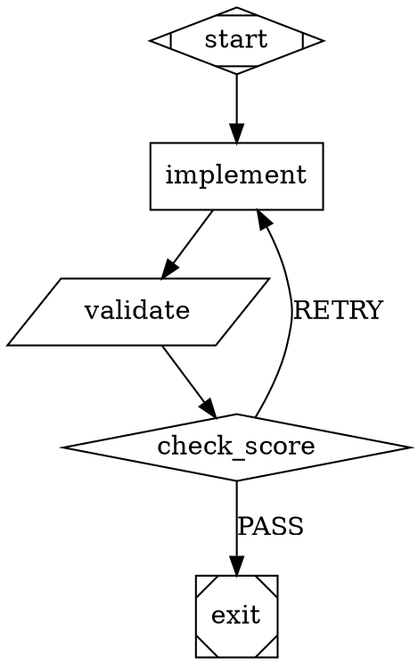

# Product Requirements Document: Substrate Software Factory

**Version:** 1.1
**Date:** 2026-03-22
**Author:** John Planow
**Status:** Draft
**Informed by:** Product Brief (2026-03-21), Phase 0 Technical Research Report (2026-03-21), Attractor Spec (2,090 lines), Coding Agent Loop Spec (1,467 lines), Unified LLM Client Spec (2,169 lines), StrongDM Software Factory Report

---

## 1. Purpose and Scope

This PRD defines the requirements for transforming Substrate from a linear SDLC pipeline orchestrator into a graph-based software factory. The transformation adds a directed-graph execution engine (implementing the Attractor specification), external scenario validation, and convergence loops with goal gates — while preserving the existing SDLC pipeline behavior unchanged.

The document covers three implementation phases:
- **Phase A (Foundation):** Core extraction, graph engine, SDLC-as-graph parity
- **Phase B (Factory Loop):** Scenario validation, goal gates, convergence controller, satisfaction scoring
- **Phase C (Scale):** Digital Twin Universe, direct API backend, advanced graph features

---

## 2. Background

### 2.1 Current State

Substrate v0.8.5 is a battle-tested SDLC pipeline orchestrator with 39 completed epics, 5,944 tests, and validated cross-project runs on ynab (TypeScript/SvelteKit) and NextGen Ticketing (Turborepo monorepo with 17 stories). It enforces a fixed linear phase sequence: analysis, planning, solutioning, implementation (with create-story, dev-story, code-review sub-phases). Quality assurance is a code-review dispatch returning a three-way verdict (SHIP_IT, NEEDS_MINOR_FIXES, escalation).

### 2.2 Limitations

1. **Linear execution cannot express iteration.** The phase orchestrator (`src/modules/phase-orchestrator/`) enforces a rigid sequence. The only iteration mechanism is `maxReviewCycles` in the implementation orchestrator — a decrementing integer, not a general convergence mechanism.
2. **Code review is a weak quality signal.** The reviewing agent reads code but does not execute it. The verdict is categorical (pass/fail), not probabilistic. There is no measure of "how close to correct."
3. **CLI agent opacity.** `Dispatcher.dispatch()` spawns CLI agents as black boxes. No per-turn visibility, no mid-task steering, no loop detection.

### 2.3 Target State

A graph-based pipeline engine that coexists with the SDLC pipeline. Users choose: `substrate run` (SDLC mode, linear, code review) or `substrate factory run` (factory mode, graph pipeline, scenario validation). The SDLC pipeline is internally re-expressed as a DOT graph with zero behavioral change.

### 2.4 End-to-End Factory Flow Example

**Scenario:** A user wants to add JWT authentication to a Node.js API project using the factory.

**Step 1: Define the pipeline graph** (`pipeline.dot`):


**Step 2: Write holdout scenarios** (`.substrate/scenarios/`):
- `scenario-login-valid-credentials.sh` — POST /auth/login with valid creds, assert 200 + JWT in body
- `scenario-login-invalid-password.sh` — POST /auth/login with bad password, assert 401
- `scenario-protected-route-no-token.sh` — GET /api/protected without token, assert 401
- `scenario-protected-route-valid-token.sh` — GET /api/protected with valid JWT, assert 200
- `scenario-token-refresh.sh` — POST /auth/refresh with valid refresh token, assert new access token

**Step 3: Run the factory:**
```bash
substrate factory run --graph pipeline.dot --scenarios .substrate/scenarios/ --events
```

**Expected convergence behavior:**
1. **Iteration 1:** Agent implements basic login. Scenarios 1-2 pass (login works), scenarios 3-5 fail (middleware not implemented). Score: 0.4. Goal gate unsatisfied → retry.
2. **Iteration 2:** Agent receives remediation: "Middleware and token refresh missing." Implements middleware. Scenarios 1-4 pass, scenario 5 fails. Score: 0.8. Goal gate satisfied → exit.

Total cost: ~$2-5. Wall clock: ~15 minutes for 2 iterations.

---

## 3. Migration Strategy

### 3.1 Compatibility Contract

The following behavior is guaranteed to not change at any point during the transformation:

| Guarantee | Verification Method |
|-----------|-------------------|
| `substrate run` produces identical outputs for any given story set | SDLC parity test: same stories through both linear and graph orchestrator |
| All CLI commands (`run`, `status`, `health`, `resume`, `metrics`, `supervisor`) work identically | Existing CLI integration tests |
| Configuration format (`config.yaml`) is backward-compatible; no required changes | Schema validation regression tests |
| NDJSON event protocol (`--events`) emits the same event types and payload shapes | Event protocol snapshot tests |
| All 5,944 existing tests pass at every intermediate commit | CI gate (non-negotiable) |
| Cost tracking, telemetry, and routing behavior are unchanged | Telemetry regression tests |

**What may change:** Internal module organization (file paths shift during core extraction), import paths (mitigated by re-exports from original paths), and internal type names (only when they become part of the public core API).

**Error behavior guarantee:** Error behaviors (escalation, timeout, agent failure) are guaranteed identical between linear and graph orchestrators. New events emitted by graph engine (e.g., `graph:checkpoint-saved`) are additive and do not replace existing event types. Existing event consumers that ignore unknown event types continue to work without modification.

### 3.2 Phase-by-Phase Engine Replacement

The graph engine replaces the linear orchestrator in three stages, not as a single switchover:

| Stage | Graph Engine Role | Linear Orchestrator Role | User Impact |
|-------|-------------------|--------------------------|-------------|
| Phase A, Steps 1-4 | Standalone: parses, validates, executes test graphs | Primary: handles all `substrate run` execution | None — graph engine is internal only |
| Phase A, Step 5-6 | Capable of running SDLC pipeline as DOT graph | Still primary; graph engine runs in shadow mode for parity testing | None — `substrate run` uses linear orchestrator |

**Parity testing definition:** Parity testing runs both orchestrators on the same story set and compares: (a) final file diffs are identical, (b) story verdicts match (`SHIP_IT`/`NEEDS_MINOR_FIXES`/escalate), (c) event sequence is structurally equivalent (same event types in same order, timing may differ). Graph engine runs as secondary; linear orchestrator remains primary.
| Phase B entry | Primary for `substrate factory run` | Primary for `substrate run` | New command only; existing command unchanged |
| Phase B exit | Available as optional backend for `substrate run --engine=graph` | Still default for `substrate run` | Opt-in flag; default unchanged |
| Phase C | Default for all execution | Deprecated but retained | Config flag to force linear orchestrator |

### 3.3 Opt-In Adoption

Users adopt factory features incrementally:

1. **No action needed.** `substrate run` works identically after every phase.
2. **Try the graph engine.** `substrate run --engine=graph` routes the existing SDLC pipeline through the graph executor. Same behavior, different internal path.
3. **Try factory mode.** `substrate factory run --graph pipeline.dot` runs a custom graph. Requires a DOT file and optional scenarios.
4. **Full factory.** `substrate factory run --graph pipeline.dot --scenarios .substrate/scenarios/` runs with scenario validation and convergence loops.

### 3.4 Rollback Plan

| Failure Scenario | Rollback Mechanism |
|-----------------|-------------------|
| Graph engine produces different results from linear orchestrator | `substrate run` defaults to linear orchestrator until parity is proven; `--engine=linear` flag forces it permanently |
| Core extraction breaks imports | Re-export shims from original paths are kept for one full major version; `npm run build` validates no broken imports |
| Scenario validation false-positives block convergence | `--skip-scenarios` flag bypasses scenario validation; falls back to code review verdict |
| Graph engine performance regression | `--engine=linear` flag; monitoring in CI (graph overhead < 100ms per node, measured) |

---

## 4. The Bootstrap Problem

The factory validates software through holdout scenarios. The factory itself is software. This section defines explicitly how the factory validates itself.

### 4.1 Bootstrap Sequence

The factory cannot validate itself until it exists. The bootstrap proceeds in four stages:

| Stage | Quality Mechanism | What Gets Validated |
|-------|-------------------|-------------------|
| 1. Conventional tests | Unit + integration + e2e tests (vitest) | Graph parser, validator, executor, edge selection, checkpoint serialization |
| 2. Cross-project validation | Run factory on ynab and nextgen-ticketing, compare results to known-good SDLC runs | SDLC parity, convergence loop behavior, scenario runner correctness |
| 3. Self-validation (milestone) | Write holdout scenarios for the factory's own subsystems (edge selection, goal gates, checkpoint resume), run factory against them | Factory's ability to build known-correct components |
| 4. Self-hosting (milestone) | Factory builds new factory features using its own scenario validation | Full loop closure — factory as both tool and subject |

### 4.2 Cross-Project Validation as Bootstrap

The ynab project (7 stories, TypeScript/SvelteKit) and nextgen-ticketing project (17 stories, Turborepo monorepo) serve as the bootstrap validation corpus. Both have known-good SDLC pipeline results. The factory must produce equivalent or better results on the same stories.

**Validation protocol:**
1. Run the same story set through the SDLC pipeline and capture all outputs (file changes, test results, build status).
2. Run the same story set through the factory pipeline with the SDLC-as-graph DOT file.
3. Compare: same file changes, same test results, same build status. Deviation is a regression.

### 4.3 Self-Hosting Milestone

The factory becomes self-hosting when it can build a non-trivial factory component using its own scenario validation loop. The target component is the **edge selection algorithm** — well-specified (the 5-step priority algorithm is defined in pseudocode in the Attractor spec), testable in isolation, and small enough for a single factory run.

**Milestone criteria:**
- Holdout scenarios written for all 5 edge selection steps
- Factory run converges on a correct implementation within budget
- Conventional tests confirm the implementation matches the spec
- This milestone is targeted for the end of Phase B

### 4.4 Scenario Runner Independent Validation

Scenario runner correctness is validated independently of the graph engine via a dedicated test suite (conventional unit + integration tests) that proves:

1. **Deterministic execution:** Scenarios execute deterministically — the same scenario set produces the same pass/fail results across repeated runs with identical inputs.
2. **Known-good/known-bad accuracy:** Pass/fail results match expected outcomes for known-good implementations (all scenarios pass) and known-bad implementations (specific scenarios fail predictably).
3. **Isolation enforcement:** Agent dispatches cannot access scenario source code, scenario directory content, or scenario checksums during pipeline execution.

This validation occurs in Epic 44 (Scenario Store + Runner) before scenarios are used as quality signals in Epic 45 (Convergence Loop). The scenario runner must be trustworthy before the convergence loop relies on it.

### 4.5 Pre-Scenario Quality

Before scenarios exist, quality comes from:
- 5,944 existing tests (preserved throughout)
- New unit tests for every graph engine component (+500 in Phase A)
- SDLC parity tests comparing linear and graph orchestrator outputs
- AttractorBench conformance tests for spec compliance

---

## 5. Acceptance Criteria

### 5.1 Graph Engine

#### 5.1.1 DOT Parser

| ID | Criterion | Verification |
|----|-----------|-------------|
| GE-P1 | Parse DOT digraph with graph, node, and edge attribute blocks via `ts-graphviz` | Unit test: parse reference graph, assert node count, edge count, attribute values |
| GE-P2 | Extract graph-level attributes: `goal`, `label`, `model_stylesheet`, `default_max_retries`, `retry_target`, `fallback_retry_target`, `default_fidelity` | Unit test: parse graph with all attributes, assert each is accessible |
| GE-P3 | Parse node attributes: `label`, `shape`, `type`, `prompt`, `max_retries`, `goal_gate`, `retry_target`, `fallback_retry_target`, `fidelity`, `thread_id`, `class`, `timeout`, `llm_model`, `llm_provider`, `reasoning_effort`, `auto_status`, `allow_partial` | Unit test: node with all attributes parses correctly |
| GE-P4 | Parse edge attributes: `label`, `condition`, `weight`, `fidelity`, `thread_id`, `loop_restart` | Unit test: edge with all attributes parses correctly |
| GE-P5 | Expand chained edges: `A -> B -> C [label="x"]` produces `A->B [label="x"]` and `B->C [label="x"]` | Unit test |
| GE-P6 | Apply node/edge default blocks to subsequent declarations | Unit test: `node [shape=box]` followed by node without shape resolves to box |
| GE-P7 | Flatten subgraph blocks, preserving node contents and deriving class names from subgraph labels | Unit test: subgraph `label="Loop A"` yields class `loop-a` on contained nodes |
| GE-P8 | Handle both quoted and unquoted attribute values | Unit test |
| GE-P9 | Strip `//` line comments and `/* */` block comments before parsing | Unit test |

**AttractorBench conformance:** AttractorBench (github.com/strongdm/attractorbench) provides conformance tests for Attractor implementations. The graph engine must pass all structural validation tests. Behavioral conformance tests are advisory during Phase A, required by Phase B exit.

#### 5.1.2 Graph Validation (13 Lint Rules)

All 13 rules from the Attractor spec must be implemented. The validator produces a list of diagnostics with rule ID, severity, message, and optionally related node/edge IDs.

**Error rules (8 — block execution):**

| Rule ID | Description | Test |
|---------|-------------|------|
| `start_node` | Exactly one start node (shape=Mdiamond or id `start`/`Start`) | Graph with 0 start nodes: ERROR. Graph with 2: ERROR. Graph with 1: pass. |
| `terminal_node` | Exactly one terminal node (shape=Msquare or id `exit`/`end`) | Graph with 0 exit nodes: ERROR. Graph with 2: ERROR. Graph with 1: pass. |
| `reachability` | All nodes reachable from start via BFS/DFS | Graph with orphan node: ERROR. All reachable: pass. |
| `edge_target_exists` | Every edge target references an existing node ID | Edge targeting nonexistent node: ERROR. All valid: pass. |
| `start_no_incoming` | Start node has no incoming edges | Edge into start node: ERROR. No edges into start: pass. |
| `exit_no_outgoing` | Exit node has no outgoing edges | Edge from exit node: ERROR. No edges from exit: pass. |
| `condition_syntax` | Edge condition expressions parse correctly per Section 10 grammar | Invalid condition `outcome==success` (double equals): ERROR. Valid `outcome=success`: pass. |
| `stylesheet_syntax` | `model_stylesheet` attribute parses as valid CSS-like rules | Invalid stylesheet `box llm_model: x;` (missing braces): ERROR. Valid: pass. |

**Warning rules (5 — execution allowed):**

| Rule ID | Description | Test |
|---------|-------------|------|
| `type_known` | Node `type` values should be recognized by handler registry | Node with `type="unknown_handler"`: WARNING. Known type: pass. |
| `fidelity_valid` | Fidelity values must be one of: `full`, `truncate`, `compact`, `summary:low`, `summary:medium`, `summary:high` | Node with `fidelity="invalid"`: WARNING. Valid fidelity: pass. |
| `retry_target_exists` | `retry_target` and `fallback_retry_target` reference existing nodes | `retry_target="nonexistent"`: WARNING. Valid target: pass. |
| `goal_gate_has_retry` | Nodes with `goal_gate=true` should have `retry_target` or `fallback_retry_target` | Goal gate without retry target: WARNING. With target: pass. |
| `prompt_on_llm_nodes` | Codergen nodes should have `prompt` or `label` | Codergen node with neither: WARNING. With prompt: pass. |

| ID | Criterion | Verification |
|----|-----------|-------------|
| GE-V1 | `validate()` returns diagnostics list; `validate_or_raise()` throws on any ERROR | Unit test with invalid graph: throws. With warnings only: returns diagnostics. |
| GE-V2 | Custom lint rules can be registered and run alongside built-in rules | Unit test: register custom rule, verify it runs |

#### 5.1.3 Node Type Handlers (8 Required)

| Handler | Shape | Behavior | Test |
|---------|-------|----------|------|
| `start` | Mdiamond | No-op, returns SUCCESS | Unit test: execute returns SUCCESS with no side effects |
| `exit` | Msquare | No-op, returns SUCCESS; goal gate check is in engine, not handler | Unit test: execute returns SUCCESS |
| `codergen` | box | Expand `$goal` in prompt, call `CodergenBackend.run()`, write `prompt.md` and `response.md` to `{logs_root}/{node_id}/`, write `status.json` | Unit test with mock backend: verify files written, outcome returned |
| `wait.human` | hexagon | Derive choices from outgoing edge labels, parse accelerator keys (`[K] Label`, `K) Label`, `K - Label`), present to Interviewer, return selected label as `suggested_next_ids` | Unit test with QueueInterviewer: verify correct choice returned |
| `conditional` | diamond | No-op, returns SUCCESS; routing handled by edge selection engine | Unit test: execute returns SUCCESS |
| `parallel` | component | Clone context per branch, execute branches concurrently (bounded by `max_parallel`), store results in `parallel.results`, evaluate join policy (`wait_all` or `first_success`) | Unit test: 3 branches, verify all execute, context isolated |
| `parallel.fan_in` | tripleoctagon | Read `parallel.results`, select best candidate (heuristic or LLM-based if prompt set), record winner in context | Unit test: 3 candidates with different statuses, verify best selected |
| `tool` | parallelogram | Execute `tool_command` via shell, return stdout as `tool.output` in context updates | Unit test: echo command returns output |

| ID | Criterion | Verification |
|----|-----------|-------------|
| GE-H1 | Handler registry resolves by: (1) explicit `type` attribute, (2) shape-to-handler mapping, (3) default codergen handler | Unit test: node with `type="tool"` resolves tool handler; node with `shape=diamond` resolves conditional; bare node resolves codergen |
| GE-H2 | Custom handlers can be registered by type string and override defaults | Unit test: register custom handler, verify it executes |
| GE-H3 | Handler exceptions are caught by engine and converted to FAIL outcomes | Unit test: handler throws, verify FAIL outcome returned |

#### 5.1.4 Edge Selection Algorithm (5 Steps)

The implementation must follow the exact 5-step priority algorithm from the Attractor spec:

| Step | Behavior | Test |
|------|----------|------|
| 1. Condition match | Evaluate edge `condition` against context/outcome. Condition-matched edges take priority. Among multiple matches, `best_by_weight_then_lexical` breaks ties. | Graph with 2 condition edges: one matches, one doesn't. Verify matched edge selected. |
| 2. Preferred label | If no condition match and outcome has `preferred_label`, find unconditional edge whose label matches after normalization (lowercase, trim, strip accelerator prefix). | Outcome with `preferred_label="[Y] Yes"`, edge with `label="[Y] Yes"`. Verify match after normalization. |
| 3. Suggested next IDs | If no label match and outcome has `suggested_next_ids`, find unconditional edge whose target matches. First match wins. | Outcome with `suggested_next_ids=["node_b", "node_c"]`, edges to both. Verify node_b selected (first match). |
| 4. Highest weight | Among remaining unconditional edges, highest `weight` wins (default 0). | Two unconditional edges: weight 5 and weight 3. Verify weight 5 selected. |
| 5. Lexical tiebreak | Equal weight: target node ID ascending alphabetical. | Two edges same weight, targets "beta" and "alpha". Verify "alpha" selected. |

| ID | Criterion | Verification |
|----|-----------|-------------|
| GE-E1 | Step 1 beats Step 2: condition match takes priority over preferred label | Integration test: both condition and label match available, verify condition wins |
| GE-E2 | Step 4 beats Step 5: weight beats lexical when weights differ | Unit test |
| GE-E3 | No outgoing edges returns NONE (pipeline terminates) | Unit test |
| GE-E4 | Condition syntax: `key=value`, `key!=value`, `&&` conjunction, case-sensitive comparison, missing context keys resolve to empty string | Unit tests for each operator and edge case |
| GE-E5 | Label normalization: lowercase, trim whitespace, strip accelerator prefixes (`[K] `, `K) `, `K - `) | Unit tests for each pattern |

#### 5.1.5 Checkpointing

| ID | Criterion | Verification |
|----|-----------|-------------|
| GE-C1 | Checkpoint written after every node execution to `{logs_root}/checkpoint.json` | Integration test: run 3-node pipeline, verify checkpoint file exists with correct fields |
| GE-C2 | Checkpoint JSON contains: `timestamp`, `current_node`, `completed_nodes`, `node_retries`, `context` (serialized), `logs` | Schema validation test |
| GE-C3 | Resume from checkpoint: load state, skip completed nodes, continue from next node | Integration test: checkpoint at node 2 of 4, resume, verify nodes 3-4 execute and 1-2 do not |
| GE-C4 | Fidelity degradation on resume: if previous node used `full` fidelity, degrade to `summary:high` for the first resumed node, then allow `full` again | Integration test: verify fidelity value on first resumed node |
| GE-C5 | Resume produces the same final outcome as uninterrupted execution (for deterministic graphs) | Integration test: run full, run with mid-point resume, compare outcomes |

#### 5.1.6 Model Stylesheet

| ID | Criterion | Verification |
|----|-----------|-------------|
| GE-S1 | Parse stylesheet from `model_stylesheet` graph attribute using CSS-like grammar | Unit test: parse multi-rule stylesheet |
| GE-S2 | Selector specificity: `*` (0) < shape name (1) < `.class` (2) < `#node_id` (3) | Unit test: node matches all four selectors, verify highest-specificity rule wins |
| GE-S3 | Later rules of equal specificity override earlier rules | Unit test |
| GE-S4 | Recognized properties: `llm_model`, `llm_provider`, `reasoning_effort` | Unit test: each property resolves correctly |
| GE-S5 | Explicit node attributes override stylesheet values | Unit test: node with `llm_model="x"` and stylesheet rule `.class { llm_model: y; }` — node attribute wins |
| GE-S6 | Stylesheet applied as transform after parsing, before validation | Integration test: verify lint rules see stylesheet-resolved attributes |

### 5.2 Core Extraction

| ID | Criterion | Verification |
|----|-----------|-------------|
| CE-1 | `substrate-core` is an independently publishable npm package with its own `package.json` | `npm pack` in core package directory succeeds |
| CE-2 | All 5,944 existing tests pass after extraction | CI gate; `npm test` in root workspace |
| CE-3 | Re-export shims from original import paths (`src/core/event-bus.ts` re-exports from `packages/core/`) | Import test: existing import paths resolve correctly |
| CE-4 | `substrate-sdlc` imports only from `substrate-core` interfaces (no direct file imports into core internals) | TypeScript project references enforce boundary; build fails on violation |
| CE-5 | `substrate-factory` imports only from `substrate-core` interfaces | Same as CE-4 |
| CE-6 | No circular dependencies between packages | `madge --circular` returns zero cycles across package boundaries |
| CE-7 | Monorepo uses npm workspaces with TypeScript project references | `npm ls --workspaces` lists all three packages; `tsc --build` succeeds |
| CE-8 | Build time remains under 5 seconds | CI timing gate |

**Module-to-package mapping:**

| Module | Target Package | Validation |
|--------|---------------|-----------|
| `src/core/event-bus.ts` (TypedEventBus) | core | Interface extracted, import works from sdlc and factory |
| `src/modules/routing/` (14 files) | core | All routing tests pass via core imports |
| `src/modules/agent-dispatch/` (Dispatcher) | core | Dispatcher interface in core, impl in core |
| `src/modules/telemetry/` (20+ files) | core | OTEL pipeline works from both sdlc and factory |
| `src/modules/supervisor/` | core | Supervisor works from both packages |
| `src/persistence/` (DatabaseAdapter) | core | Schema, adapter, queries accessible from both |
| `src/modules/config/` | core | Config system shared |
| `src/modules/phase-orchestrator/` | sdlc | Phase orchestrator is SDLC-specific |
| `src/modules/implementation-orchestrator/` (~2,700 lines) | sdlc | Story state machine is SDLC-specific |
| `src/modules/compiled-workflows/` | sdlc | create-story, dev-story, code-review prompts |
| `src/modules/methodology-pack/` | sdlc | BMAD methodology packs |

### 5.3 Scenario Validation

| ID | Criterion | Verification |
|----|-----------|-------------|
| SV-1 | Scenarios stored in `.substrate/scenarios/`, gitignored, excluded from agent context | File system test: path is gitignored; context compiler does not include it |
| SV-2 | Dev agents cannot read scenario source code during pipeline execution | Integration test: agent working tree does not contain `.substrate/scenarios/`; scenario dir not in any prompt |
| SV-3 | Scenario runner executes E2E journeys in a separate process and returns structured results | Unit test: run mock scenario script, verify JSON output with pass/fail + details |
| SV-4 | Structured result format: `{ scenarios: [{ name, status: "pass"|"fail", details?, duration_ms }], summary: { total, passed, failed } }` | Schema validation test |
| SV-5 | Scenario results feed into satisfaction scoring (see 5.6) | Integration test: scenario results produce a score between 0.0 and 1.0 |
| SV-6 | Scenario files are immutable during pipeline execution | Integrity check: SHA-256 checksum computed before run, verified before each execution; modification triggers pipeline error (not false pass) |
| SV-7 | Scenario format: shell scripts returning exit code 0 (pass) or non-zero (fail), with optional JSON on stdout | Unit test: shell script scenarios with various exit codes |
| SV-8 | Scenario discovery: runner finds all executable files in scenario directory matching `scenario-*.sh` or `scenario-*.{py,js,ts}` | Unit test: mixed file types, verify correct discovery |

**Scenario result JSON schema:**

```json
{
  "scenarios": [
    {
      "name": "scenario-login-flow",
      "status": "pass" | "fail",
      "exitCode": 0,
      "stdout": "optional JSON string",
      "stderr": "captured in details field",
      "durationMs": 1234,
      "details": {}
    }
  ],
  "summary": { "total": 3, "passed": 2, "failed": 1 },
  "durationMs": 5678
}
```

**Stderr handling:** Stderr output from scenario scripts is captured in the `details` field of the `ScenarioResult`. It is not treated as a failure signal — only exit code determines pass/fail.

**Naming collision resolution:** If both `scenario-login.sh` and `scenario-login.py` exist, both run and their results are merged by name (first by `.sh`, then `.py`). The later result overwrites the earlier if names collide.

**Execution order:** Scenarios are executed in alphabetical order by filename. This ensures deterministic execution order across runs.

### 5.4 Convergence Loop

| ID | Criterion | Verification |
|----|-----------|-------------|
| CL-1 | Nodes with `goal_gate=true` must reach SUCCESS or PARTIAL_SUCCESS before pipeline can exit | Integration test: goal gate node fails, pipeline does not exit via terminal node |
| CL-2 | On unsatisfied gate at exit: jump to `retry_target` (node-level, then graph-level, then fallback variants) | Integration test: verify retry target resolution chain |
| CL-3 | If no retry target exists and gates unsatisfied, pipeline returns FAIL | Integration test |
| CL-4 | Retry with structured remediation context: on retry, inject previous failure reason, scenario diff, and specific fix scope into the retried node's context | Integration test: verify context contains remediation keys on second iteration |
| CL-5 | Per-node budget: `max_retries` attribute controls additional attempts (1 + max_retries = total) | Unit test: `max_retries=2` allows 3 total executions |
| CL-6 | Per-node backoff: exponential with jitter (default: 200ms initial, 2x factor, 60s cap, +/-50% jitter) | Unit test: verify delay sequence |
| CL-7 | Per-pipeline budget: `budget_cap_usd` stops execution when estimated cost exceeds cap | Integration test: set low cap, verify pipeline stops with budget exhaustion message |
| CL-8 | Per-session budget: wall-clock cap terminates execution after configured duration | Integration test |
| CL-9 | Diminishing returns detection: if satisfaction score plateaus (delta < 0.05) across N consecutive iterations (configurable, default 3), escalate instead of retrying | Integration test: mock scenario that returns same score 3 times, verify escalation |
| CL-10 | `allow_partial=true` on a node accepts PARTIAL_SUCCESS when retries exhausted instead of failing | Unit test |

**Budget enforcement timing:** Budget is checked BEFORE each node dispatch. If estimated cost of next node would exceed remaining budget, execution stops. In-flight nodes are allowed to complete (no mid-node cancellation). Estimation uses the model's known input/output token rates from the model catalog multiplied by historical average tokens per task type.

**Budget conflict resolution:** When multiple budget limits trigger simultaneously, enforcement priority is: per-session wall-clock (highest) > per-pipeline cost > per-node retries (lowest). The first limit hit terminates execution.

### 5.5 CodergenBackend

| ID | Criterion | Verification |
|----|-----------|-------------|
| CB-1 | `CodergenBackend` interface: `run(node, prompt, context) -> Promise<string \| Outcome>` | TypeScript compilation; both backends implement it |
| CB-2 | `CLICodergenBackend` wraps existing `Dispatcher.dispatch()` with zero behavioral change | Integration test: dispatch same prompt via CLI backend and directly via dispatcher, compare results |
| CB-3 | `CLICodergenBackend` translates graph node attributes to `DispatchRequest` fields (model, timeout, maxTurns) | Unit test: verify mapping |
| CB-4 | `DirectCodergenBackend` implementing Coding Agent Loop spec (Phase C) | Deferred — acceptance criteria defined when Phase C planning begins |
| CB-5 | Backend selection via graph-level or node-level attribute (`backend="cli"` or `backend="direct"`) | Unit test: attribute resolves to correct backend |
| CB-6 | Both backends produce `Outcome` objects with the same structure (status, context_updates, notes, failure_reason) | Type test: verify structural compatibility |

### 5.6 Satisfaction Scoring

| ID | Criterion | Verification |
|----|-----------|-------------|
| SS-1 | Satisfaction score is a float between 0.0 and 1.0 computed from scenario results | Unit test: 5 scenarios, 3 pass → score = 0.6 (baseline weighted average) |
| SS-2 | Score feeds into goal gate evaluation: gate passes when score >= threshold (configurable, default 0.8) | Integration test: score 0.7 with threshold 0.8 → gate fails; score 0.9 → gate passes |
| SS-3 | Score supports weighted scenarios: critical scenarios weighted higher than nice-to-have | Unit test: weighted computation |
| SS-4 | Score persisted per run in database (`scenario_results` table and `run_metrics.satisfaction_score` column) | Database schema test |
| SS-5 | Score history visible via `substrate metrics` command | CLI test: verify score appears in output |

### 5.7 SDLC-as-Graph

| ID | Criterion | Verification |
|----|-----------|-------------|
| SG-1 | Current linear pipeline (analysis -> planning -> solutioning -> implementation with review/rework) expressible as a DOT graph | DOT file exists in `packages/sdlc/graphs/sdlc-pipeline.dot`, parses without errors |
| SG-2 | `substrate run` works identically when backed by graph engine | SDLC parity test (see Section 3.1) |
| SG-3 | SDLC parity test: same stories produce same file changes, test results, and build status through both paths | Automated comparison script in CI |
| SG-4 | Review/rework cycle expressed as goal gate with retry target: `dev_story [goal_gate=true, retry_target=dev_story]` → `code_review [shape=diamond]` → conditional edges | DOT file inspection + execution test |
| SG-5 | `maxReviewCycles` config maps to `max_retries` attribute on the dev_story node | Config-to-graph mapping test |

---

## 6. Quality Model Transition

The transition from code review to scenario validation uses a parallel-running approach across four phases. Each phase is tied to specific epics.

| Phase | Quality Signal | Decision Authority | Code Review Role | Scenario Role | Target Epic |
|-------|---------------|-------------------|-----------------|---------------|-------------|
| **Phase 1** | Code review verdict | Code review | Primary (decision-making) | Not present | Current state (Epics 1-39) |
| **Phase 2** | Dual: code review + scenario score | Code review | Primary (decision-making) | Advisory (logged, compared, not decision-making) | Phase B, Epics 44-45 |
| **Phase 3** | Dual: scenario score + code review | Scenario satisfaction | Advisory (logged, not decision-making) | Primary (drives goal gates) | Phase B, Epic 46 |
| **Phase 4** | Scenario satisfaction only | Scenario satisfaction | Removed from factory pipeline (retained in SDLC pipeline) | Sole quality signal | Phase C, Epics 47+ |

**Transition criteria between phases:**

| Transition | Criterion |
|-----------|-----------|
| Phase 1 -> Phase 2 | Scenario infrastructure operational; at least 5 scenarios written for reference project |
| Phase 2 -> Phase 3 | Scenario scores agree with code review verdicts in >80% of cases across >20 stories |
| Phase 3 -> Phase 4 | Scenario scores alone produce convergence rate >80% with no quality regressions vs. Phase 3 |

---

## 7. Non-Functional Requirements

### 7.1 Performance

| Requirement | Target | Measurement |
|-------------|--------|-------------|
| Graph engine overhead per node transition | < 100ms (parse outcome, select edge, write checkpoint, advance) | Benchmark test with 20-node graph, measure avg transition time |
| DOT parsing time for 100-node graph | < 500ms | Benchmark test |
| Validation (13 rules) for 100-node graph | < 200ms | Benchmark test |
| Checkpoint write time | < 50ms | Benchmark test with realistic context size (10KB) |
| No degradation to existing `substrate run` performance | Within 5% of current wall-clock time | Before/after benchmark on reference story set |

### 7.2 Observability

| Requirement | Target | Verification |
|-------------|--------|-------------|
| Every graph node transition emits NDJSON events | `StageStarted`, `StageCompleted`, `StageFailed`, `StageRetrying`, `CheckpointSaved` events | Event capture test |
| Events compatible with existing `--events` protocol | Same JSON structure, parseable by existing consumers | Protocol compatibility test |
| Pipeline lifecycle events: `PipelineStarted`, `PipelineCompleted`, `PipelineFailed` | Emitted at correct lifecycle points | Integration test |
| Parallel execution events: `ParallelStarted`, `ParallelBranchStarted`, `ParallelBranchCompleted`, `ParallelCompleted` | Emitted for parallel node execution | Integration test |
| Human interaction events: `InterviewStarted`, `InterviewCompleted`, `InterviewTimeout` | Emitted for wait.human nodes | Integration test |
| Scenario validation events: `ScenarioRunStarted`, `ScenarioRunCompleted`, `SatisfactionScoreComputed` | Emitted during scenario validation | Integration test |
| Goal gate events: `GoalGateChecked(node_id, satisfied, score)` | Emitted at terminal node check | Integration test |

### 7.3 Reliability

| Requirement | Target | Verification |
|-------------|--------|-------------|
| Checkpoint/resume works across process restarts | Resume from any checkpoint produces correct completion | Kill-and-resume integration test |
| Checkpoint/resume works across machine restarts | File-backed checkpoints are self-contained (no process-local state needed) | Cold-start resume test |
| Partial pipeline failure does not corrupt state | Checkpoint is always the last known-good state; never written mid-node | Fault injection test: kill during node execution, verify checkpoint is from previous node |
| Graph validation prevents execution of invalid pipelines | All 8 error rules block execution | Negative validation tests |

### 7.4 Security

| Requirement | Target | Verification |
|-------------|--------|-------------|
| Scenario isolation: agents cannot access holdout tests | Scenario directory excluded from agent working tree, context, and prompts | Audit test: scan all dispatched prompts for scenario file content |
| Scenario immutability: modification during run is detected | SHA-256 checksum validation before each scenario execution | Tampering test: modify scenario mid-run, verify error |
| Tool node sandboxing: shell commands respect configured working directory | `tool_command` executes in specified directory, not in scenario directory | Isolation test |
| API keys not exposed in graph definitions or checkpoints | Checkpoint serialization strips environment variables; DOT files contain no secrets | Audit test |

---

## 8. Risk Register

| # | Risk | Description | Severity | Likelihood | Mitigation | Owner |
|---|------|-------------|----------|-----------|------------|-------|
| R1 | Core extraction breaks existing tests | Moving modules to `substrate-core` breaks import paths, circular dependencies, or runtime behavior | Critical | Medium | Interface-first extraction; re-export shims from original paths; CI gate requires 5,944/5,944 tests at every commit; incremental extraction (one module per PR) | Core team |
| R2 | Graph engine semantics drift from Attractor spec | Custom implementation diverges from spec's edge selection, goal gate, or checkpoint behavior | High | Medium | Implement edge selection verbatim from spec pseudocode; test against AttractorBench conformance suite; cross-reference every handler against spec Section 4; code review against spec during story development | Core team |
| R3 | Convergence loop infinite cost | Goal gate retries burn unlimited tokens before budget controls kick in | High | High | Budget controls at three levels (per-node `max_retries`, per-pipeline `budget_cap_usd`, per-session wall-clock cap); diminishing returns detection with mandatory escalation on plateau; cost estimation before each dispatch | Core team |
| R4 | DTU fidelity insufficient for validation | Digital twin behavioral clones miss edge cases, producing false-positive scenario results | Medium | High | Start with Docker Compose + existing test doubles (LocalStack, WireMock, testcontainers) in Phase B; defer agent-generated twins to Phase C; periodic twin validation against real service samples | Core team |
| R5 | Vercel AI SDK doesn't cover unified-llm-spec requirements | SDK gaps in prompt caching, provider-aligned tool formats, or cost tracking | Medium | Medium | Audit SDK against unified-llm-spec.md during Phase C architecture; if >20% gap, build custom layer from spec instead; defer decision until Phase C (CLI backend covers Phase A-B) | Core team |
| R6 | Scenario format too rigid for diverse projects | Shell-script scenarios don't work for all project types or produce insufficient signal | Medium | Medium | Start maximally flexible (shell scripts, any language); formalize format after 3-5 real project usages; support scenario plugins for custom runners | Core team |
| R7 | Self-hosting bootstrap fails | Factory cannot build its own components — scenarios too hard to write, convergence doesn't work for framework code | Medium | Low | Conventional tests remain primary through Phase A; self-hosting is a milestone, not a prerequisite; factory validated via cross-project comparison first | Core team |
| R8 | Performance regression from graph engine overhead | Graph traversal, checkpoint I/O, edge selection add latency per node | Low | Low | Graph traversal is an async loop (not recursive); checkpoint is single JSON write; edge selection is a pure function; benchmark gate in CI (< 100ms per transition); `--engine=linear` escape hatch | Core team |
| R9 | Monorepo tooling complexity | npm workspaces + TypeScript project references introduce build complexity, slow CI | Medium | Medium | Avoid Nx/Turborepo initially; use npm workspaces (substrate already uses npm); TypeScript project references for type-checking boundaries; verify CI time stays within 2x current | Core team |
| R10 | Community Attractor spec evolves incompatibly | Spec changes after our implementation begins, requiring rework | Low | Low | Pin to current spec version (March 2026); implement core semantics first; monitor spec repo for breaking changes; maintain a spec-diff document | Core team |

---

## 9. Out of Scope (V1)

The following capabilities are explicitly deferred. They are documented to prevent scope creep and clarify Phase C versus post-V1 boundaries.

### 9.1 Deferred to Phase C

| Capability | Reason for Deferral |
|-----------|-------------------|
| **Digital Twin Universe (DTU)** | Requires factory loop to be operational; Docker Compose + existing test doubles cover Phase B needs |
| **DirectCodergenBackend** (Coding Agent Loop + Unified LLM Client) | CLICodergenBackend wrapping existing Dispatcher covers Phase A-B; direct API unlocks per-turn control for Phase C optimization |
| **Agent-generated twins** | Meta-bootstrap (factory building its own infra) requires a working factory first |
| **LLM-evaluated edges** | Edge conditions evaluated by LLM call; current string-match conditions are sufficient for Phase A-B graphs |
| **Parallel fan-out/fan-in with isolation** | Concurrent branch execution with isolated contexts and join policies; SDLC's concurrent story execution covers Phase A-B needs |
| **Subgraphs as first-class compositions** | Graphs containing graphs; manager_loop handler provides sufficient hierarchy for Phase A-B |
| **Pyramid summaries** | Reversible multi-level summarization; not needed until convergence loops exceed context windows in Phase C |

### 9.2 Out of Scope Entirely (Post-V1)

| Capability | Reason |
|-----------|--------|
| **Hosted SaaS / cloud deployment** | Substrate is a CLI tool; no cloud dependency, no account creation, no data leaves local environment |
| **Requirements definition automation** | Factory automates implementation and validation, not requirements; humans define what to build |
| **IDE integration** | Future concern; CLI is primary interface |
| **Multi-machine orchestration** | Single-machine execution; distributed execution is a future consideration |
| **Gene transfusion** | Cross-codebase pattern transfer; nice-to-have, not essential for factory V1 |
| **Semport** | Semantic code porting between languages; specialized, not core to factory |

### 9.3 Explicitly Retained from Product Brief

The following were considered for deferral but are retained because they are prerequisites for a working factory:

| Capability | Why Retained |
|-----------|-------------|
| **Model stylesheet** | Required for per-node model routing in graph pipelines; simple CSS parser, not complex |
| **Satisfaction scoring** | Required for goal gate evaluation; without it, gates are binary (pass/fail), no convergence optimization |
| **SDLC-as-graph parity** | Critical proof point; if the graph engine cannot reproduce SDLC behavior, it is not trustworthy |

---

## 10. Relationship to Existing Epics

Three planned epics are subsumed by the factory transformation. They become the implementation vehicle, not separate initiatives.

| Planned Epic | Factory Phase | Transformation |
|-------------|---------------|---------------|
| **Epic 32: Core Extraction** (`epic-32-substrate-core-extraction.md`) | Phase A (Epics 40-41) | Interface-first extraction into `substrate-core`. Unchanged in approach; motivated by factory's shared library need rather than code organization alone. |
| **Epic 33: Validation Harness** (`epic-33-validation-harness.md`) | Phase B (Epics 44-45) | Evolves into external scenario validation. Harness scope expands: validates any project's implementation quality, not just substrate's pipeline. `RemediationContext` design carries forward as retry context injection. |
| **Epic 34: Autonomous Execution Baselines** (`epic-34-autonomous-execution-baselines.md`) | Phase B (Epic 46) | Evolves into convergence loop with goal gates. "Baselines" become the satisfaction threshold. "Autonomous execution" becomes factory's core loop. |

**New epics created by the factory transformation:**

| New Epic | Phase | Scope |
|----------|-------|-------|
| Graph parser + validator | Phase A (Epic 42) | DOT parsing via ts-graphviz, 13 lint rules, diagnostic model |
| Graph executor + handlers | Phase A (Epic 43) | Execution loop, 8 node handlers, edge selection, checkpointing |
| Scenario store + runner | Phase B (Epic 44) | Scenario storage, isolation, shell-script runner, structured results |
| Goal gates + convergence | Phase B (Epic 45) | Goal gate enforcement, budget controls, convergence controller |
| Satisfaction scoring | Phase B (Epic 46) | Probabilistic scoring, parallel running with code review, threshold evaluation |
| DTU foundation | Phase C (Epic 47) | Twin registry, Docker Compose orchestration |
| Direct API backend | Phase C (Epic 48) | CodingAgentLoop + UnifiedLLMClient (or Vercel AI SDK wrapper) |
| Agent-generated twins | Phase C (Epic 49) | Factory builds twins from API docs |
| Advanced graph features | Phase C (Epic 50) | LLM-evaluated edges, parallel fan-out/fan-in, subgraphs |

---

## 11. Phased Epic Breakdown

### Phase A: Foundation (Epics 40-43)

**Goal:** Substrate becomes a monorepo with a working graph engine. The existing SDLC pipeline is expressed as a DOT graph with zero behavioral changes.

**Quality model phase:** Phase 1 (code review only).

| Epic | Stories (est.) | Key Deliverables | Dependencies | Success Metric |
|------|---------------|------------------|-------------|----------------|
| 40: Monorepo setup | 3-4 | npm workspaces config, TypeScript project references, CI pipeline update, build verification | None | `npm run build` and `npm test` pass in monorepo structure |
| 41: Core extraction | 8-10 | Interface definitions, module migration, re-export shims, boundary validation | Epic 40 | 5,944/5,944 tests pass; no circular deps; sdlc/factory import only from core |
| 42: Graph parser + validator | 5-6 | DOT parser (ts-graphviz), 13 lint rules, diagnostic model, stylesheet parser, condition parser | Epic 40 | All 13 rules implemented; parse all spec example graphs; AttractorBench conformance |
| 43: Graph executor + SDLC-as-graph | 8-10 | Execution loop, 8 handlers, edge selection, checkpointing, SDLC DOT graph, parity tests | Epics 41, 42 | SDLC parity test passes; graph overhead < 100ms/node |

**Phase A exit criteria:** `substrate run` produces identical results via graph engine (verified by parity test on ynab and nextgen-ticketing story sets). All 13 lint rules pass. Checkpoint/resume works. +500 new tests.

### Phase B: Factory Loop (Epics 44-46)

**Goal:** A working convergence loop that iterates until holdout scenarios pass. First "factory" milestone.

**Quality model phase:** Phases 2-3 (dual signal, then scenario primary).

| Epic | Stories (est.) | Key Deliverables | Dependencies | Success Metric |
|------|---------------|------------------|-------------|----------------|
| 44: Scenario store + runner | 5-6 | Scenario storage in `.substrate/scenarios/`, isolation verification, shell-script runner, structured results, integrity checking | Epic 43 | Scenarios execute in isolation; agents cannot access scenario source; checksum verification works |
| 45: Goal gates + convergence | 6-8 | Goal gate enforcement at exit, retry_target resolution chain, budget controls (per-node, per-pipeline, per-session), diminishing returns detection, remediation context injection | Epic 44 | Goal gates block exit when unsatisfied; budget caps terminate execution; plateau detection escalates |
| 46: Satisfaction scoring | 4-5 | Probabilistic score computation, weighted scenarios, threshold evaluation, parallel running with code review, database persistence, CLI display | Epic 45 | Scores between 0.0-1.0; goal gates evaluate against threshold; scores agree with code review >80% |

**Phase B exit criteria:** Factory convergence loop works end-to-end (`implement -> validate -> score -> pass/exit or fail/retry`). Convergence rate >80% on reference project. Self-hosting milestone attempted (holdout scenarios for edge selection algorithm). +300 new tests.

### Phase C: Scale (Epics 47-50)

**Goal:** Full factory capabilities including digital twins and per-turn agent control.

**Quality model phase:** Phase 4 (scenarios only in factory mode).

| Epic | Stories (est.) | Key Deliverables | Dependencies | Success Metric |
|------|---------------|------------------|-------------|----------------|
| 47: DTU foundation | 5-6 | Twin registry, Docker Compose orchestration, integration with scenario runner | Epic 46 | Twins run locally; scenarios use twins for external service dependencies |
| 48: Direct API backend | 8-10 | Unified LLM Client (or Vercel AI SDK wrapper), Coding Agent Loop, DirectCodergenBackend, per-turn events | Epic 43 | Direct API produces same results as CLI backend; per-turn events visible |
| 49: Agent-generated twins | 4-5 | Factory generates twins from API docs, twin validation against real services | Epics 47, 46 | Factory builds a twin; twin passes behavior validation |
| 50: Advanced graph features | 6-8 | LLM-evaluated edges, parallel fan-out/fan-in with join policies, subgraph composition | Epic 43 | Each new node type has handler, tests, and docs |

**Phase C exit criteria:** Factory can produce validated implementations using scenario-only quality model. Direct API backend operational. Convergence rate >90%. Avg cost per converged story <$10. +400 new tests.

---

## 12. Success Criteria

### 12.1 Quantitative Targets

| Metric | Phase A | Phase B | Phase C |
|--------|---------|---------|---------|
| Existing tests passing | 5,944/5,944 | 5,944/5,944 | 5,944/5,944 |
| New tests added | +500 | +300 | +400 |
| SDLC behavioral parity | Verified (ynab + nextgen-ticketing) | Verified | Verified |
| Attractor lint rule conformance | 13/13 | 13/13 | 13/13 |
| Graph engine overhead per node | < 100ms | < 100ms | < 100ms |
| Factory self-hosting | N/A | Milestone attempted | Factory builds own components |
| Convergence rate | N/A | > 80% (20+ stories, 2+ projects) | > 90% |
| Avg cost per converged story | N/A | < $15 | < $10 |
| Cross-project validation | Parity confirmed | Factory produces equivalent results | Factory produces better results |

### 12.2 Qualitative Milestones

| Milestone | Definition | Target Phase |
|-----------|-----------|-------------|
| **Graph engine operational** | Parse, validate, execute a 10-node graph end-to-end with all 8 node types | Phase A |
| **SDLC parity** | `substrate run --engine=graph` produces identical results to `substrate run` | Phase A |
| **First factory run** | `substrate factory run` completes a convergence loop with scenario validation | Phase B |
| **Self-validation** | Factory builds its own edge selection algorithm using holdout scenarios | Phase B |
| **Cross-project factory run** | Factory produces validated implementation on ynab or nextgen-ticketing | Phase B |
| **Self-hosting** | Factory builds a new factory subsystem using its own scenario validation | Phase C |
| **Scenario-only quality** | Factory converges on correct implementations without code review | Phase C |

---

## 13. Key Technical Decisions

| Decision | Choice | Rationale | Alternatives Considered |
|----------|--------|-----------|----------------------|
| DOT parser | `ts-graphviz` | Mature, typed, active (Feb 2026), exact match for Attractor DOT subset | Custom parser (unnecessary), graphviz-wasm (overkill) |
| Graph executor | Build custom | Attractor's 5-step edge selection, goal gates, fidelity modes, and checkpoint degradation are unique; no existing engine matches | LangGraph.js (different execution model), Apache Airflow (server-based, wrong paradigm) |
| LLM abstraction (Phase C) | Evaluate Vercel AI SDK first, wrap with custom layer if gaps < 20%; build from spec if gaps > 20% | AI SDK 5+ covers 20+ providers with tool calling and streaming; audit against unified-llm-spec.md before committing | Build from scratch (most work), use provider SDKs directly (no unification) |
| Scenario format | Shell scripts first, formalize later | Maximum flexibility for diverse project stacks; formalize after 3-5 real usages | YAML definitions (premature), Playwright-specific (language lock-in) |
| Monorepo tooling | npm workspaces + TypeScript project references | Substrate already uses npm; minimal tooling overhead; project references enforce package boundaries | Nx (heavyweight), Turborepo (extra dependency), pnpm workspaces (migration cost) |
| Graph state persistence | File-backed (per Attractor spec) | Debuggable (`cat` any node state), portable, spec-aligned | SQLite (per feedback: no SQLite for run manifest), database-backed (overcomplicated for per-node state) |
| Metrics/scores persistence | Extend existing DatabaseAdapter | Reuse existing tables + add `scenario_results` and satisfaction score columns | Separate database (unnecessary fragmentation) |
| Backend strategy | CLI backend first (Phase A-B), direct API second (Phase C) | Zero migration cost to prove graph engine; direct API unlocks per-turn control later | Direct API first (larger upfront investment, delays graph engine validation) |
| Quality model transition | Parallel running (code review + scenarios) before switchover | Builds confidence; detects disagreements; no cliff-edge transition | Hard cutover (risky), scenarios-only from start (no comparison data) |

---

## 14. Glossary

| Term | Definition |
|------|-----------|
| **Attractor spec** | The Attractor Pipeline Runner specification (2,090 lines) defining DOT-based graph execution, 8 node types, 5-step edge selection, goal gates, and checkpointing |
| **CodergenBackend** | The interface between the graph engine and agent execution: `run(node, prompt, context) -> String \| Outcome` |
| **Convergence loop** | The factory's core iteration: implement -> validate -> score -> pass or retry until satisfaction threshold met |
| **DOT** | Graphviz DOT language, used as the pipeline definition format |
| **DTU** | Digital Twin Universe — behavioral clones of third-party services for scenario validation |
| **Factory mode** | Graph-based execution with scenario validation (`substrate factory run`) |
| **Goal gate** | A node with `goal_gate=true` that must reach SUCCESS before the pipeline can exit |
| **Holdout scenario** | An E2E user story stored outside the agent's view, used for external validation |
| **SDLC mode** | Linear pipeline execution with code review (`substrate run`) |
| **Satisfaction score** | Probabilistic quality measure (0.0 to 1.0) computed from scenario results |
| **Trycycle** | Dan Shapiro's distilled factory loop: define -> plan -> evaluate plan -> implement -> evaluate impl |

---

**End of PRD**
