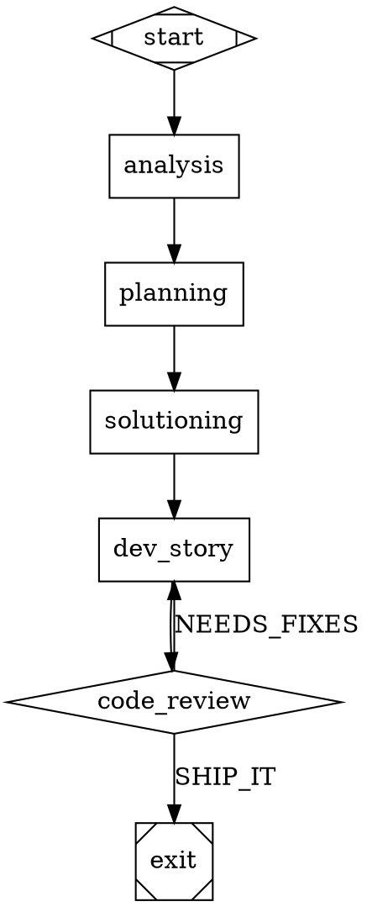

# Product Brief: Substrate Software Factory

**Date:** 2026-03-21
**Author:** John Planow
**Status:** Draft
**Informed by:** Phase 0 Technical Research Report (2026-03-21), Attractor Spec, Coding Agent Loop Spec, Unified LLM Client Spec, StrongDM Software Factory Report

---

## 1. Product Vision

The Substrate Software Factory is an evolution of substrate from a linear SDLC pipeline orchestrator into a graph-based autonomous software development system. It replaces substrate's fixed phase sequence (analysis, planning, solutioning, implementation) and code-review-based quality model with a directed-graph execution engine and external scenario validation, enabling iterative convergence loops where agents implement, validate against holdout scenarios, and refine until measurable quality thresholds are met — without human code review. The factory preserves substrate's existing strengths (multi-provider routing with auto-tuning, telemetry-driven optimization, battle-tested process management, language-agnostic operation) while adding the execution model flexibility needed for autonomous, high-quality software production at scale.

---

## 2. Problem Statement

Substrate today orchestrates AI-driven software development through a linear pipeline with a fixed phase sequence and a code-review-based quality model. This design has three fundamental limitations:

### 2.1 Linear Execution Cannot Express Iteration

The phase orchestrator (`src/modules/phase-orchestrator/`) enforces a rigid sequence: analysis, planning, solutioning, implementation. Within implementation, the orchestrator (`src/modules/implementation-orchestrator/orchestrator-impl.ts`, ~2700 lines) runs a create-story, dev-story, code-review pipeline with a hardcoded `maxReviewCycles` retry counter. There is no way to express conditional branching (skip solutioning for a bug fix), parallel evaluation paths (try two approaches and pick the best), or multi-level convergence loops (validate at the story level, then validate at the integration level). Every workflow must fit the same linear mold.

### 2.2 Code Review Is a Weak Quality Signal

Quality assurance is a single code review dispatch per cycle, producing a three-way verdict: `SHIP_IT`, `NEEDS_MINOR_FIXES`, or escalation. This model has three problems. First, the reviewing agent has no access to runtime behavior — it judges code by reading it, not by running it. Second, the agent that writes the code and the agent that reviews it both see the same context, creating a bias toward self-consistent but potentially wrong implementations. Third, the verdict is categorical (pass/fail/fix), not probabilistic — there is no measure of "how close to correct" the implementation is, which makes it impossible to detect diminishing returns in retry loops.

### 2.3 CLI Agent Opacity

Substrate dispatches to CLI agents (claude, codex, gemini) as black boxes via `Dispatcher.dispatch()`. The orchestrator sends a compiled prompt and receives a structured result, but has no visibility into per-turn tool calls, no ability to inject steering messages mid-task, and no loop detection for agents stuck in repetitive patterns. This limits the orchestrator's ability to optimize agent behavior during convergence loops where fine-grained control determines cost efficiency.

---

## 3. Target Users

### Primary: Solo developers and small teams already using substrate

Developers who run `substrate run` today to ship multi-story epics. They benefit from graph-based pipelines that can express their actual workflows (conditional logic, parallel exploration, iterative refinement) rather than forcing everything through the linear phase sequence. Migration is seamless — existing behavior is preserved, new capabilities are opt-in.

### Secondary: Teams building AI-native development workflows

Engineering teams designing autonomous development processes for their organizations. The factory provides a declarative pipeline definition format (DOT graphs), a pluggable quality model (scenario validation instead of code review), and convergence economics (budget controls, diminishing returns detection) needed for production use of AI agents at scale.

### Tertiary: The substrate project itself

The factory's self-hosting milestone — where the factory builds its own components using its own scenario validation — validates the system and accelerates substrate's own development.

---

## 4. Product Boundary

### 4.1 Monorepo Package Structure

The research report recommends three packages in a monorepo: `substrate-core`, `substrate-sdlc`, and `substrate-factory`. This structure is affirmed with one refinement: the extraction must be interface-first and incremental, not a big-bang restructure.

**Affirmed structure:**

| Package | Purpose | Contains |
|---------|---------|----------|
| `substrate-core` | General-purpose agent infrastructure | AdapterRegistry, RoutingEngine, TypedEventBus, telemetry pipeline, Dispatcher, supervisor, DatabaseAdapter, config system, context compiler |
| `substrate-sdlc` | Existing SDLC pipeline (preserved) | Phase orchestrator, implementation orchestrator, compiled workflows (create-story, dev-story, code-review), methodology packs, CLI commands |
| `substrate-factory` | Graph engine + factory capabilities | DOT parser/validator, graph executor, CodergenBackend, scenario store/runner, satisfaction scoring, convergence controller |

**Boundary principle:** `substrate-core` contains everything that is useful independent of the SDLC or factory domain. `substrate-sdlc` contains everything specific to the existing linear pipeline and its methodology-pack-driven workflows. `substrate-factory` contains everything specific to graph-based execution and scenario-driven convergence. Both `sdlc` and `factory` depend on `core`. They do not depend on each other.

### 4.2 Where Existing Capabilities Live

| Current Module | Target Package | Rationale |
|----------------|---------------|-----------|
| `src/core/event-bus.ts` | core | Domain-agnostic pub/sub |
| `src/modules/routing/` | core | Task-to-provider routing is pipeline-agnostic |
| `src/modules/agent-dispatch/` | core | Dispatcher spawns agents regardless of pipeline model |
| `src/modules/telemetry/` | core | OTEL pipeline, cost tracking, efficiency scoring |
| `src/modules/supervisor/` | core | Stall detection, health, kill-restart |
| `src/persistence/` | core | DatabaseAdapter, schema, queries |
| `src/modules/config/` | core | Config loading, validation, hot-reload |
| `src/modules/phase-orchestrator/` | sdlc | Linear phase sequence is SDLC-specific |
| `src/modules/implementation-orchestrator/` | sdlc | Story state machine is SDLC-specific |
| `src/modules/compiled-workflows/` | sdlc | create-story, dev-story, code-review prompts |
| `src/modules/methodology-pack/` | sdlc | BMAD methodology packs |

### 4.3 What Is NOT in Scope

The factory does not replace the existing SDLC pipeline. It is a new execution mode that coexists with it. After the transformation, a user can run `substrate run` (SDLC mode, linear pipeline, code review) or `substrate factory run` (factory mode, graph pipeline, scenario validation). The SDLC pipeline is re-expressed as a DOT graph internally but its behavior does not change.

---

## 5. Key Capabilities

### P0 — Must Have (Foundation + Factory Loop)

#### 5.1 Graph Pipeline Engine (Attractor Spec)

A directed-graph execution engine that replaces the fixed phase sequence as the pipeline's execution model. Pipelines are defined as DOT (Graphviz) files with typed nodes and conditional edges.

**Core components:**
- **DOT parser and validator** — Parse DOT graph definitions, enforce the 13 validation rules from the Attractor spec (exactly one start node, exactly one exit node, all nodes reachable, etc.). Use `ts-graphviz` for parsing.
- **Graph executor** — Async loop that traverses the graph: resolve current node, dispatch to handler, write checkpoint, select next edge, advance. Single-threaded at the top level.
- **8 node type handlers** — `start`, `exit`, `codergen` (LLM task), `wait.human` (human gate), `conditional` (routing), `parallel` (fan-out), `parallel.fan_in` (merge), `tool` (shell/API). The `stack.manager_loop` handler maps to substrate's existing supervisor.
- **5-step edge selection algorithm** — Condition-matched edges, preferred label match, suggested next IDs, highest weight, lexical tiebreak. Replaces hardcoded phase transitions.
- **Per-node checkpointing** — Serialize execution state after every node completion. Resume from checkpoint on crash. Degrade `full` fidelity to `summary:high` for one hop on resume (in-memory sessions are not serializable).

#### 5.2 Core Extraction

Extract substrate's general-purpose infrastructure into `substrate-core` as a shared library. Interface-first: define TypeScript interfaces, then move implementations. All 5,944 existing tests must pass at every intermediate step. Re-export from original paths during migration to avoid breaking consumers.

#### 5.3 External Scenario Validation

Replace code-review verdicts with external holdout scenario validation as the quality signal for convergence loops.

**Properties:**
- Scenarios are end-to-end user stories stored outside the agent's working tree (`.substrate/scenarios/`, gitignored, excluded from context)
- Agents never see scenario source code — they only receive structured pass/fail results
- Scenario files are immutable during pipeline execution (checksum validation)
- Scenario runner executes in a separate process with structured output (pass/fail per scenario, diffs, traces)
- Start simple: shell scripts that run E2E tests and return exit codes. Formalize the scenario format after real usage patterns emerge.

#### 5.4 Convergence Loop with Goal Gates

Goal gate enforcement per the Attractor spec: nodes marked `goal_gate=true` must reach SUCCESS or PARTIAL_SUCCESS before the pipeline can exit. On unsatisfied gate at exit, jump to `retry_target`. Combined with external scenarios, this creates the core factory loop:

```
implement → validate (scenario runner) → score → pass? → exit
                                            └─ fail? → implement (retry)
```

**Budget controls at three levels:**
- Per-node: `max_retries` attribute with exponential backoff
- Per-pipeline: total cost cap (`budget_cap_usd`), wall-clock cap
- Diminishing returns detection: escalate if satisfaction score plateaus across N iterations

#### 5.5 SDLC Pipeline as Graph

Express substrate's existing linear pipeline (analysis → planning → solutioning → implementation with review/rework cycles) as a DOT graph. Wire the graph to the existing phase and implementation orchestrators. Validate behavioral parity: same stories, same inputs produce the same results through both the linear orchestrator and the graph engine.

This is the critical proof point for Phase A. The graph engine must be able to run the SDLC pipeline identically before any new factory capabilities are layered on.

### P1 — Should Have (Quality Model + Backend Flexibility)

#### 5.6 Satisfaction Scoring

Replace boolean pass/fail verdicts with probabilistic satisfaction scoring: "what fraction of observed trajectories through all scenarios likely satisfy the user?" This score is the goal gate's evaluation input. Benefits: enables measurement of "how close," supports diminishing returns detection, and provides a meaningful progress signal across iterations.

#### 5.7 Hybrid CodergenBackend

The `CodergenBackend` interface is the extension point between the graph engine and agent execution:

```typescript
interface CodergenBackend {
  run(node: Node, prompt: string, context: Context): Promise<string | Outcome>
}
```

Two implementations:
- **`CLICodergenBackend`** — Wraps substrate's existing `Dispatcher.dispatch()`. Zero migration cost. Each call spawns a CLI agent process. No per-turn visibility. Used for SDLC backward compatibility.
- **`DirectCodergenBackend`** — Implements the Coding Agent Loop spec. Manages the agentic loop in-process: build request, call LLM, dispatch tools, truncate output, inject steering, detect loops, repeat. Uses a Unified LLM Client for API calls. Full per-turn observability.

Ship `CLICodergenBackend` first (Phase A). Add `DirectCodergenBackend` when factory convergence loops need per-turn control (Phase C).

#### 5.8 Model Stylesheet

CSS-like routing syntax for per-node model selection, complementing substrate's existing `RoutingPolicy`:

```css
* { llm_model: claude-sonnet-4-5; }
.code { llm_model: claude-opus-4-6; reasoning_effort: high; }
#critical_review { llm_model: gpt-5.2; }
```

Specificity: universal (0) < shape (1) < class (2) < node ID (3). Coexists with RoutingPolicy: stylesheet provides per-node intent, RoutingPolicy applies operational constraints (subscription-first routing, rate limits, cost optimization).

### P2 — Nice to Have (Scale)

#### 5.9 Digital Twin Universe

Behavioral clones of third-party services for high-volume scenario validation. Start with Docker Compose and existing test doubles (LocalStack, WireMock, testcontainers). Evolve to agent-generated twins from API documentation in Phase C.

#### 5.10 Agent-Generated Twins

Use the factory itself to build digital twins: feed public API documentation to agents, produce self-contained service binaries, validate against real service behavior samples. This is the meta-bootstrap: the factory building its own infrastructure.

#### 5.11 Pyramid Summaries

Reversible multi-level summarization for long-running sessions. Compress context without losing the ability to expand back to full detail. Addresses the context window pressure that accumulates during convergence loops with many iterations.

#### 5.12 Advanced Graph Features

- **LLM-evaluated edges** — Edge conditions evaluated by an LLM call, not just string matching against context. Enables semantic routing decisions.
- **Parallel fan-out/fan-in** — Concurrent branch execution with isolated contexts and configurable join policies (all, first-success, quorum).
- **Subgraphs** — Graphs containing graphs. Enables composable pipeline libraries.

---

## 6. Execution Model Evolution

### 6.1 From Linear Phases to Graph-Based Execution

Today's execution model is a hardcoded sequence driven by the phase orchestrator and implementation orchestrator:

```
PhaseOrchestrator.startRun()
  → analysis phase (entry gates → dispatch → exit gates)
  → planning phase (entry gates → dispatch → exit gates)
  → solutioning phase (entry gates → dispatch → exit gates)
  → ImplementationOrchestrator.start()
      → for each story:
          create-story → dev-story → code-review
          → SHIP_IT? done.
          → NEEDS_FIXES? dev-story → code-review (up to maxReviewCycles)
          → exhausted? escalate.
```

The state transitions are imperative (`StoryPhase`: PENDING → IN_STORY_CREATION → IN_DEV → IN_REVIEW → NEEDS_FIXES → COMPLETE/ESCALATED). Conditional logic is `if/else` in TypeScript. The review cycle count is a decrementing integer.

### 6.2 The Existing Review/Rework Cycle Is a Proto-Loop

The critical insight from the research: substrate's review/rework cycle (`dev-story → code-review → NEEDS_FIXES → dev-story`) is already a convergence loop — it just has a weak quality signal (code review verdict) and a fixed iteration budget (`maxReviewCycles`). The factory generalization replaces the quality signal (code review → scenario validation) and the iteration mechanism (integer counter → goal gate with budget controls), but the structural pattern is the same. This is not a rewrite; it is a generalization.

### 6.3 Graph Execution Model

The graph engine executes a DAG defined in DOT format:

```
parse DOT → validate → transform (stylesheet, variable expansion) →
execute:
  current_node = start_node
  while current_node != exit_node:
    handler = registry.get(current_node.type)
    outcome = await handler.execute(current_node, context, graph)
    write_checkpoint(current_node, outcome, context)
    edge = select_edge(current_node, outcome, context, graph)
    current_node = graph.get_node(edge.target)
  check_goal_gates()
```

The same SDLC pipeline expressed as a graph:



This graph preserves the existing behavior while making every transition explicit, visual, and extensible. Adding a pre-implementation validation step is adding a node and two edges, not modifying orchestrator control flow.

---

## 7. Quality Model Transition

### 7.1 Current Model: Code Review Verdicts

The code review dispatch returns a structured verdict:
- `SHIP_IT` — implementation passes review, story completes
- `NEEDS_MINOR_FIXES` — implementation needs targeted changes, retry with remediation context
- Escalation — implementation is fundamentally wrong, human intervention required

Limitations: the reviewing agent reads code but does not execute it, the verdict is categorical not probabilistic, and the reviewing agent shares the same context biases as the implementing agent.

### 7.2 Target Model: Scenario Satisfaction Scoring

External holdout scenarios provide a runtime quality signal:
- Scenarios execute the implementation against real (or twin) environments
- The agent cannot see or modify scenario source code
- Satisfaction is a probabilistic score (0.0 to 1.0), not a boolean
- Goal gates evaluate the score against a threshold to determine convergence

### 7.3 Parallel Running During Transition

The transition from code review to scenario validation uses parallel running to build confidence:

**Phase 1 — Code review only (current state).** All quality decisions use code review verdicts. No scenarios.

**Phase 2 — Dual signal.** Both code review and scenario validation run for every story. Code review remains the decision-making signal. Scenario scores are logged for comparison. Operators can see whether the scenario score agrees with or disagrees with the code review verdict.

**Phase 3 — Scenario primary, review secondary.** Scenario satisfaction score drives goal gate decisions. Code review runs as an advisory signal (logged but not decision-making). This catches cases where scenarios pass but code quality is poor (e.g., hardcoded scenario responses).

**Phase 4 — Scenarios only.** Code review dispatch is removed from the factory pipeline. Quality comes entirely from external scenario validation. The SDLC pipeline retains code review for users who prefer it.

---

## 8. Relationship to Planned Epics

Three planned epics (32, 33, 34) are subsumed by the factory vision. They are not canceled — they become the implementation vehicle for factory capabilities.

### Epic 32: Core Extraction → Package Extraction (Phase A)

Epic 32 (`epic-32-substrate-core-extraction.md`) planned to extract substrate's reusable infrastructure into a `substrate-core` library. This directly becomes the foundation phase of the factory transformation. The interface-first extraction pattern, the test preservation requirement, and the re-export migration strategy all carry forward unchanged. The difference: the extraction is now motivated by the factory's need for a shared library, not just code organization.

### Epic 33: Validation Harness → Scenario Validation (Phase B)

Epic 33 (`epic-33-validation-harness.md`) planned a validation harness for testing substrate's own pipeline quality. This evolves into the external scenario validation system. The harness concept expands: instead of validating substrate's pipeline behavior, it validates any project's implementation quality through holdout scenarios. The `RemediationContext` design from Epic 33 carries forward as the structured feedback context injected on convergence loop retries.

### Epic 34: Autonomous Execution Baselines → Convergence Loop (Phase B)

Epic 34 (`epic-34-autonomous-execution-baselines.md`) planned autonomous execution with quality baselines. This evolves into the convergence loop with goal gates and satisfaction scoring. The "baselines" concept becomes the satisfaction threshold that goal gates evaluate against. The "autonomous execution" concept becomes the factory's core loop: implement, validate, iterate until convergence — without human code review in the loop.

### Summary

| Planned Epic | Factory Phase | What It Becomes |
|-------------|---------------|-----------------|
| Epic 32: Core Extraction | Phase A: Foundation | Monorepo restructure, `substrate-core` package |
| Epic 33: Validation Harness | Phase B: Factory Loop | External scenario validation, satisfaction scoring |
| Epic 34: Autonomous Execution | Phase B: Factory Loop | Convergence loop, goal gates, budget controls |
| New: Graph Engine | Phase A: Foundation | DOT parser, validator, executor, edge selection |
| New: DTU + Direct API | Phase C: Scale | Digital twins, Coding Agent Loop, Unified LLM Client |

---

## 9. Hard Constraints

### 9.1 Backward Compatibility

Existing `substrate run` behavior must work identically at every stage of the transformation. Users who do not opt into factory mode see zero behavioral changes. The SDLC pipeline may be re-expressed internally as a graph, but its inputs, outputs, and observable behavior must not change.

### 9.2 Test Preservation

All 5,944 existing tests must remain green at every commit throughout the transformation. This is enforced by CI and is non-negotiable. New capabilities add tests; they do not break existing ones.

### 9.3 Multi-Provider Support

The factory must support Claude, Codex, and Gemini as execution backends, consistent with substrate's existing multi-provider routing. The model stylesheet provides per-node routing; the existing RoutingEngine applies operational constraints. Provider lock-in is a design failure.

### 9.4 Language-Agnostic Operation

The factory must work on any project stack — TypeScript, Python, Go, Rust, Java, or any other. Scenario validation uses shell scripts (any language can invoke `npm test`, `go test`, `pytest`, etc.). No language-specific logic in the factory's core execution path.

### 9.5 CLI Tool / Local Daemon

Substrate is a CLI tool that runs on a developer's machine. The factory does not change this. There is no hosted service, no cloud dependency, no account creation. Everything runs locally. An optional HTTP server (for web dashboards and remote human gates) may be added, but the CLI is the primary interface.

---

## 10. What This Is Not

### 10.1 Not a Hosted SaaS

The factory runs on the developer's machine using their API keys. There is no substrate cloud service, no data leaves the local environment beyond LLM API calls, and there is no subscription fee beyond the LLM provider costs.

### 10.2 Not a Replacement for Human Judgment on Requirements

The factory automates implementation and validation, not requirements definition. Humans define what to build (seeds, scenarios, acceptance criteria). The factory figures out how to build it and validates that it works. The `wait.human` node type provides explicit human gates for decisions that require judgment.

### 10.3 Not an Attractor Clone

Substrate implements the Attractor spec for its graph engine because the spec is well-designed, battle-tested by 16+ community implementations, and provides a declarative pipeline format that is inherently debuggable (DOT files render as visual graphs). But substrate brings unique strengths that no Attractor implementation has:

- **Multi-provider routing with auto-tuning** — Subscription-first routing, rate limit tracking, telemetry-driven routing recommendations. The RoutingEngine is 14 files of battle-tested logic.
- **Telemetry-driven optimization** — A full OTEL pipeline with efficiency scoring, cost tracking, turn analysis, and advisory directives. 20+ files of telemetry infrastructure.
- **Battle-tested process management** — 39 epics of real-world pipeline execution across multiple projects (ynab, nextgen-ticketing). Stall detection, kill-restart recovery, memory pressure management, package snapshot/restore.
- **SDLC domain knowledge** — Methodology packs, story complexity analysis, interface contract verification, conflict group detection, escalation diagnosis. The factory builds on this domain expertise, not discards it.

### 10.4 Not a Complete Reimplementation

The factory reuses ~60% of substrate's existing infrastructure. The transformation is additive: new graph engine + new scenario validation + new convergence loop, all built on the existing event bus, routing, telemetry, dispatch, supervisor, persistence, and config systems.

---

## 11. Success Criteria

### 11.1 Self-Hosting

The factory can build its own components. Specifically: write holdout scenarios for a factory subsystem (e.g., the edge selection algorithm), run the factory against those scenarios, and converge on a correct implementation. This validates the entire loop: graph execution, scenario validation, convergence, and goal gates.

### 11.2 Cross-Project Validation

The factory produces correct, validated implementations on a reference project outside the substrate codebase. Candidates: the ynab project (TypeScript/SvelteKit, 7 stories completed via SDLC pipeline) or the nextgen-ticketing project (Turborepo monorepo, 17 stories completed via SDLC pipeline). Success means the factory produces equivalent or better results than the SDLC pipeline on the same stories.

### 11.3 Convergence Rate

Greater than 80% of stories converge within budget (satisfy scenario validation at the goal gate threshold without exhausting `max_retries` or `budget_cap_usd`). Measured across at least 20 stories on at least 2 different project codebases.

### 11.4 SDLC Parity

The existing SDLC pipeline behavior is unchanged after the transformation. Validated by running the same story set through both the old linear orchestrator and the new graph-based orchestrator and confirming identical results.

### 11.5 Cost Efficiency

Factory mode costs no more than 5x the SDLC pipeline per story on average ($5-25 per factory story vs. $1-5 per SDLC story), while producing scenario-validated quality that the SDLC pipeline cannot guarantee.

### 11.6 Quantitative Targets by Phase

| Metric | Phase A | Phase B | Phase C |
|--------|---------|---------|---------|
| Existing tests passing | 5,944/5,944 | 5,944/5,944 | 5,944/5,944 |
| New tests added | +500 | +300 | +400 |
| SDLC behavioral parity | Verified | Verified | Verified |
| Attractor lint rule conformance | 13/13 | 13/13 | 13/13 |
| Factory self-hosting | N/A | Scenario infra built via factory | Factory builds own components |
| Convergence rate | N/A | >80% | >90% |
| Avg cost per converged story | N/A | <$15 | <$10 |

---

## 12. Implementation Phasing

### Phase A: Foundation (Epics 40-43)

**Goal:** Substrate becomes a monorepo with a working graph engine. The existing SDLC pipeline is expressed as a DOT graph with zero behavioral changes.

1. Monorepo setup (npm workspaces + TypeScript project references)
2. Interface extraction — define `substrate-core` interfaces
3. Implementation migration — move implementations to core package
4. Graph parser + validator (`ts-graphviz`, 13 lint rules)
5. Graph executor (state machine loop, handler registry, 5-step edge selector)
6. SDLC-as-graph (DOT graph wired to existing orchestrators, parity testing)

### Phase B: Factory Loop (Epics 44-46)

**Goal:** A working convergence loop that iterates until holdout scenarios pass. First "factory" milestone.

7. Scenario store + format (YAML definitions, isolated storage, shell-script runner)
8. Goal gates (goal_gate + retry_target per Attractor spec, budget controls)
9. Convergence controller (scenarios wired to goal gates, plateau detection)
10. Satisfaction scoring (probabilistic score, parallel running with code review)

### Phase C: Scale (Epics 47-50)

**Goal:** Full factory capabilities including digital twins and per-turn agent control.

11. DTU foundation (twin registry, Docker Compose orchestration)
12. Direct API backend (CodingAgentLoop + UnifiedLLMClient or Vercel AI SDK wrapper)
13. Agent-generated twins (factory builds twins from API docs)
14. Advanced graph features (LLM-evaluated edges, parallel fan-out/fan-in, subgraphs)

---

## 13. Key Technical Decisions

| Decision | Choice | Rationale |
|----------|--------|-----------|
| DOT parser | Adopt `ts-graphviz` | Mature, typed, active (Feb 2026), exact match for Attractor DOT subset |
| Graph executor | Build custom | Attractor's execution semantics are unique (5-step edge selection, goal gates, fidelity modes); no existing engine matches |
| LLM abstraction | Evaluate Vercel AI SDK, wrap with custom layer | 20+ providers, tool calling, streaming; audit against unified-llm-spec.md before committing |
| Scenario format | Shell scripts first, formalize later | Maximum flexibility for diverse project stacks |
| Monorepo tooling | npm workspaces | Substrate already uses npm; minimal new tooling overhead |
| Persistence for graph state | File-backed (per Attractor spec) | Debuggable (`cat` any node state), portable, spec-aligned |
| Persistence for metrics/scores | Extend existing DatabaseAdapter | Reuse existing tables + add `scenario_results` and satisfaction score columns |
| Backend strategy | CLI backend first, direct API second | Zero migration cost to prove graph engine; direct API unlocks per-turn control later |

---

## 14. Risks

| Risk | Severity | Mitigation |
|------|----------|------------|
| Core extraction breaks existing tests | Critical | Interface-first extraction, re-export from original paths, CI gate at every commit |
| Graph engine semantics drift from Attractor spec | High | Test against AttractorBench conformance suite, implement edge selection verbatim from spec pseudocode |
| Convergence loop infinite cost | High | Budget caps at three levels, diminishing returns detection, mandatory escalation on plateau |
| Scenario format too rigid for diverse projects | Medium | Start with shell scripts (maximally flexible), formalize after usage patterns emerge |
| DTU fidelity insufficient for validation | Medium | Start with Docker Compose + existing test doubles; agent-generated twins deferred to Phase C |
| Self-hosting bootstrap fails | Medium | Conventional tests first; self-hosting is a milestone, not a prerequisite |

---

**End of Product Brief**
