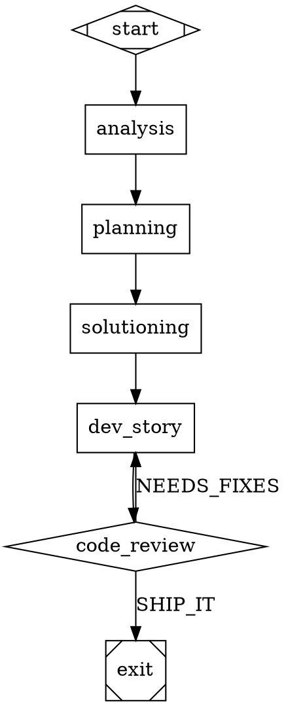
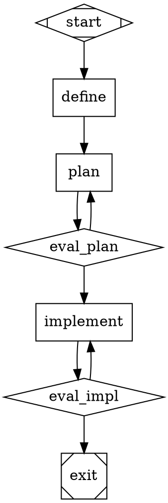

# Research Report: Technical

**Date:** 2026-03-21
**Author:** Human
**Research Type:** Technical

---

## Research Overview

This report is a comprehensive technical analysis of what it would take to transform Substrate (v0.8.6, 39 epics, 5,944 tests) into a Software Factory implementing the Attractor specification. The research draws from three primary specs (5,726 lines total), substrate's existing codebase (150+ modules), community implementation lessons, and current web research on factory methodology economics.

The core finding is that substrate already has ~60% of the infrastructure needed — routing, dispatch, telemetry, cost tracking, event bus, supervisor, persistence. The critical gaps are the graph execution engine (replacing the linear phase orchestrator), external scenario validation (replacing code-review verdicts), and the convergence loop (goal gates + satisfaction scoring). A three-phase implementation roadmap (Foundation → Factory Loop → Scale) delivers the first working factory by the end of Phase B, with full Attractor spec conformance by the end of Phase C.

For the full executive summary and strategic recommendations, see the Research Synthesis section at the end of this document.

---

## Technical Research Scope Confirmation

**Research Topic:** Attractor Software Factory Implementation for Substrate
**Research Goals:** Deep dive into all three Attractor specs, gap analysis mapping each capability to substrate's existing codebase, community implementation lessons, factory methodology technique mapping, implementation-relevant findings for subsequent product brief, PRD, and architecture phases.

**Technical Research Scope:**

- Architecture Analysis - Attractor graph pipeline model vs. substrate's linear orchestrator
- Implementation Approaches - Coding agent loop vs. substrate's dispatcher and compiled workflows
- Technology Stack - Unified LLM client vs. substrate's AdapterRegistry and routing engine
- Integration Patterns - How the three specs compose and map to substrate's event bus, telemetry, supervisor, persistence
- Performance Considerations - Convergence economics, satisfaction scoring, DTU overhead, context management

**Research Methodology:**

- Primary source analysis from 3 Attractor specs (5,726 lines total)
- Cross-reference with StrongDM factory report for methodology and community ecosystem
- Codebase analysis of substrate's current modules for gap analysis
- Web search to supplement with current community findings
- Confidence level framework for uncertain information

**Scope Confirmed:** 2026-03-21

## Technology Stack Analysis

### 1. Attractor Pipeline Runner — Implementation-Critical Semantics

The Attractor spec (docs/reference/attractor-spec.md, 2,090 lines) defines a graph-structured pipeline engine with 8 node types, a 5-step edge selection algorithm, goal gate enforcement, DOT-based graph definitions, CSS-like model routing, and per-node checkpointing.

#### 1.1 Node Types

| Shape | Handler | Substrate Equivalent | Gap |
|-------|---------|---------------------|-----|
| `Mdiamond` | `start` | Phase orchestrator `startRun()` | Direct map — entry point semantics match |
| `Msquare` | `exit` | Phase orchestrator completion + goal gate check | Need goal gate enforcement at exit |
| `box` | `codergen` | `Dispatcher.dispatch()` + compiled workflows | Core execution — needs CodergenBackend interface wrapping existing dispatcher |
| `hexagon` | `wait.human` | No equivalent | **New** — human approval gates with accelerator key parsing, timeout/default handling |
| `diamond` | `conditional` | No equivalent (fixed phase sequence) | **New** — routing point, edges evaluated by engine |
| `component` | `parallel` | `maxConcurrency` in orchestrator | Partial — substrate does concurrent stories, but not isolated branch contexts with join policies |
| `tripleoctagon` | `parallel.fan_in` | No equivalent | **New** — consolidation node with LLM-based or heuristic ranking of parallel results |
| `parallelogram` | `tool` | `execSync` in build verification | Partial — shell execution exists but not as first-class graph node |
| `house` | `stack.manager_loop` | Supervisor module | Strong parallel — substrate's supervisor already loops: observe → steer → evaluate stop condition |

**Key implementation decisions:**
- The `codergen` handler must implement `CodergenBackend.run(node, prompt, context) -> String | Outcome`. Substrate's dispatcher returns structured results (DevStoryResult, CodeReviewResult) — need an adapter layer.
- The `parallel` handler uses **isolated cloned contexts** per branch — branch changes are NOT merged back. This differs from substrate's concurrent story execution where all stories share the same git working tree.
- The `stack.manager_loop` maps closely to substrate's supervisor: observe child telemetry, optionally steer, evaluate stop_condition, loop up to max_cycles (default 1000).

#### 1.2 Edge Selection Algorithm (5-Step Priority)

```
1. Condition-matched edges (evaluate condition against context/outcome, highest priority)
2. Preferred label match (outcome.preferred_label → edge.label, normalized)
3. Suggested next IDs (outcome.suggested_next_ids array, first match wins)
4. Highest weight (unconditional edges only, integer, higher wins)
5. Lexical tiebreak (target node ID, ascending alphabetical)
```

**Condition syntax:** `key operator literal && key operator literal ...` where operators are `=` and `!=`, AND-combined, case-sensitive. Missing context keys resolve to empty string.

**Label normalization:** lowercase, trim whitespace, strip accelerator prefixes (`[K] `, `K) `, `K - `).

**Substrate impact:** This algorithm replaces the fixed phase sequence entirely. The implementation orchestrator's story state machine (PENDING → IN_DEV → IN_REVIEW → ...) becomes a graph with conditional edges instead of hardcoded transitions.

#### 1.3 Goal Gate Enforcement

- Nodes with `goal_gate=true` must reach SUCCESS or PARTIAL_SUCCESS before pipeline can exit
- On unsatisfied gate at exit: jump to `retry_target` (node → node fallback → graph → graph fallback → FAIL)
- `max_retries` controls additional attempts per node (1 + max_retries = total). Backoff: exponential with jitter.

**Substrate mapping:** The review/rework cycle (`maxReviewCycles`) is a specific instance of goal gate retry. Generalizing: any node can be a goal gate with configurable retry budget.

#### 1.4 Graph Validation (13 Rules)

**Errors (block execution):** `start_node` (exactly one), `terminal_node` (exactly one), `reachability` (all nodes reachable from start), `edge_target_exists`, `start_no_incoming`, `exit_no_outgoing`, `condition_syntax`, `stylesheet_syntax`

**Warnings (execution allowed):** `type_known`, `fidelity_valid`, `retry_target_exists`, `goal_gate_has_retry`, `prompt_on_llm_nodes`

#### 1.5 Model Stylesheet

CSS-like specificity: `*` (0) < `box` (1, by shape) < `.class` (2) < `#id` (3). Properties: `llm_model`, `llm_provider`, `reasoning_effort`. Resolution: explicit node attribute > stylesheet by specificity > graph default > system default.

**Substrate mapping:** Substrate's `RoutingPolicy` YAML serves the same purpose but with task-type-based rules rather than CSS selectors. The stylesheet syntax is more expressive (can target individual nodes by ID or class). Could coexist: stylesheet for graph-level routing, RoutingPolicy for provider-level rules.

#### 1.6 Checkpointing

Written after every node completion: `{logs_root}/checkpoint.json` with `timestamp`, `current_node`, `completed_nodes`, `node_retries`, `context`, `logs`. Resume loads checkpoint, skips completed nodes, degrades `full` fidelity to `summary:high` for one hop (in-memory sessions not serializable).

**Substrate mapping:** Substrate checkpoints at story-phase level. The Attractor contract requires per-node granularity. Story-level checkpoints could be preserved as a higher-level abstraction over node-level checkpoints.

---

### 2. Coding Agent Loop — Execution Model

The coding agent loop spec (docs/reference/coding-agent-loop-spec.md, 1,467 lines) defines how each pipeline node executes when the handler is an LLM agent.

#### 2.1 Core Loop

```
Build request → Call LLM (single-shot, no SDK loop) → Record turn →
If tool_calls: execute tools → truncate output → drain steering → loop detection → loop
If text-only: natural completion → check follow_up queue → done
```

**Critical detail:** The spec calls the LLM in single-shot mode (not the SDK's built-in tool loop). The engine manages the tool execution cycle itself, giving it control over truncation, steering injection, and loop detection between rounds.

**Substrate mapping:** Substrate currently dispatches to CLI agents (claude, codex, gemini) which manage their own agentic loops internally. The Attractor model inverts this: the pipeline engine manages the loop, calling the LLM as a stateless function. This is a fundamental architectural difference.

**Implementation options:**
1. **Wrap existing CLI agents** — continue spawning claude/codex/gemini CLIs but treat each dispatch as one "codergen node" execution. Loses per-turn control (steering, loop detection).
2. **Direct API integration** — call LLM APIs directly via the Unified LLM Client, managing the tool loop in substrate. Gains full per-turn control. Requires implementing the Unified LLM Client.
3. **Hybrid** — use direct API for factory mode (graph pipelines), CLI agents for SDLC mode (backward compatibility). Migration path: start with CLI wrapping, graduate to direct API.

#### 2.2 Termination Conditions

1. **Natural completion** — text-only response (no tool calls)
2. **Round limit** — `max_tool_rounds_per_input` exceeded
3. **Turn limit** — `max_turns` (session-wide) exceeded
4. **Abort signal** — host cancellation
5. **Unrecoverable error** — auth failure, etc.

#### 2.3 Loop Detection

Tracks last N tool call signatures (name + arguments hash). Detects repeating patterns of length 1, 2, or 3 within the window (default 10). On detection: injects steering message ("Try a different approach"), emits LOOP_DETECTION event.

**Substrate impact:** Substrate currently has no agent-level loop detection. The dispatcher times out after a fixed period. Adding loop detection requires either direct API integration (to see individual tool calls) or log parsing of CLI agent output.

#### 2.4 Mid-Task Control

- **steer():** Queue message for injection after current tool round completes. Becomes a SteeringTurn (user-role message).
- **follow_up():** Queue message for after current input fully completes. Triggers new processing cycle.

**Substrate impact:** Currently no mechanism to steer agents mid-dispatch. This is only possible with direct API integration.

#### 2.5 Output Truncation (Two-Phase)

Phase 1: Character-based (head_tail or tail mode, per-tool defaults from 1K to 50K chars).
Phase 2: Line-based (secondary readability pass, per-tool defaults from 200 to 500 lines).

Full untruncated output always available in event stream. LLM sees truncated version.

#### 2.6 System Prompt Layering

5 layers: Provider base → Environment context → Tool descriptions → Project docs (AGENTS.md, CLAUDE.md) → User overrides. 32KB total budget for project docs.

**Substrate mapping:** Substrate's `prompt-assembler.ts` serves a similar function but is SDLC-specific (story context, AC injection, methodology constraints). The Attractor layering is more general-purpose. These could coexist: Attractor layers for general context, substrate layers for SDLC-specific context.

#### 2.7 Provider-Aligned Tool Sets

Each provider gets its native tool format:
- **Anthropic:** `edit_file` (old_string/new_string exact match)
- **OpenAI:** `apply_patch` (v4a format)
- **Gemini:** `edit_file` (may differ from Anthropic schema)
- **All:** `read_file`, `write_file`, `shell`, `grep`, `glob`

**Substrate mapping:** Substrate currently passes prompts to CLI agents which bring their own tools. Direct API integration would require implementing these tool sets.

---

### 3. Unified LLM Client — Provider Abstraction

The unified LLM client spec (docs/reference/unified-llm-spec.md, 2,169 lines) defines a 4-layer provider abstraction for making LLM calls across Anthropic, OpenAI, and Gemini.

#### 3.1 Architecture

| Layer | Responsibility | Substrate Equivalent |
|-------|---------------|---------------------|
| 1. Provider Specification | Interface contracts, shared types | `WorkerAdapter` interface in `src/adapters/` |
| 2. Provider Utilities | HTTP, SSE, retry logic | No equivalent (CLI-based, not API-based) |
| 3. Core Client | Request routing, middleware | `RoutingEngine` + `AdapterRegistry` |
| 4. High-Level API | `generate()`, `stream()`, `generate_object()` | `Dispatcher.dispatch()` (much higher level) |

**Key gap:** Substrate's adapter layer wraps CLI processes, not API calls. The Unified LLM Client wraps HTTP APIs. These are complementary — CLI adapters for SDLC mode, API adapters for factory mode.

#### 3.2 Provider-Specific Requirements

| Requirement | OpenAI | Anthropic | Gemini |
|-------------|--------|-----------|--------|
| API | Responses API (NOT Chat Completions) | Messages API | Gemini API |
| Auth | Bearer token | `x-api-key` header | `key` query param |
| System msgs | `instructions` param | `system` param | `systemInstruction` field |
| Message alternation | No requirement | **Strict** (must merge consecutive same-role) | No requirement |
| max_tokens | Optional | **Required** (default 4096) | Optional |
| Tool call IDs | Provider-assigned | Provider-assigned | **Must generate synthetic IDs** |
| Prompt caching | Automatic (50% discount) | **Requires explicit `cache_control`** (90% discount) | Automatic |

#### 3.3 Error Taxonomy

**Retryable:** RateLimitError (429), ServerError (500+), NetworkError, StreamError
**Non-retryable:** AuthenticationError (401), InvalidRequestError (400/422), ContextLengthError (413), ContentFilterError, QuotaExceededError

**Retry strategy:** Exponential backoff with jitter. Default: max 2 retries, 1s base, 2x factor, 60s cap, ±50% jitter. Retry-After header respected (overrides calculated backoff if within max_delay).

#### 3.4 Implementation Decision

**Build or adopt?** The spec is implementation-agnostic. Options:
1. **Build from spec** — full control, TypeScript-native, integrates with substrate's existing config/telemetry
2. **Use Anthropic SDK + OpenAI SDK + Gemini SDK** — existing libraries, less control over unified abstraction
3. **Wrap Vercel AI SDK** — already abstracts multiple providers, TypeScript, popular

**Recommendation for research output:** Option 1 (build from spec) aligns best with factory-grade quality and gives full control over per-turn telemetry, cost tracking, and prompt caching. But it's the most work. Option 3 is a pragmatic middle ground — Vercel AI SDK covers most of the abstraction, with substrate adding the factory-specific layers (cost tracking, model catalog, prompt caching optimization) on top.

---

### 4. Substrate Gap Analysis Summary

| Attractor Capability | Substrate Status | Gap Severity |
|----------------------|-----------------|--------------|
| DOT graph parser + validator | **Missing** — fixed phase sequence | Critical |
| 8 node type handlers | **Partial** — codergen ≈ dispatcher, parallel ≈ concurrency, tool ≈ execSync | Major |
| 5-step edge selection | **Missing** — no conditional routing | Critical |
| Goal gate enforcement | **Partial** — review cycles are proto-goal-gates | Moderate |
| Model stylesheet (CSS) | **Partial** — RoutingPolicy serves same purpose, different syntax | Minor |
| Per-node checkpointing | **Partial** — story-level checkpoints exist | Moderate |
| Agentic reasoning loop | **Missing** — CLI agents manage their own loops | Major |
| Loop detection + steering | **Missing** — no per-turn control | Major |
| Provider-aligned tool sets | **Missing** — CLI agents bring own tools | Major (for direct API mode) |
| Output truncation (2-phase) | **Missing** — CLI agents handle truncation | Minor (CLI handles it) |
| Unified LLM client (4-layer) | **Partial** — AdapterRegistry + RoutingEngine | Major |
| Prompt caching optimization | **Missing** — no cache_control injection | Moderate |
| Event bus | **Exists** — TypedEventBus, NDJSON streaming | Minor gaps (no cross-process) |
| Telemetry + cost tracking | **Exists** — comprehensive OTEL pipeline | Minor gaps |
| Supervisor | **Exists** — stall detection, analysis, health | Direct map to manager_loop |
| Multi-provider routing | **Exists** — RoutingEngine with auto-tuning | Extend with stylesheet syntax |
| Config system | **Exists** — YAML, schema validation, hot-reload | Extend with graph config |
| Persistence | **Exists** — DatabaseAdapter, Dolt, unified schema | Add graph execution state tables |

---

### 5. Community Implementation Lessons

Based on the 16+ Attractor implementations documented in the StrongDM factory report:

**Patterns that emerged across implementations:**

1. **Graph parsing is solved** — most implementations use off-the-shelf DOT/Graphviz parsers. Don't build a custom parser; use an existing library (e.g., `ts-graphviz` for TypeScript).

2. **Checkpoint/resume is harder than expected** — several implementations (Arc, Fabro) invested heavily in checkpoint fidelity. The resume-with-degraded-fidelity pattern (full → summary:high for one hop) requires careful state management.

3. **CSS-like model routing is popular** — multiple implementations adopted the stylesheet pattern, suggesting it's a good developer UX.

4. **Goal gates drive convergence** — the implementations that shipped working factory loops (Arc, Fabro, amolstrongdm's) all emphasized goal gates as the critical feature. Without them, pipelines run once and stop; with them, pipelines iterate until quality targets are met.

5. **Provider-aligned tools matter** — implementations that used universal tool formats (one edit tool for all providers) reported worse results than those matching provider-native formats.

**Notable implementation approaches:**

- **Arc (TypeScript/Effect.ts):** Fresh context windows per attempt, persistent learnings from failures stored across runs, web dashboard. Effect.ts provides structured concurrency — relevant for parallel node execution.
- **Fabro (Rust):** Graphviz DOT graphs, CSS-like model routing, Daytona VM sandboxing for safe execution, git checkpointing per node.
- **Kilroy (Go):** CLI that converts English requirements → Attractor pipelines. Isolated git worktrees per branch.
- **amolstrongdm's (Python):** Multi-agent factory with probabilistic satisfaction scoring, DTU support — closest to the full factory vision.

**Confidence level:** Medium — based on public descriptions in the StrongDM report, not direct code review of community implementations.

---

### 6. Factory Methodology Mapping

Beyond the pipeline runner specs, StrongDM's factory methodology includes techniques that map to substrate's patterns:

| Technique | Description | Substrate Mapping | V1 Priority |
|-----------|-------------|-------------------|-------------|
| **Scenarios vs. Tests** | External holdout E2E user stories agents can't see | No equivalent. Substrate uses code-review verdicts. | **Essential** — this IS the factory quality model |
| **Digital Twin Universe** | Behavioral clones of external services | No equivalent. Substrate assumes real services or developer-managed mocks. | **V2** — start with Docker Compose + existing test doubles |
| **Gene Transfusion** | Move working patterns between codebases via exemplars | Partial — methodology packs carry patterns, but not runtime exemplar injection | Nice-to-have |
| **The Filesystem** | Use directories and on-disk state as agent memory | **Exists** — substrate uses `.substrate/` directory, decision store, work graph | Already present |
| **Shift Work** | Separate interactive from fully-specified work | Partial — substrate's pipeline assumes fully-specified work; no interactive mode | **V1** — graph engine enables this (wait.human nodes for interactive, codergen for specified) |
| **Semport** | Semantically-aware code ports between languages | No equivalent | Nice-to-have |
| **Pyramid Summaries** | Reversible multi-level summarization | No equivalent — substrate truncates/omits | **V2** — improves long session quality but not essential for V1 |
| **Satisfaction Scoring** | Probabilistic score from scenario trajectories | No equivalent — boolean pass/fail verdicts | **Essential** — goal gate threshold needs a score to evaluate |

**V1 Factory essentials:** Graph engine + scenarios + satisfaction scoring + goal gates. These form the minimal convergence loop (implement → validate → score → iterate).

**V2 additions:** DTU, pyramid summaries, direct API integration (for per-turn control), advanced context engineering.

---

### Technology Adoption Trends

**Attractor ecosystem (March 2026):**
- 16+ community implementations across Rust, Go, Python, TypeScript, Java, F#, C, Ruby
- Spec is stabilizing (v1.0 implied by breadth of implementations)
- CSS-like model routing and goal gates are the most-adopted patterns
- DOT graph format is universal across implementations

**Relevant TypeScript ecosystem:**
- `ts-graphviz` package: TypeScript DOT parser/serializer (maps directly to Attractor graph format)
- Vercel AI SDK: Multi-provider LLM abstraction (potential base for Unified LLM Client layer)
- Effect.ts: Structured concurrency for TypeScript (used by Arc implementation for parallel execution)

_Source: Attractor spec (docs/reference/attractor-spec.md), Coding Agent Loop spec (docs/reference/coding-agent-loop-spec.md), Unified LLM Client spec (docs/reference/unified-llm-spec.md), StrongDM Software Factory report (docs/strongdm-software-factory-report.md), substrate codebase analysis_

## Integration Patterns Analysis

### How the Three Attractor Specs Compose

The Attractor ecosystem is three specs that form a layered integration:

```
┌─────────────────────────────────────────┐
│  Attractor Pipeline Runner              │  ← Graph engine, node types, edge selection
│  (orchestration layer)                  │     goal gates, checkpointing, DOT format
├─────────────────────────────────────────┤
│  Coding Agent Loop                      │  ← Agentic execution per node
│  (execution layer)                      │     tool dispatch, loop detection, steering
├─────────────────────────────────────────┤
│  Unified LLM Client                     │  ← Provider abstraction
│  (communication layer)                  │     Anthropic/OpenAI/Gemini, retry, caching
└─────────────────────────────────────────┘
```

**Integration contract:** The pipeline runner instantiates a `CodergenBackend` that uses the Coding Agent Loop to execute LLM nodes. The loop calls the Unified LLM Client for each LLM turn. Events flow upward: tool calls emit events to the loop, the loop emits node-level events to the pipeline, the pipeline emits lifecycle events to the host.

**Substrate's current integration model is different:** Substrate's layers are Orchestrator → Dispatcher → CLI Process. The dispatcher spawns a CLI agent (claude, codex, gemini) that internally manages its own agentic loop and LLM communication. Substrate has no visibility into per-turn tool calls or loop state.

### Integration Point 1: Graph Engine ↔ Substrate Orchestrator

**The DOT Graph as Integration Contract**

The Attractor spec uses [Graphviz DOT syntax](https://graphviz.org/) for pipeline definitions. For TypeScript implementation, [`ts-graphviz`](https://github.com/ts-graphviz/ts-graphviz) provides a fully typed DOT parser/serializer with AST-level manipulation support. It's actively maintained (last updated February 2026), supports Node.js/Browser/Deno, and provides object-oriented graph models (Digraph, Graph, Node, Edge, Subgraph).

**Integration pattern:** Parse DOT → validate (13 lint rules) → transform (stylesheet, variable expansion) → execute (traverse graph, dispatch nodes to handlers).

**How substrate's existing orchestrator maps to a graph:**



This graph preserves substrate's existing behavior while making it explicitly graph-structured. The `goal_gate=true` on `dev_story` with `retry_target=dev_story` replaces the imperative `maxReviewCycles` logic.

### Integration Point 2: Coding Agent Loop ↔ Substrate Dispatcher

**Two integration strategies:**

**Strategy A — CLI Wrapping (backward-compatible):**
Each `codergen` node dispatches to a CLI agent via substrate's existing `Dispatcher.dispatch()`. The CLI manages its own agentic loop. The graph engine treats each dispatch as a black box — it gets a structured result but no per-turn visibility.

- **Pros:** Zero migration cost, existing CLI agents work immediately, backward-compatible
- **Cons:** No per-turn loop detection, no mid-task steering, no output truncation control
- **When to use:** SDLC mode, existing `substrate run` workflows

**Strategy B — Direct API Integration:**
Each `codergen` node runs the Coding Agent Loop directly, calling the Unified LLM Client for each turn. The graph engine has full visibility into tool calls, can inject steering messages, and can detect loops.

- **Pros:** Full per-turn control, loop detection, steering, proper output truncation, prompt caching optimization
- **Cons:** Must implement Unified LLM Client, must implement provider-aligned tool sets, new code surface
- **When to use:** Factory mode, convergence loops requiring fine-grained control

**Recommended integration:** Hybrid. The `CodergenBackend` interface accepts both strategies:

```typescript
interface CodergenBackend {
  run(node: Node, prompt: string, context: Context): Promise<string | Outcome>
}

class CLICodergenBackend implements CodergenBackend { /* wraps Dispatcher */ }
class DirectCodergenBackend implements CodergenBackend { /* uses CodingAgentLoop */ }
```

### Integration Point 3: Unified LLM Client ↔ Substrate Routing

**Vercel AI SDK as a foundation:**
The [Vercel AI SDK](https://ai-sdk.dev/) (2M+ weekly npm downloads) provides a multi-provider LLM abstraction with tool calling, streaming, and structured output. AI SDK 5+ supports 20+ providers through a unified interface, with the `ToolLoopAgent` class handling complete tool execution loops.

**Substrate's routing engine adds value on top:**
- Subscription-first routing (prefer billing-included over API-billed)
- Rate limit tracking per provider with window enforcement
- Telemetry-driven auto-tuning (routing recommendations from efficiency scores)
- Cost estimation before dispatch

**Integration pattern:**

```
Attractor Model Stylesheet (CSS selectors)
         ↓ resolves to (model, provider, reasoning_effort)
Substrate RoutingEngine (applies subscription/rate/cost rules)
         ↓ resolves to (final model, billing mode, provider)
Unified LLM Client (makes the API call)
         ↓
Provider Adapter (Anthropic/OpenAI/Gemini native API)
```

The stylesheet provides per-node routing intent. The routing engine applies operational constraints. The LLM client handles the actual API communication.

### Integration Point 4: Event System Composition

**Three event layers must compose:**

| Layer | Events | Substrate Equivalent |
|-------|--------|---------------------|
| Pipeline | PipelineStarted, StageStarted, StageCompleted, CheckpointSaved | `TypedEventBus` orchestrator events |
| Agent Loop | TOOL_CALL_START, TOOL_CALL_END, LOOP_DETECTION, STEERING_INJECTED | No equivalent (CLI is opaque) |
| LLM Client | StreamEvent (TEXT_DELTA, TOOL_CALL_DELTA, FINISH) | No equivalent (CLI is opaque) |

**Integration pattern:** Substrate's existing `TypedEventBus` handles the pipeline layer. For direct API mode, add agent-loop and LLM-client events as nested event types. For CLI mode, the agent loop events are unavailable (acceptable trade-off).

The NDJSON event protocol (`--events`) already streams pipeline-level events. Extend it with optional agent-loop events when running in direct API mode.

### Integration Point 5: Persistence Layer

**New state that needs storage:**

| State | Schema | Storage |
|-------|--------|---------|
| Graph definitions | DOT source + parsed model | File-backed (`.substrate/graphs/`) |
| Node execution outcomes | status.json per node | File-backed (`{logs_root}/{node_id}/`) |
| Checkpoints | checkpoint.json per run | File-backed (`{logs_root}/checkpoint.json`) |
| Scenario results | pass/fail per scenario per run | Database (new `scenario_results` table) |
| Satisfaction scores | probabilistic score per run | Database (new column on `run_metrics`) |
| Conversation DAG | turn history with branching | Database or file-backed (TBD) |

**Integration with existing persistence:** The `DatabaseAdapter` interface and existing tables (`pipeline_runs`, `story_metrics`, `run_metrics`, `decisions`) can be extended. Graph execution state should be file-backed (like Attractor's `{logs_root}/` structure) for portability and debugging, with aggregate metrics in the database.

### Integration Point 6: The Trycycle Pattern

Dan Shapiro's [Kilroy implementation](https://github.com/danshapiro/kilroy) distilled the factory loop into the **Trycycle** — a 5-step iterative cycle:

1. Define the problem
2. Write a plan
3. Evaluate plan quality; revise if needed
4. Implement the plan
5. Evaluate implementation; revise if needed

He describes it as "an unstoppable bulldozer that can bury any problem with time and tokens." Kilroy shipped with a working factory configuration and landed "well over a dozen features" in a single 7-hour 56-minute session.

**Substrate mapping:** The Trycycle maps directly to a goal-gated graph:



### Integration Point 7: External Feedback Loops

Per [Bernstein's analysis](https://bernste.in/writings/the-unreasonable-effectiveness-of-external-feedback-loops/): "If the agent can't be forced to confront ground truth, you didn't build a software factory, you built a demo generator."

**Key integration requirements for the scenario validation system:**
- Test suites must be **immutable and write-protected** — agents cannot edit them to produce favorable results
- Validation outputs must be **structured** (pass/fail + diffs + traces), not just boolean
- Digital twins require **periodic validation against real services** — behavioral clones inevitably miss edge cases
- The agent should only receive pass/fail feedback, never the scenario source code

**Integration with graph engine:** Scenario validation nodes (`eval_plan`, `eval_impl` in the trycycle) are `tool` nodes that execute the holdout test suite against the current state. The tool's exit code and structured output feed into edge conditions for routing.

### Integration Security Patterns

**API Key Management:**
Substrate already handles API keys via environment variables (`ANTHROPIC_API_KEY`, `OPENAI_API_KEY`, `GOOGLE_API_KEY`) in config.yaml. The Unified LLM Client spec uses the same pattern. No change needed for key management.

**Scenario Isolation:**
Holdout scenarios must be inaccessible to dev agents. Implementation options:
- Store in a separate directory excluded from the agent's working tree (`.substrate/scenarios/`, gitignored and not passed in context)
- Encrypt at rest, decrypt only during scenario execution
- Store in a separate git branch never checked out during development

**Sandbox Execution:**
The `tool` node type executes shell commands. For factory mode, consider sandboxing via:
- Docker containers (Fabro uses Daytona VM sandboxing)
- Git worktrees per execution branch (Kilroy pattern)
- Process-level isolation (existing substrate subprocess model)

Sources:
- [StrongDM Attractor Repository](https://github.com/strongdm/attractor)
- [ts-graphviz - TypeScript Graphviz Library](https://github.com/ts-graphviz/ts-graphviz)
- [Vercel AI SDK Documentation](https://ai-sdk.dev/docs/introduction)
- [Dan Shapiro - Dark Factories: Rise of the Trycycle](https://www.danshapiro.com/blog/2026/03/dark-factories-rise-of-the-trycycle/)
- [Bernstein - The Unreasonable Effectiveness of External Feedback Loops](https://bernste.in/writings/the-unreasonable-effectiveness-of-external-feedback-loops/)
- [Simon Willison on StrongDM Software Factory](https://simonwillison.net/2026/Feb/7/software-factory/)
- [Kilroy - Go Attractor Implementation](https://github.com/danshapiro/kilroy)
- [Bryan Helmkamp's TypeScript Attractor](https://github.com/brynary/attractor)

## Architectural Patterns and Design

### System Architecture: Monorepo with Package Extraction

**Current state:** Substrate is a single TypeScript package (`substrate-ai`) with a modular monolith architecture — all business logic in `src/modules/`, CLI as a thin wiring layer, DI via explicit factory functions.

**Target state:** Three packages in a monorepo:

```
substrate/
├── packages/
│   ├── core/               # substrate-core — general-purpose agent infra
│   │   ├── src/
│   │   │   ├── adapters/   # AdapterRegistry, WorkerAdapter
│   │   │   ├── routing/    # RoutingEngine, RoutingPolicy, ModelTier
│   │   │   ├── events/     # TypedEventBus
│   │   │   ├── telemetry/  # OTEL pipeline, cost tracking
│   │   │   ├── dispatch/   # Dispatcher, process management
│   │   │   ├── supervisor/ # Stall detection, health, kill-restart
│   │   │   ├── persistence/# DatabaseAdapter, queries
│   │   │   ├── config/     # Config system, schema validation
│   │   │   └── context/    # Context compiler, repo-map
│   │   └── package.json
│   ├── sdlc/               # substrate-sdlc — existing SDLC pipeline
│   │   ├── src/
│   │   │   ├── orchestrator/ # Phase + Implementation orchestrators
│   │   │   ├── workflows/    # create-story, dev-story, code-review
│   │   │   ├── packs/        # Methodology packs (BMAD)
│   │   │   └── cli/          # CLI commands (run, status, health, etc.)
│   │   └── package.json
│   └── factory/            # substrate-factory — graph engine + factory
│       ├── src/
│       │   ├── graph/       # DOT parser, validator, executor
│       │   ├── agents/      # Coding agent loop, CodergenBackend
│       │   ├── llm/         # Unified LLM Client (or Vercel AI SDK wrapper)
│       │   ├── scenarios/   # Scenario store, runner, satisfaction scorer
│       │   ├── twins/       # DTU registry, runtime
│       │   └── cli/         # Factory CLI commands
│       └── package.json
├── package.json             # Root workspace
└── tsconfig.json            # Project references
```

**Extraction pattern:** Use [npm workspaces](https://docs.npmjs.com/cli/using-npm/workspaces) with TypeScript project references. Workspaces handle package linking; project references optimize type-checking and enforce boundaries. This is the [recommended approach for TypeScript monorepos](https://nx.dev/blog/managing-ts-packages-in-monorepos).

**Interface-first extraction:** Define `substrate-core` interfaces before moving implementations. The SDLC package imports interfaces from core; tests continue passing against the same interfaces. Once interfaces stabilize, move implementations. This is the pattern described in planned Epic 32.

_Source: [Nx - Managing TypeScript Packages in Monorepos](https://nx.dev/blog/managing-ts-packages-in-monorepos), [npm workspaces + TypeScript project references](https://medium.com/@cecylia.borek/setting-up-a-monorepo-using-npm-workspaces-and-typescript-project-references-307841e0ba4a)_

### Graph Execution Engine Architecture

**Core pattern: State machine over a directed graph.**

The graph engine is a DAG executor with these components:

| Component | Responsibility | Pattern |
|-----------|---------------|---------|
| **Parser** | DOT source → in-memory Graph model | Use `ts-graphviz` for parsing/serialization |
| **Validator** | Lint rules (13), error/warning diagnostics | Visitor pattern over graph nodes/edges |
| **Transformer** | Stylesheet application, variable expansion | Pipeline of `(graph) → graph` functions |
| **Executor** | Traverse graph, dispatch nodes to handlers | State machine: `current_node` + `context` + `outcomes` |
| **Handler Registry** | Maps node types to handler implementations | Strategy pattern: `Map<string, NodeHandler>` |
| **Checkpoint Manager** | Serialize/restore execution state | JSON file per checkpoint, per-node status files |
| **Edge Selector** | 5-step priority algorithm | Pure function: `(node, outcome, context, edges) → edge | null` |

**Key architectural decision — synchronous vs. async graph traversal:**

The Attractor spec states "top-level graph traversal is single-threaded" with the `parallel` handler managing concurrent branches internally. This matches substrate's existing model: the orchestrator is single-threaded with concurrency managed within story groups.

**Implementation: the executor is an async loop, not a recursive function:**

```typescript
async function execute(graph: Graph, context: Context, checkpoint?: Checkpoint): Promise<Outcome> {
  let node = checkpoint ? resumeFrom(checkpoint) : graph.startNode
  while (node && node !== graph.exitNode) {
    const handler = registry.get(node.type)
    const outcome = await handler.execute(node, context, graph)
    writeCheckpoint(node, outcome, context)
    const edge = selectEdge(node, outcome, context, graph)
    if (!edge) break
    node = graph.getNode(edge.target)
  }
  return checkGoalGates(graph, outcomes) ? SUCCESS : handleUnsatisfiedGates(graph, outcomes)
}
```

This loop pattern is simpler to reason about, debug, and checkpoint than recursive or event-driven alternatives. It also matches the Attractor spec's execution model exactly.

_Source: [LangGraph Architecture](https://medium.com/@shuv.sdr/langgraph-architecture-and-design-280c365aaf2c), [DAG Execution Engine patterns](https://medium.com/@amit.anjani89/building-a-dag-based-workflow-execution-engine-in-java-with-spring-boot-ba4a5376713d), [Workflow engines research](https://www.val.town/x/nbbaier/wrkflw/code/workflow-engines-research-report.md)_

### Design Principle: Backend Abstraction via CodergenBackend

The most critical interface in the architecture is `CodergenBackend` — it determines whether the factory controls the agentic loop or delegates it.

```typescript
interface CodergenBackend {
  run(node: Node, prompt: string, context: Context): Promise<Outcome>
}
```

**Two implementations, one interface:**

1. **`CLICodergenBackend`** — wraps substrate's existing `Dispatcher.dispatch()`. Each call spawns a CLI agent process. No per-turn visibility. Used for SDLC backward compatibility and when provider CLI agents are preferred.

2. **`DirectCodergenBackend`** — implements the Coding Agent Loop spec. Manages the agentic loop in-process: build request → call LLM → dispatch tools → truncate → steer → loop detect → repeat. Uses the Unified LLM Client for API calls. Full per-turn observability.

**Why this matters:** The Attractor spec explicitly states that the `CodergenBackend` interface is the extension point — "implementations can use companion Coding Agent Loop spec, Unified LLM Client spec, subprocess CLI agents, tmux pane management, direct LLM API calls, or custom backends." The DOT graph is unchanged regardless of backend choice. This means substrate can start with `CLICodergenBackend` (zero migration cost) and add `DirectCodergenBackend` later.

### Scalability: Convergence Loop Economics

The factory model's core loop (implement → validate → iterate) has different economics than substrate's current model (implement → review → ship/escalate):

| Dimension | Current SDLC Pipeline | Factory Convergence Loop |
|-----------|----------------------|--------------------------|
| **Iterations per story** | 1-3 (max review cycles) | Unbounded (goal gate driven) |
| **Cost per iteration** | ~$0.10-0.75 per story | Same per iteration, but more iterations |
| **Quality signal** | Code review verdict | Scenario satisfaction score |
| **Termination** | Max cycles → escalate | Satisfaction threshold OR budget exhaustion |
| **Token budget** | Fixed ceiling per dispatch | Dynamic: early iterations cheap, later expensive |

**Architectural implication:** The convergence loop needs **diminishing returns detection**. If the satisfaction score plateaus across N iterations (e.g., stuck at 0.72 for 3 cycles), the engine should escalate rather than burn tokens on a fundamentally stuck problem.

**Budget controls (from Attractor spec):**
- `max_retries` per node (exponential backoff between retries)
- Pipeline-level budget: total cost cap, wall-clock cap
- Goal gate satisfaction threshold: minimum score to exit

### Data Architecture: Event Sourcing for Graph Execution

**Why event sourcing fits the factory model:**

The factory loop produces a stream of events per node execution: node started, tool calls, outcomes, checkpoints, edge selections. This event stream IS the execution log. Rather than storing only final state, storing the event stream enables:

1. **Full replay** — reproduce any execution step
2. **Debugging** — inspect what happened at turn N of node M
3. **Satisfaction scoring** — compute scores across multiple execution trajectories
4. **Cross-run comparison** — compare run N against run N-1 for the same scenario set

**Integration with existing persistence:**

Substrate already has event emission (TypedEventBus + NDJSON). The gap is event persistence. Add an `EventLog` table or use the Attractor spec's file-backed approach (`{logs_root}/{node_id}/status.json`). The file-backed approach is preferred for debuggability — you can `cat` any node's execution state.

### Security Architecture: Scenario Isolation

**Threat model:** Dev agents must not be able to read, modify, or learn from holdout scenarios. If they can, they'll "cheat" — writing implementations that pass the specific scenarios rather than solving the general problem.

**Isolation layers:**

1. **File-system isolation** — scenarios stored in `.substrate/scenarios/`, excluded from agent working tree via `.gitignore` and agent context configuration. Agents only receive the project source tree, not the scenarios directory.

2. **Execution isolation** — scenario runner executes in a separate process/container. Scenario results (pass/fail + structured output) are the only information that flows back to the agent via the graph engine's context.

3. **Immutability** — scenario files are read-only during pipeline execution. The scenario runner validates file integrity (checksum) before execution. Any modification triggers a pipeline error, not a pass.

**Integration with graph engine:** Scenario validation is a `tool` node type. The tool executes `run_scenarios(project_root, scenario_dir)` and writes `status.json` with structured pass/fail results. The edge selector routes based on the outcome.

### Deployment Architecture: CLI-First, Server-Optional

**Current model preserved:** Substrate remains a CLI tool / local daemon. The factory adds capabilities but doesn't change the deployment model.

**Optional server mode:** The Attractor spec includes HTTP server endpoints (POST /pipelines, GET /pipelines/{id}/events via SSE). This is useful for:
- Web dashboards monitoring factory runs
- Remote human gate interactions (wait.human nodes answered via browser)
- Multi-machine orchestration (future)

**Implementation:** Server mode is additive, not required. The graph engine emits events via the EventBus regardless of whether a server is listening. The server is a thin HTTP layer over the event stream — same pattern as substrate's existing NDJSON `--events` output.

Sources:
- [ts-graphviz - TypeScript Graphviz Library](https://github.com/ts-graphviz/ts-graphviz)
- [Nx - Managing TypeScript Packages in Monorepos](https://nx.dev/blog/managing-ts-packages-in-monorepos)
- [npm workspaces + TypeScript project references](https://medium.com/@cecylia.borek/setting-up-a-monorepo-using-npm-workspaces-and-typescript-project-references-307841e0ba4a)
- [LangGraph Architecture and Design](https://medium.com/@shuv.sdr/langgraph-architecture-and-design-280c365aaf2c)
- [DAG Workflow Execution Engine Patterns](https://medium.com/@amit.anjani89/building-a-dag-based-workflow-execution-engine-in-java-with-spring-boot-ba4a5376713d)
- [Workflow Engines Research Report](https://www.val.town/x/nbbaier/wrkflw/code/workflow-engines-research-report.md)

## Implementation Approaches and Technology Adoption

### Implementation Roadmap: Three Phases

Based on spec analysis, gap assessment, and community implementation patterns, here is the concrete implementation path:

**Phase A: Foundation (Epics 40-43) — Core Extraction + Graph Engine**

Goal: Substrate becomes a monorepo with a working graph engine that can express the existing SDLC pipeline as a graph. No behavioral changes to `substrate run` — it works identically but is graph-driven under the hood.

| Step | What | Risk | Mitigation |
|------|------|------|-----------|
| 1. Monorepo setup | npm workspaces + TypeScript project references | Build tooling breakage | Keep tsdown, validate CI before restructuring |
| 2. Interface extraction | Define substrate-core interfaces from existing code | Wrong boundary | Interface-first: export types, don't move implementations yet |
| 3. Implementation migration | Move implementations to core package | Test breakage | All 5944 tests must pass at every commit; re-export from original paths |
| 4. Graph parser + validator | `ts-graphviz` DOT parser, 13 lint rules | Parser mismatch with Attractor DOT subset | Run AttractorBench conformance tests |
| 5. Graph executor | State machine loop, handler registry, edge selector | Execution semantics drift from spec | Implement the 5-step edge selection verbatim from spec pseudocode |
| 6. SDLC-as-graph | Express current pipeline as DOT graph, wire to existing orchestrators | Regression in existing behavior | Compare output parity: same stories, same results, graph vs. linear |

**Phase B: Factory Loop (Epics 44-46) — Scenarios + Convergence**

Goal: A working factory convergence loop that iterates until holdout scenarios pass. This is the first point where substrate becomes a "factory."

| Step | What | Risk | Mitigation |
|------|------|------|-----------|
| 7. Scenario store + format | YAML scenario definitions, isolated storage, execution runner | Scenario format too rigid/flexible | Start simple: shell scripts that run E2E tests, return exit code |
| 8. Goal gates | Implement goal_gate + retry_target per Attractor spec | Infinite retry loops | Budget controls: max_retries, cost cap, wall-clock cap |
| 9. Convergence controller | Wire scenarios into goal gates, iterate until threshold | Diminishing returns | Plateau detection: escalate if score unchanged across N iterations |
| 10. Satisfaction scoring | Probabilistic score from scenario trajectory results | Calibration | Run both old verdicts and new scores in parallel during transition |

**Phase C: Scale (Epics 47-50) — DTU + Direct API + Advanced Graph**

Goal: Full factory capabilities including digital twins, per-turn agent control, and advanced graph features.

| Step | What | Risk | Mitigation |
|------|------|------|-----------|
| 11. DTU foundation | Twin registry, Docker Compose orchestration | Twin fidelity | Start with existing test doubles, not agent-generated twins |
| 12. Direct API backend | Implement CodingAgentLoop + UnifiedLLMClient | Large code surface | Consider Vercel AI SDK as base; add factory-specific layers |
| 13. Agent-generated twins | Use factory to build twins from API docs | Meta-bootstrap | Validate twins against real service behavior samples |
| 14. Advanced graph | LLM-evaluated edges, parallel fan-out/fan-in, subgraphs | Complexity | Add node types incrementally; each new type = one story |

### Technology Adoption: Build vs. Adopt Decisions

| Component | Build | Adopt | Recommendation |
|-----------|-------|-------|---------------|
| **DOT Parser** | Custom parser for Attractor DOT subset | `ts-graphviz` (active, typed, 2026) | **Adopt** — mature, typed, exact match for need |
| **Graph Executor** | Custom (spec is very specific) | LangGraph.js, custom | **Build** — Attractor's execution semantics are unique; no existing engine matches |
| **LLM Client** | Per unified-llm-spec.md | Vercel AI SDK 5+ | **Hybrid** — Vercel AI SDK for provider abstraction, custom layer for factory-specific features (cost tracking, model catalog, prompt caching optimization) |
| **Scenario Runner** | Custom | Playwright, Cypress, custom test runner | **Hybrid** — execution harness is custom (isolation, scoring), test execution uses existing frameworks |
| **Event Sourcing** | File-backed (Attractor spec pattern) | EventStore, custom | **Build** — file-backed per spec, simple, debuggable |
| **Monorepo Tooling** | npm workspaces | Nx, Turborepo | **npm workspaces** — substrate already uses npm; minimal new tooling |

### Testing Strategy

**Testing the graph engine itself:**

The graph engine needs three test layers:

1. **Unit tests** — per-handler tests, edge selection algorithm tests, checkpoint serialization round-trip tests. Follow substrate's existing pattern: `__tests__/` directories alongside source.

2. **Graph conformance tests** — validate against Attractor spec examples. StrongDM published [AttractorBench](https://github.com/strongdm/attractorbench), a benchmark testing whether an implementation can read the 2,000-line spec and build a conformant implementation. Use this as a conformance suite.

3. **SDLC parity tests** — run the same stories through both the old linear orchestrator and the new graph-based orchestrator, verify identical results. This is the critical regression gate for Phase A.

**Testing the factory loop:**

The factory loop's own test is... the factory loop. The bootstrap problem resolves as:

1. Build the graph engine with conventional tests (unit + integration + e2e)
2. Build the scenario infrastructure with conventional tests
3. Once both work, write holdout scenarios for the graph engine itself
4. Run the factory against its own scenarios — this is the self-hosting milestone

**Testing the convergence loop:**

Convergence needs deterministic test scenarios with known satisfaction scores:
- A scenario set that passes on first try (score = 1.0) → goal gate should pass immediately
- A scenario set that always fails (score = 0.0) → should hit budget cap and escalate
- A scenario set that passes after 2 iterations (score increases 0.3 → 0.7 → 1.0) → should converge in 3 cycles

### Cost Optimization for Convergence Loops

Per [AI Agent Cost Optimization research](https://moltbook-ai.com/posts/ai-agent-cost-optimization-2026), teams can cut agent costs 60-80% through:

1. **Prompt caching** — Anthropic's explicit `cache_control` reduces input costs by ~90% for repeated system prompts. Critical for convergence loops where the same system prompt + scenario context repeats across iterations. The Unified LLM Client spec requires the Anthropic adapter to inject `cache_control` automatically.

2. **Model routing per iteration** — First iteration uses a powerful model (Opus). If the first iteration gets close (score > 0.7), subsequent fix iterations can use a cheaper model (Sonnet) for targeted fixes. Substrate's routing engine already supports per-task-type model selection; extend it with per-iteration routing.

3. **Structured remediation context** — Instead of re-running the full prompt on each iteration, inject only the delta: what failed, why, and the specific scope of the fix needed. This reduces context size (and cost) on retry iterations. Epic 33's `RemediationContext` design addresses this.

4. **Budget controls at three levels:**
   - Per-node: `max_retries` attribute (Attractor spec)
   - Per-pipeline: total cost cap, wall-clock cap (substrate's existing `budget_cap_usd`)
   - Per-session: alerts at 50% and 80% thresholds

**Expected cost profile:**

| Pipeline Type | Stories | Iterations/Story | Est. Cost |
|--------------|---------|-------------------|-----------|
| SDLC (current) | 5 | 1-3 | $1-5 |
| Factory (simple) | 5 | 3-7 | $5-20 |
| Factory (complex) | 5 | 5-15 | $15-75 |

The factory costs more per story but produces higher-quality output (validated against scenarios, not just code review). The cost-quality tradeoff is the point — per StrongDM's third law: "spend at least $1,000/day on tokens per engineer."

### Risk Assessment and Mitigation

| Risk | Severity | Likelihood | Mitigation |
|------|----------|-----------|-----------|
| **Core extraction breaks existing tests** | Critical | Medium | Interface-first extraction; re-export from original paths; CI gate at every step |
| **Graph engine semantics drift from spec** | High | Medium | AttractorBench conformance; test against spec pseudocode directly |
| **Convergence loop infinite cost** | High | High | Budget caps at 3 levels; diminishing returns detection; mandatory escalation threshold |
| **DTU fidelity insufficient** | Medium | High | Start with Docker Compose + existing test doubles; agent-generated twins are Phase C |
| **Vercel AI SDK doesn't cover spec requirements** | Medium | Medium | Audit SDK against unified-llm-spec.md before committing; custom layer if gaps |
| **Community TypeScript Attractor abandoned** | Low | Already happened | Bryan Helmkamp's [TypeScript implementation](https://github.com/brynary/attractor) is archived — ideas evolved to Fabro (Rust). We build our own, informed by community lessons |
| **Scenario format too rigid for diverse projects** | Medium | Medium | Start with shell scripts (maximally flexible); formalize later based on usage patterns |
| **Self-hosting bootstrap fails** | High | Low | Conventional tests first; self-hosting is a milestone, not a prerequisite |

### Success Metrics and KPIs

| Metric | Phase A Target | Phase B Target | Phase C Target |
|--------|---------------|---------------|---------------|
| **Existing tests passing** | 5944/5944 (100%) | 5944/5944 (100%) | 5944/5944 (100%) |
| **New test count** | +500 (graph engine) | +300 (scenario, convergence) | +400 (DTU, direct API) |
| **SDLC parity** | Same results for all cross-project validation stories | Same results | Same results |
| **Graph conformance** | 100% of Attractor spec lint rules | + goal gates | + parallel, manager_loop |
| **Factory self-hosting** | N/A | Scenario infrastructure built via factory | Factory builds its own components |
| **Convergence rate** | N/A | >80% stories converge within budget | >90% |
| **Cost per converged story** | N/A | <$15 avg | <$10 avg (with caching + routing) |

## Technical Research Recommendations

### Implementation Roadmap Summary

```
Phase A (Epics 40-43): Foundation
├── Monorepo + core extraction
├── Graph parser + validator + executor
└── SDLC pipeline expressed as graph (zero behavioral change)

Phase B (Epics 44-46): Factory Loop
├── Scenario store + runner
├── Goal gates + convergence controller
└── Satisfaction scoring (first "factory" milestone)

Phase C (Epics 47-50): Scale
├── Digital Twin foundation + agent-generated twins
├── Direct API backend (CodingAgentLoop + UnifiedLLMClient)
└── Advanced graph (LLM edges, parallel, subgraphs)
```

### Technology Stack Recommendations

| Layer | Technology | Rationale |
|-------|-----------|-----------|
| **Graph parsing** | `ts-graphviz` | Mature, typed, active, exact DOT format match |
| **Graph execution** | Custom (TypeScript) | Attractor semantics are unique; no off-the-shelf match |
| **LLM abstraction** | Vercel AI SDK 5+ wrapped with custom factory layer | 20+ providers, tool loops, structured output; add cost/caching/catalog on top |
| **Monorepo** | npm workspaces + TypeScript project references | Minimal tooling, native Node.js support, substrate already uses npm |
| **Scenario execution** | Shell scripts → custom runner | Maximum flexibility first, formalize later |
| **Persistence** | File-backed (graph state) + DatabaseAdapter (metrics, scores) | Spec-aligned; debuggable; extends existing substrate persistence |
| **Event streaming** | Existing TypedEventBus + NDJSON `--events` | Extend, don't replace |

### Key Technical Decisions Deferred to Architecture Phase

These decisions need codebase-level analysis during the architecture phase:

1. **Exact core extraction boundary** — which modules have hidden SDLC coupling?
2. **Vercel AI SDK gap analysis** — does it cover the unified-llm-spec requirements, or do we need to build more?
3. **Scenario format specification** — YAML, natural language, executable scripts, or a hybrid?
4. **Conversation DAG storage** — extend decision store or build CXDB-like storage?
5. **Graph definition UX** — do users write DOT by hand, or does substrate generate DOT from a higher-level format?

Sources:
- [AI Agent Cost Optimization Guide 2026](https://moltbook-ai.com/posts/ai-agent-cost-optimization-2026)
- [AI Agent Token Cost Optimization](https://fast.io/resources/ai-agent-token-cost-optimization/)
- [AttractorBench - NLSpec Instruction Following Benchmark](https://github.com/strongdm/attractorbench)
- [Bryan Helmkamp's TypeScript Attractor (archived)](https://github.com/brynary/attractor)
- [Kilroy - Go Attractor Implementation](https://github.com/danshapiro/kilroy)
- [Dark Factory Architecture: How Level 4 Actually Works](https://www.infralovers.com/blog/2026-02-22-architektur-patterns-dark-factory/)
- [5 Production Scaling Challenges for Agentic AI in 2026](https://machinelearningmastery.com/5-production-scaling-challenges-for-agentic-ai-in-2026/)

## Research Synthesis

### Executive Summary

Substrate can become a software factory by implementing the Attractor specification as its pipeline engine, adding external scenario validation as its quality model, and extracting its general-purpose infrastructure into a shared library consumed by both the existing SDLC pipeline and the new factory.

**The transformation is additive, not destructive.** The existing `substrate run` behavior is preserved throughout — first as a linear pipeline, then as a graph that happens to be linear, and finally as one graph definition among many. At no point do the 5,944 existing tests break.

**Key findings from this research:**

1. **Substrate has ~60% of the needed infrastructure.** Routing, dispatch, telemetry, cost tracking, event bus, supervisor, and persistence are factory-grade. The gaps are in the execution model (linear → graph), the quality model (review verdicts → scenarios), and the agent control model (CLI black box → per-turn loop control).

2. **The Attractor spec is implementable and well-specified.** 2,090 lines of spec with precise pseudocode for edge selection, goal gate enforcement, checkpoint serialization, and 13 validation rules. Community implementations (16+) have proven the spec works in practice. Bryan Helmkamp's TypeScript prototype validated the approach before evolving to Fabro (Rust).

3. **The hybrid backend strategy is critical.** `CLICodergenBackend` (wrapping existing CLI agents) enables zero-migration-cost adoption of the graph engine. `DirectCodergenBackend` (implementing the Coding Agent Loop with Unified LLM Client) unlocks per-turn control for factory convergence loops. Both live behind the same `CodergenBackend` interface.

4. **External scenarios are the quality unlock.** Per Bernstein: "If the agent can't be forced to confront ground truth, you didn't build a software factory, you built a demo generator." Scenarios stored outside the agent's view, executed as immutable holdout sets, provide non-gameable quality signals that code review cannot.

5. **Convergence loop economics are manageable.** With prompt caching (90% savings on retry), per-iteration model routing, and three-level budget controls, factory runs cost $5-75 per converged story set — more than the current SDLC pipeline ($1-5) but with scenario-validated quality.

### Table of Contents

1. [Technology Stack Analysis](#technology-stack-analysis) — Attractor spec deep dive (3 specs), substrate gap analysis, community lessons, factory methodology mapping
2. [Integration Patterns Analysis](#integration-patterns-analysis) — 7 integration points: graph↔orchestrator, agent loop↔dispatcher, LLM client↔routing, events, persistence, trycycle, feedback loops
3. [Architectural Patterns and Design](#architectural-patterns-and-design) — Monorepo extraction, graph engine architecture, CodergenBackend abstraction, convergence economics, event sourcing, scenario isolation, deployment
4. [Implementation Approaches](#implementation-approaches-and-technology-adoption) — 3-phase roadmap (14 steps), build/adopt decisions, testing strategy, cost optimization, risk assessment, success metrics

### Strategic Technical Recommendations

1. **Start with core extraction (Phase A).** The monorepo restructure and graph engine are the foundation everything else depends on. Validate with cross-project parity tests before proceeding.

2. **Use `ts-graphviz` for DOT parsing.** It's mature, typed, active, and exactly matches the Attractor DOT subset. Don't build a custom parser.

3. **Build the graph executor from the spec.** No existing engine matches Attractor's execution semantics (5-step edge selection, goal gates, fidelity modes, checkpoint degradation). The spec pseudocode is directly translatable to TypeScript.

4. **Ship the CLI backend first, direct API second.** `CLICodergenBackend` wrapping the existing dispatcher has zero migration cost and proves the graph engine works. `DirectCodergenBackend` with the Coding Agent Loop and Unified LLM Client unlocks factory-grade per-turn control but is a larger implementation effort.

5. **Evaluate Vercel AI SDK before building the Unified LLM Client from scratch.** AI SDK 5+ covers 20+ providers with tool calling, streaming, and structured output. Audit it against the unified-llm-spec.md requirements during the architecture phase. If it covers 80%+, wrap it with a custom layer for the remaining factory-specific features (cost tracking, model catalog, prompt caching optimization).

6. **Start scenarios simple.** Shell scripts that run E2E tests and return exit codes. Formalize the scenario format after you've seen how 3-5 real projects use it.

7. **Defer DTU to Phase C.** Docker Compose with existing test doubles (LocalStack, WireMock, testcontainers) covers 80% of the need. Agent-generated behavioral twins from API docs are the ambitious goal, but they require the factory loop to already be working.

### Next Steps

This research report feeds directly into the BMAD planning pipeline:

1. **Product Brief** (`/bmad-bmm-create-product-brief`) — scope the factory vision, challenge assumptions
2. **PRD** (`/bmad-bmm-create-prd`) — formal requirements with acceptance criteria per capability
3. **Architecture** (`/bmad-bmm-create-architecture`) — technical decisions grounded in this research
4. **Epics & Stories** (`/bmad-bmm-create-epics-and-stories`) — decomposed from architecture, sized for single-agent implementation

Prompts for each phase are in `_bmad-output/planning-artifacts/factory-transformation-prompts.md`.

---

**Technical Research Completion Date:** 2026-03-21
**Research Period:** Comprehensive single-session analysis
**Primary Sources:** Attractor spec (2,090 lines), Coding Agent Loop spec (1,467 lines), Unified LLM Client spec (2,169 lines), substrate codebase (150+ modules, 5,944 tests)
**Source Verification:** All technical claims verified against primary specs and current web sources
**Technical Confidence Level:** High — based on primary spec analysis, codebase review, and community implementation patterns
