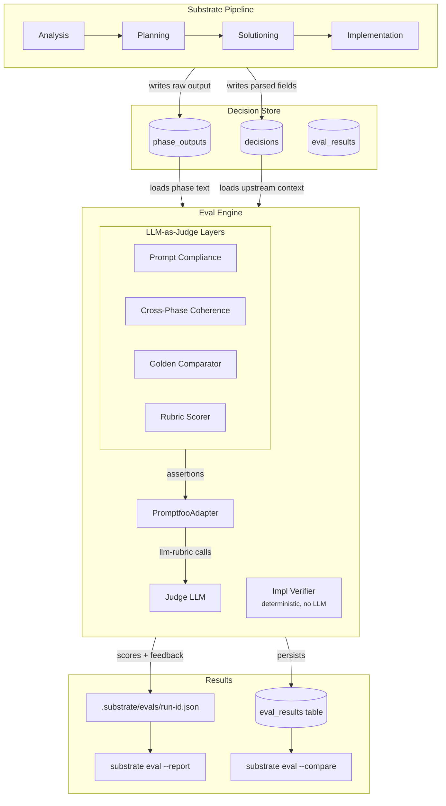
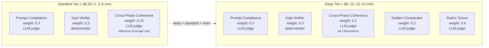
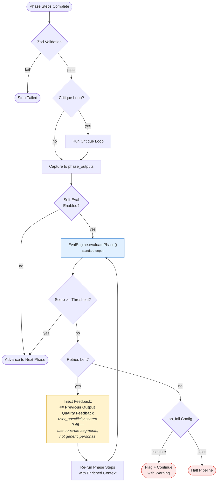
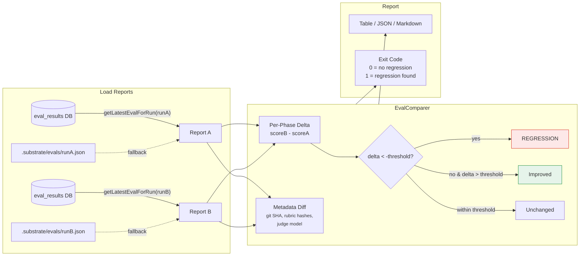
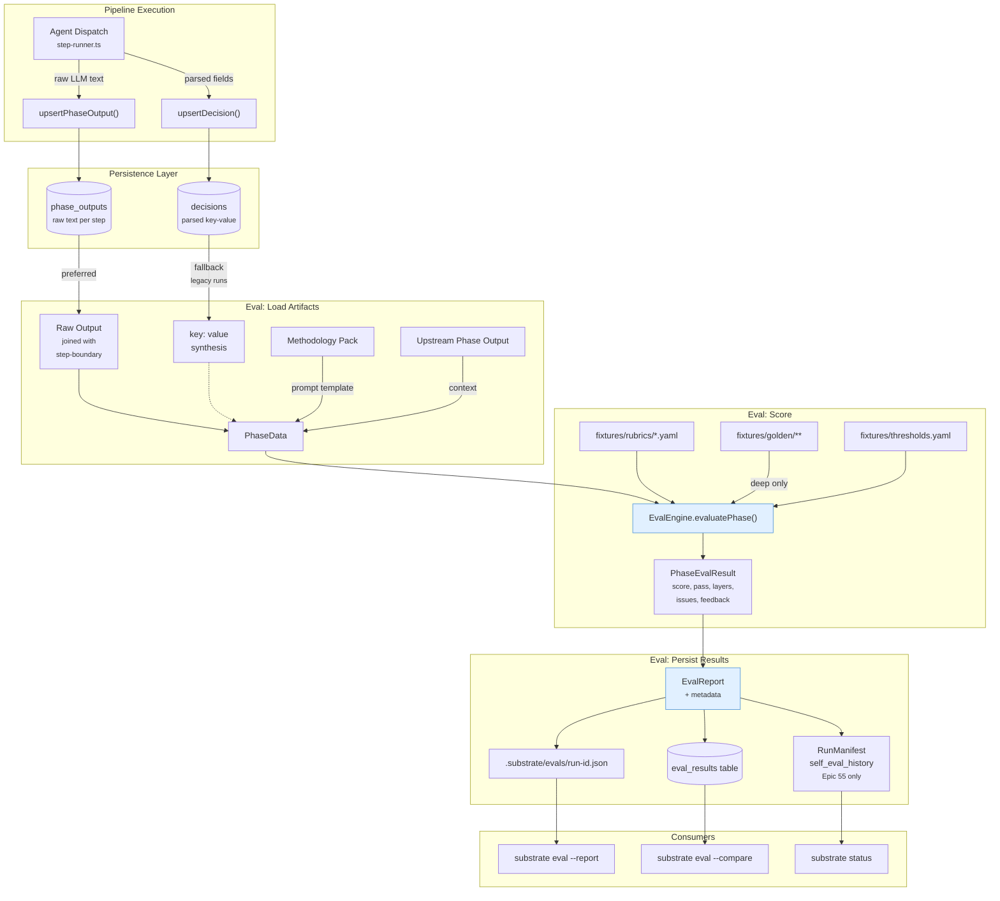

# Eval System Architecture

How substrate evaluates pipeline output quality — from post-run scoring to inline self-eval at phase transitions.

---

## 1. System Overview

The eval system sits alongside the pipeline, not inside it. It reads phase outputs from the decision store, scores them through layered evaluators, and writes results to both JSON files and a queryable database.



The eval layers don't call the LLM directly. Each layer builds **assertions** (rubric questions with scoring criteria), and the `PromptfooAdapter` translates them into LLM judge calls. The adapter is a seam — swap it to change the judge model or replace promptfoo entirely without touching any layer code.

---

## 2. Evaluation Tiers

Two depth tiers, each additive. Standard runs fast and cheap. Deep adds reference comparisons and multi-dimension rubrics.



### Layer Details

| Layer | Tier | Weight | What It Checks |
|-------|------|--------|----------------|
| **Prompt Compliance** | Standard | 0.30 | Did the output follow the prompt's instructions, mission, and quality bar? |
| **Impl Verifier** | Standard | 0.30 | Compile check, file existence, acceptance criteria (impl phase only) |
| **Cross-Phase Coherence (Standard)** | Standard | 0.15 | Does downstream reference upstream? (reference-coverage dimension only) |
| **Golden Comparator** | Deep | 0.20 | How does the output compare to a curated golden example? |
| **Cross-Phase Coherence (Deep)** | Deep | 0.10 | Reference coverage + contradiction detection + information loss |
| **Rubric Scorer** | Deep | 0.40 | Per-dimension scoring against phase-specific YAML rubrics |

Phase score = weighted mean across layers that ran: `sum(weight * score) / sum(weight)`

---

## 3. Self-Eval at Phase Transitions

When enabled, the step runner evaluates each phase's output before advancing. Low scores trigger a retry with diagnostic feedback injected into the prompt.



### Configuration (thresholds.yaml)

```yaml
self_eval:
  analysis:
    enabled: true
    threshold: 0.65
    max_retries: 1
    on_fail: escalate
  planning:
    enabled: true
    threshold: 0.65
    on_fail: escalate
```

Self-eval is **opt-in per phase** — disabled when not configured. Retries count against the run's cost ceiling. Use `--skip-self-eval` to disable globally.

---

## 4. Run-to-Run Comparison

`substrate eval --compare <runA>,<runB>` loads eval reports from DB (with JSON file fallback), computes per-phase deltas, and flags regressions.



### Metadata Awareness

Each eval report includes versioning metadata (V1b-1):

| Field | Purpose |
|-------|---------|
| `schemaVersion` | Detect incompatible report shapes |
| `gitSha` | Know what code produced the scores |
| `rubricHashes` | SHA-256 per rubric file — detect rubric changes |
| `judgeModel` | Which LLM judged the output |

If rubric hashes or judge model differ between runs, the comparison report emits a warning — score differences may reflect config changes, not quality changes.

---

## 5. Data Flow

End-to-end path from pipeline execution through eval to persistent results.



### Key Design Decisions

- **Raw output preferred over decision synthesis** — eval judges the actual LLM text, not a reconstructed version (G2)
- **Promptfoo behind adapter seam** — `PromptfooAdapter` isolates the dependency; replaceable without touching layers
- **Rubrics in YAML, not code** — editable by anyone who understands the pipeline, not just TypeScript developers
- **Per-phase thresholds** — implementation naturally scores lower (0.685) than analysis (0.775); one threshold doesn't fit all
- **Self-eval reuses the same engine** — no separate judge; `evaluatePhase()` works for both post-run and inline eval

### Viewing Results in promptfoo's Web UI

To persist eval results to promptfoo's cache for visual exploration:

```bash
substrate eval --promptfoo-ui          # run eval + persist to promptfoo cache
npx promptfoo view                     # launch the web UI at localhost:15500
```

The `--promptfoo-ui` flag tells the adapter to write results to promptfoo's output database after each evaluation. This is fire-and-forget — if the write fails, the eval still succeeds and results are still saved to `.substrate/evals/` and the `eval_results` table as usual.
