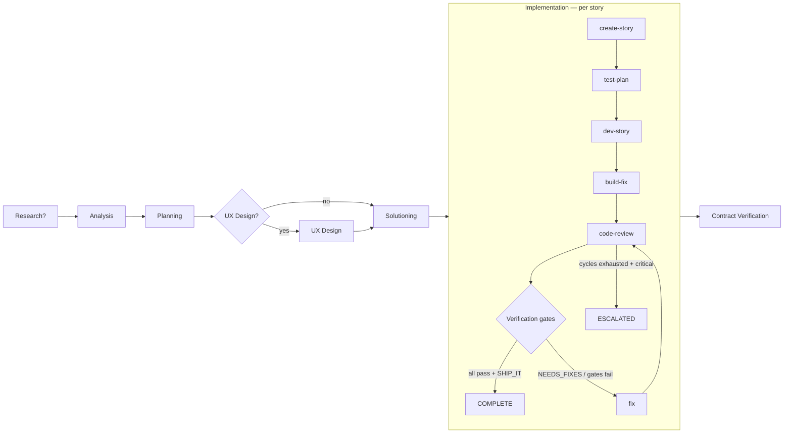
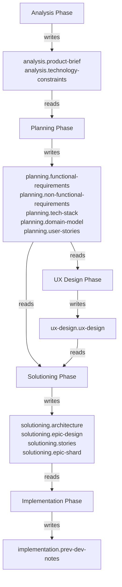

# Pipeline Workflows Reference

> Operational reference for the substrate pipeline architecture as of v0.20.46. Prompt-specific details (token budgets, constraint counts, exact context placeholders) should be cross-referenced against `packs/bmad/manifest.yaml` and `packs/bmad/prompts/` — this doc captures the architecture, not every number.

Substrate orchestrates a methodology pack (default: BMAD) through two coordinated systems: the **Phase Orchestrator** (planning) and the **Implementation Orchestrator** (per-story execution). Each phase dispatches focused AI agents with specific prompt templates, context injection, and quality loops. After dev work completes, a **Verification Pipeline** runs 6 independent gates before SHIP_IT.

## Pipeline Overview

Phase ordering — each phase auto-detects whether to run based on what artifacts already exist:

1. **Research** *(optional)* — runs once per pipeline if enabled in manifest or `--research` flag
2. **Analysis** — runs once
3. **Planning** — runs once
4. **UX Design** *(optional)* — runs once if enabled in manifest
5. **Solutioning** — runs once
6. **Implementation** — per-story create→test-plan→dev→build-fix→code-review→verify→fix loop, parallelized across non-conflicting stories
7. **Contract Verification** — runs once at end of sprint to validate cross-story interface declarations

Engine choice (`--engine`):
- `linear` (default) — sequential phase orchestrator with per-story parallelism
- `graph` — DOT-based graph executor for custom topologies (conditional edges, fan-out/fan-in, subgraph composition)

---

## Decision Store Data Flow

All inter-phase context flows through a SQLite decision store. Each phase writes keyed decisions that downstream phases query via `{{placeholder}}` injection into prompt templates.

---

## Phase 1: Analysis

**Goal:** Product discovery and brief creation from the user's concept.

| Step | Prompt template | Context injected | Quality loop |
|---|---|---|---|
| 1. Vision | `analysis-step-1-vision.md` | `{{concept}}` from user input | Elicitation (1-2 methods) |
| 2. Scope | `analysis-step-2-scope.md` | `{{concept}}` + `{{vision_output}}` from step 1 | Critique via `critique-analysis.md` + `refine-artifact.md` (up to 2 iterations) |

**Outputs written:** `analysis.product-brief` (problem statement, target users, core features, success metrics, constraints), `analysis.technology-constraints`

**Gates:** Exit requires `product-brief-complete`.

---

## Phase 2: Planning

**Goal:** Generate PRD with functional and non-functional requirements.

| Step | Prompt template | Context injected | Quality loop |
|---|---|---|---|
| 1. Classification | `planning-step-1-classification.md` | `{{product_brief}}` | None |
| 2. Functional Reqs | `planning-step-2-frs.md` | `{{product_brief}}` + `{{classification}}` | Elicitation (1-2 methods) |
| 3. Non-Functional Reqs | `planning-step-3-nfrs.md` | `{{product_brief}}` + `{{classification}}` + `{{functional_requirements}}` + `{{technology_constraints}}` + `{{concept}}` | Critique via `critique-planning.md` + `refine-artifact.md` |

**Outputs written:** `planning.functional-requirements`, `planning.non-functional-requirements`, `planning.tech-stack`, `planning.domain-model`, `planning.user-stories`

**Gates:** Entry requires `product-brief-complete`. Exit requires `prd-complete`.

**Special behavior:** Step 3 includes a constraint-violation retry — if the generated tech stack violates technology constraints from analysis, it re-dispatches with corrective instructions.

---

## Phase 3: UX Design (optional)

**Goal:** UX discovery, design system definition, and user journey mapping. Runs when `uxDesign: true` in `manifest.yaml`.

| Step | Prompt template | Context injected | Quality loop |
|---|---|---|---|
| 1. Discovery | `ux-step-1-discovery.md` | `{{product_brief}}` + `{{requirements}}` | Elicitation (hints: User Persona Focus Group, SCAMPER) |
| 2. Design System | `ux-step-2-design-system.md` | `{{product_brief}}` + `{{requirements}}` + `{{ux_discovery}}` | Elicitation (hints: SCAMPER, Design Thinking) |
| 3. Journeys | `ux-step-3-journeys.md` | `{{product_brief}}` + `{{requirements}}` + `{{ux_discovery}}` + `{{design_system}}` | Critique via `critique-stories.md` + `refine-artifact.md` |

**Outputs written:** `ux-design.ux-design`

**Gates:** Entry requires `prd-complete`. Exit requires `ux-design-complete`.

---

## Phase 4: Solutioning

**Goal:** Architecture decisions, epic/story breakdown, and adversarial readiness validation.

### Architecture sub-phase

| Step | Prompt template | Context injected | Quality loop |
|---|---|---|---|
| 1. Context | `architecture-step-1-context.md` | `{{requirements}}` + `{{nfr}}` | None |
| 2. Decisions | `architecture-step-2-decisions.md` | `{{requirements}}` + `{{starter_decisions}}` + `{{ux_decisions}}` | Elicitation |
| 3. Patterns | `architecture-step-3-patterns.md` | `{{architecture_decisions}}` | Critique via `critique-architecture.md` + `refine-artifact.md` |

### Stories sub-phase

| Step | Prompt template | Context injected | Quality loop |
|---|---|---|---|
| 1. Epics | `stories-step-1-epics.md` | `{{requirements}}` + `{{architecture_decisions}}` | Elicitation |
| 2. Stories | `stories-step-2-stories.md` | `{{epic_structure}}` + `{{requirements}}` + `{{architecture_decisions}}` | Critique via `critique-stories.md` + `refine-artifact.md` |

### Readiness gate

| Step | Prompt template | Context injected | Quality loop |
|---|---|---|---|
| Readiness check | `readiness-check.md` | All artifacts from decision store | If `NEEDS_WORK`: retries stories-step-2 then re-checks (max 1 retry). If `NOT_READY`: pipeline fails. |

**Outputs written:** `solutioning.architecture`, `solutioning.epic-design`, `solutioning.stories`, `solutioning.epic-shard` (per-epic shards)

**Gates:** Entry requires `prd-complete`. Exit requires `architecture-complete`, `stories-complete`, `readiness-check`.

---

## Phase 5: Implementation (per story)

**Goal:** Generate story spec, plan tests, implement code, fix build errors, review, verify — for each story key.

### Step 1: create-story

Generates the story artifact at `_bmad-output/implementation-artifacts/<story-key>-*.md` from the source AC + epic shard.

| | |
|---|---|
| **Prompt** | `create-story.md` |
| **Context** | `{{story_key}}`, `{{epic_shard}}`, `{{arch_constraints}}`, `{{prev_dev_notes}}`, `{{story_template}}` |
| **Constraints** | `constraints/create-story.yaml` |
| **Skip condition** | Story file already exists in `_bmad-output/implementation-artifacts/` |

The prompt enforces several disciplines that have evolved with substrate's history of catching defect classes:
- **AC preservation directive** (Story 58-1) — source AC text is read-only input; `MUST` / `MUST NOT` / `SHALL` / `SHALL NOT` clauses, named filenames, named directories, and explicit technology / storage choices appear verbatim.
- **Behavioral signal probe-awareness** (obs_017 v0.20.42) — when an AC describes subprocess / filesystem / git / database / network / registry interaction, prescribes a `## Runtime Probes` section regardless of artifact language.
- **Architectural-level signal probe-awareness** (obs_017 Phase 4 v0.20.44) — when an AC names a service / package / agent / skill / mesh / outbox via interaction verbs (queries / publishes / consumes / etc.), the same probe prescription fires even without code-API mentions.
- **Frontmatter `external_state_dependencies` declaration** (Epic 64 v0.20.43) — story frontmatter declares which interaction categories apply (subprocess / filesystem / git / database / network / registry / os); pairs with the operational `## Runtime Probes` section.

### Step 2: test-plan

Authors the test-strategy section of the story artifact (test files, categories, coverage notes, mock policies).

| | |
|---|---|
| **Prompt** | `test-plan.md` |
| **Context** | `{{story_content}}` |
| **Persists to** | Decision store under `implementation.test-plan` keyed by story |

### Step 3: dev-story

Implements the story per the artifact + test plan.

| | |
|---|---|
| **Prompt** | `dev-story.md` |
| **Timeout** | 30 minutes (overridable via `dispatch_timeouts.dev-story` in `.substrate/config.yaml`) |
| **Context** | `{{story_content}}`, `{{task_scope}}`, `{{prior_files}}`, `{{files_in_scope}}`, `{{project_context}}`, `{{test_patterns}}` |
| **Constraints** | `constraints/dev-story.yaml` |
| **Batching** | Story complexity analysis determines dispatch count. Small/medium = 1 dispatch. Large = N sequential dispatches (one per task batch). |

### Step 4: build-fix

Runs the project's build command against the dev's worktree; if errors, dispatches a fix loop. Catches compilation/lint errors before code review wastes tokens reviewing broken code.

### Step 5: probe-author *(conditional)*

Dispatches when the source AC matches event-driven heuristics (hooks / timers / signals / webhooks). Derives `## Runtime Probes` entries from AC text via a separate dispatch (independent of create-story) — probe-author probes are tagged `_authoredBy: 'probe-author'` for KPI attribution.

| | |
|---|---|
| **Prompt** | `probe-author.md` |
| **Trigger** | `detectsEventDrivenAC(sourceAC)` returns true |
| **CLI** | `substrate probe-author dispatch --story <key>` (manual invocation) |
| **Eval** | Story 65-3 corpus catch-rate; v1 corpus produced GREEN 4/4 = 100% catch under v0.20.39 |

### Step 6: code-review

Adversarial review of the dev's changes against the story spec.

| | |
|---|---|
| **Prompt** | `code-review.md` |
| **Context** | `{{story_content}}`, `{{git_diff}}` (3-tier: scoped diff > full diff > stat-only), `{{previous_findings}}`, `{{arch_constraints}}` |
| **Constraints** | `constraints/code-review.yaml` (adversarial framing, AC validation, git-reality-check, false-claims-are-critical) |
| **Output recovery** | YAML auto-recovery for `<field>: <value-with-colon>` lines that fail strict parsing (Epic 62, v0.20.33) — allowlist: description, message, error, notes, comment, finding, command, details, rationale, reason |
| **Verdict** | Computed from issue severities, not agent self-assessment. Any `blocker` = `NEEDS_MAJOR_REWORK`; any issue = `NEEDS_MINOR_FIXES`; none = `SHIP_IT`. |

### Step 7: Verification pipeline

After code-review reports SHIP_IT, six independent gates run. Failures block SHIP_IT; warnings are advisory.

| Gate | Catches | Key behaviors |
|---|---|---|
| **phantom-review** | Code review returned no real verdict (review output malformed/empty/un-actioned) | Detects "review of nothing" — agents claiming SHIP_IT without examining changes |
| **trivial-output** | Output token count below threshold | Likely no real work done; suspect false-completion |
| **acceptance-criteria-evidence** | Each AC has demonstrable evidence in dev-story signals | Ties files modified / tests added back to AC IDs |
| **build** | Project build succeeds against the dev's worktree | Catches compilation errors that slipped past build-fix |
| **runtime-probes** | Each declared `## Runtime Probes` section probe runs successfully against real or sandboxed state | See Runtime Probe Categories below |
| **source-ac-fidelity** | AC text from source epic appears verbatim in story artifact | See Source-AC-Fidelity Heuristics below |

#### Runtime Probe finding categories

| Category | Source | Trigger |
|---|---|---|
| `runtime-probe-fail` | Epic 56 (v0.20.7) | Probe exits non-zero, or `expect_stdout_*` assertion fails (Story 60-4 v0.20.24) |
| `runtime-probe-error-response` | Epic 63 (v0.20.34) | Probe stdout contains `"isError": true` or `"status": "error"` envelope, even on exit-0 |
| `runtime-probe-missing-production-trigger` | Story 60-11 / Story 60-16 (v0.20.28 / v0.20.41) | Source AC describes event-driven mechanism but no probe invokes a known production trigger (`git merge`, `systemctl start`, `kill -<sig>`, `curl -X POST`, etc.). Hard-gate as of v0.20.41. |
| `runtime-probe-missing-declared-probes` | Story 64-2 (v0.20.43) | Story frontmatter declares non-empty `external_state_dependencies` AND no `## Runtime Probes` section exists. Hard-gate. |
| `runtime-probe-deferred` | Story 56 / sandbox-twin gating | Probe declared `sandbox: twin` but Digital Twin integration not active; advisory skip |

#### Source-AC-Fidelity context-aware heuristics

The check matches AC paths/clauses literally against the story artifact, but four context-aware detectors route specific patterns to info-severity instead of error-severity:

| Heuristic | Source | Routes to | Catches |
|---|---|---|---|
| **negation-context** | obs_2026-04-27_016 (v0.20.40) | `source-ac-negation-reference` | Paths inside `(NOT replaced)`, `MUST NOT`, `documented (NOT`, `does NOT replace`, `deferred to`, `is gitignored` paragraphs |
| **dependency-context** | obs_2026-05-02_020 (v0.20.45) | `source-ac-dependency-reference` | Paths inside `via \`X\``, `via \`X\`'s outbox`, `imports from \`X\``, `consumes \`X\``, `built atop \`X\``, `\`X\`-shipped`, `using \`X\`'s` |
| **operational-path** | Story 60-7 (v0.20.28) | `source-ac-operational-path-reference` | System install destinations (`.git/hooks/`, `/usr/local/bin/`, `~/.config/...`) — paths the implementation interacts with but doesn't ship |
| **alternative-options** | Story 60-5 (v0.20.24) | `source-ac-alternative-option` | Paths inside `**(a)**` / `**(b)**` alternative-option groups when the un-taken option is missing |

Plus story-scoped under-delivery detection (Story 60-3, v0.20.23): when AC names a path that exists in the repo but THIS story's modified files don't reference it, escalates from drift-warn to drift-error.

### Fix loop

When code-review returns issues OR a verification gate fails, the fix workflow runs:

| Verdict / failure | Fix dispatch | Default model |
|---|---|---|
| `NEEDS_MINOR_FIXES` | `fix-story.md` with `taskType: minor-fixes` | Sonnet |
| `NEEDS_MAJOR_REWORK` | `fix-story.md` with `taskType: major-rework` | Opus |
| Verification gate failure | `fix-story.md` with verification finding context | per routing |
| Cycles exhausted + minor | Auto-approve as `LGTM_WITH_NOTES` (Story 61-6, v0.20.32) | — |
| Cycles exhausted + critical | Story marked `ESCALATED` for operator review | — |

Cycle limit is configurable via `--max-review-cycles <n>` (default 2; use 3 for migrations / interface extraction work).

---

## Quality Loops

Two reusable quality mechanisms run across the planning phases:

### Critique loop

Triggered by steps with `critique: true` in `manifest.yaml`. Dispatches a phase-specific critique agent, then a refinement agent if the artifact needs work. Runs up to 2 iterations (non-blocking).

| Phase | Critique prompt | Refinement prompt |
|---|---|---|
| Analysis | `critique-analysis.md` | `refine-artifact.md` |
| Planning | `critique-planning.md` | `refine-artifact.md` |
| Solutioning (architecture) | `critique-architecture.md` | `refine-artifact.md` |
| Solutioning (stories) / UX | `critique-stories.md` | `refine-artifact.md` |

### Elicitation

Triggered by steps with `elicitate: true`. Selects 1-2 methods from a 50-method library (`packs/bmad/data/elicitation-methods.csv`), dispatches each using `elicitation-apply.md`, and stores insights in the decision store. Methods rotate across steps to ensure diversity.

---

## Monolithic Fallbacks

Single-dispatch prompt templates exist for legacy/amendment mode when manifest steps are not defined:

| Prompt | Replaces |
|---|---|
| `analysis.md` | analysis-step-1 + analysis-step-2 |
| `planning.md` | planning-step-1 + planning-step-2 + planning-step-3 |
| `architecture.md` | architecture-step-1 + architecture-step-2 + architecture-step-3 |
| `story-generation.md` | stories-step-1 + stories-step-2 |

---

## Dispatch Count Summary

For a full pipeline run (`substrate run --from analysis`):

| Category | Dispatches | Notes |
|---|---|---|
| Analysis | 2 core + 0-4 quality | Elicitation on step 1, critique on step 2 |
| Planning | 3 core + 0-6 quality | Elicitation on step 2, critique on step 3 |
| UX Design | 3 core + 0-6 quality | Optional phase. Elicitation on steps 1-2, critique on step 3 |
| Solutioning | 5 core + 0-8 quality | Architecture (3) + stories (2), plus readiness check |
| Readiness gate | 1-2 | Re-check on NEEDS_WORK |
| **Per story:** create-story | 0-1 | Skipped if story artifact already exists |
| **Per story:** test-plan | 1 | Authors test strategy section |
| **Per story:** dev-story | 1-N | N = task batches for large stories |
| **Per story:** build-fix | 0-1 | Conditional on build errors |
| **Per story:** probe-author | 0-1 | Conditional on event-driven AC |
| **Per story:** code-review | 1-N | N = review cycles (default 2, configurable via `--max-review-cycles`) |
| **Per story:** fix | 0-N | One per review cycle or verification-gate failure |

All prompt templates live in `packs/bmad/prompts/`. All constraint files live in `packs/bmad/constraints/`. The manifest defining phase order, steps, and context wiring is `packs/bmad/manifest.yaml`.

## Operator Workflow Hooks

A few CLI surfaces let operators inspect or annotate pipeline runs without re-dispatching:

| Command | Purpose |
|---|---|
| `substrate annotate --story <key> --finding-category <cat>` | Tag a verification finding as `--confirmed-defect` / `--false-positive` / `--probe-bug`. Persisted to `verification_result.annotations[]`. Drives probe-author KPI feedback. |
| `substrate probes` | Inspect runtime-probe sections across story artifacts |
| `substrate probe-author dispatch --story <key>` | Manually invoke probe-author phase against a single story artifact |
| `substrate diff <story>` | Row-level diff of state changes for a story (Dolt only) |
| `substrate history` | Dolt commit log of pipeline state mutations |
| `substrate metrics --probe-author-summary` | Cross-run aggregate of probe-author dispatches, catch rate, cost |
| `substrate retry-escalated --dry-run` | List escalated stories flagged retry-targeted by escalation diagnosis |

## State Persistence

Pipeline state is persisted via:

| Backend | Default? | Enables |
|---|---|---|
| **SQLite** | yes | Decision store, run records, telemetry tables (work-graph schema present but lacks branchability) |
| **Dolt** | optional, recommended | All of SQLite plus: `substrate diff`, `substrate history`, OTEL observability persistence, context-engineering repo-map, branchable state for experiments |

Run `substrate init` with Dolt on PATH for automatic Dolt setup. Without Dolt, all functionality works except the explicitly-Dolt-only commands above.
