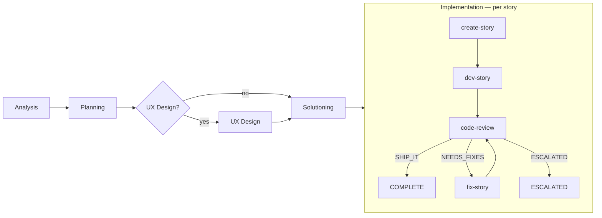
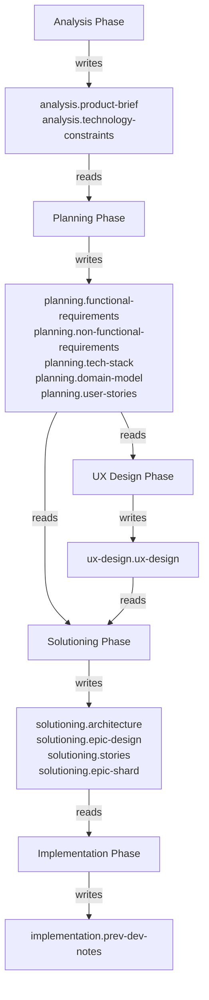

# Pipeline Workflows Reference

Substrate orchestrates BMAD methodology through two systems that chain together: the **Phase Orchestrator** (planning) and the **Implementation Orchestrator** (per-story execution). Each phase dispatches focused AI agents with specific prompt templates, context injection, and quality loops.

## Pipeline Overview

The first four phases run **once per pipeline**. The implementation phase runs its create → dev → review loop **once per story**, with non-conflicting stories processed in parallel.

---

## Decision Store Data Flow

All inter-phase context flows through a SQLite decision store. Each phase writes keyed decisions that downstream phases query via `{{placeholder}}` injection into prompt templates.

---

## Phase 1: Analysis

**Goal:** Product discovery and brief creation from the user's concept.

| Step | Prompt template | Context injected | Quality loop |
|---|---|---|---|
| 1. Vision | `analysis-step-1-vision.md` | `{{concept}}` from user input | Elicitation (1-2 methods) |
| 2. Scope | `analysis-step-2-scope.md` | `{{concept}}` + `{{vision_output}}` from step 1 | Critique via `critique-analysis.md` + `refine-artifact.md` (up to 2 iterations) |

**Outputs written:** `analysis.product-brief` (problem statement, target users, core features, success metrics, constraints), `analysis.technology-constraints`

**Gates:** Exit requires `product-brief-complete`.

---

## Phase 2: Planning

**Goal:** Generate PRD with functional and non-functional requirements.

| Step | Prompt template | Context injected | Quality loop |
|---|---|---|---|
| 1. Classification | `planning-step-1-classification.md` | `{{product_brief}}` | None |
| 2. Functional Reqs | `planning-step-2-frs.md` | `{{product_brief}}` + `{{classification}}` | Elicitation (1-2 methods) |
| 3. Non-Functional Reqs | `planning-step-3-nfrs.md` | `{{product_brief}}` + `{{classification}}` + `{{functional_requirements}}` + `{{technology_constraints}}` + `{{concept}}` | Critique via `critique-planning.md` + `refine-artifact.md` |

**Outputs written:** `planning.functional-requirements`, `planning.non-functional-requirements`, `planning.tech-stack`, `planning.domain-model`, `planning.user-stories`

**Gates:** Entry requires `product-brief-complete`. Exit requires `prd-complete`.

**Special behavior:** Step 3 includes a constraint-violation retry — if the generated tech stack violates technology constraints from analysis, it re-dispatches with corrective instructions.

---

## Phase 3: UX Design (optional)

**Goal:** UX discovery, design system definition, and user journey mapping. Runs when `uxDesign: true` in `manifest.yaml`.

| Step | Prompt template | Context injected | Quality loop |
|---|---|---|---|
| 1. Discovery | `ux-step-1-discovery.md` | `{{product_brief}}` + `{{requirements}}` | Elicitation (hints: User Persona Focus Group, SCAMPER) |
| 2. Design System | `ux-step-2-design-system.md` | `{{product_brief}}` + `{{requirements}}` + `{{ux_discovery}}` | Elicitation (hints: SCAMPER, Design Thinking) |
| 3. Journeys | `ux-step-3-journeys.md` | `{{product_brief}}` + `{{requirements}}` + `{{ux_discovery}}` + `{{design_system}}` | Critique via `critique-stories.md` + `refine-artifact.md` |

**Outputs written:** `ux-design.ux-design`

**Gates:** Entry requires `prd-complete`. Exit requires `ux-design-complete`.

---

## Phase 4: Solutioning

**Goal:** Architecture decisions, epic/story breakdown, and adversarial readiness validation.

### Architecture sub-phase

| Step | Prompt template | Context injected | Quality loop |
|---|---|---|---|
| 1. Context | `architecture-step-1-context.md` | `{{requirements}}` + `{{nfr}}` | None |
| 2. Decisions | `architecture-step-2-decisions.md` | `{{requirements}}` + `{{starter_decisions}}` + `{{ux_decisions}}` | Elicitation |
| 3. Patterns | `architecture-step-3-patterns.md` | `{{architecture_decisions}}` | Critique via `critique-architecture.md` + `refine-artifact.md` |

### Stories sub-phase

| Step | Prompt template | Context injected | Quality loop |
|---|---|---|---|
| 1. Epics | `stories-step-1-epics.md` | `{{requirements}}` + `{{architecture_decisions}}` | Elicitation |
| 2. Stories | `stories-step-2-stories.md` | `{{epic_structure}}` + `{{requirements}}` + `{{architecture_decisions}}` | Critique via `critique-stories.md` + `refine-artifact.md` |

### Readiness gate

| Step | Prompt template | Context injected | Quality loop |
|---|---|---|---|
| Readiness check | `readiness-check.md` | All artifacts from decision store | If `NEEDS_WORK`: retries stories-step-2 then re-checks (max 1 retry). If `NOT_READY`: pipeline fails. |

**Outputs written:** `solutioning.architecture`, `solutioning.epic-design`, `solutioning.stories`, `solutioning.epic-shard` (per-epic shards)

**Gates:** Entry requires `prd-complete`. Exit requires `architecture-complete`, `stories-complete`, `readiness-check`.

---

## Phase 5: Implementation (per story)

**Goal:** Generate story specs, implement code, and review — for each story key.

### Step 1: create-story

| | |
|---|---|
| **Prompt** | `create-story.md` |
| **Token budget** | 3,000 |
| **Context** | `{{story_key}}`, `{{epic_shard}}`, `{{arch_constraints}}`, `{{prev_dev_notes}}`, `{{story_template}}` |
| **Constraints** | `constraints/create-story.yaml` — 18 rules (BDD acceptance criteria, task-AC mapping, dev notes, story-key matching) |
| **Skip condition** | Story file already exists in `_bmad-output/implementation-artifacts/` |

### Step 2: dev-story

| | |
|---|---|
| **Prompt** | `dev-story.md` |
| **Token budget** | 24,000 |
| **Timeout** | 30 minutes |
| **Context** | `{{story_content}}`, `{{task_scope}}`, `{{prior_files}}`, `{{files_in_scope}}`, `{{project_context}}`, `{{test_patterns}}` |
| **Constraints** | `constraints/dev-story.yaml` — 15 rules (sequential tasks, red-green-refactor, no regressions, halt-on-failure) |
| **Batching** | Story complexity analysis determines dispatch count. Small/medium = 1 dispatch. Large = N sequential dispatches (one per task batch). |

### Step 3: code-review

| | |
|---|---|
| **Prompt** | `code-review.md` |
| **Token budget** | 100,000 |
| **Context** | `{{story_content}}`, `{{git_diff}}` (3-tier: scoped diff > full diff > stat-only), `{{previous_findings}}`, `{{arch_constraints}}` |
| **Constraints** | `constraints/code-review.yaml` — 12 rules (adversarial framing, AC validation, git-reality-check, false-claims-are-critical) |
| **Verdict** | Computed from issue severities, not agent self-assessment. Any `blocker` = `NEEDS_MAJOR_REWORK`; any issue = `NEEDS_MINOR_FIXES`; none = `SHIP_IT`. |

### Fix loop

When code-review returns issues, the fix-story workflow runs (max 2 review cycles):

| Review verdict | Fix dispatch | Model |
|---|---|---|
| `NEEDS_MINOR_FIXES` | `fix-story.md` with `taskType: minor-fixes` | Sonnet |
| `NEEDS_MAJOR_REWORK` | `fix-story.md` with `taskType: major-rework` | Opus |
| Cycles exhausted + minor | Auto-approve as COMPLETE | — |
| Cycles exhausted + major | Story marked ESCALATED | — |

---

## Quality Loops

Two reusable quality mechanisms run across the planning phases:

### Critique loop

Triggered by steps with `critique: true` in `manifest.yaml`. Dispatches a phase-specific critique agent, then a refinement agent if the artifact needs work. Runs up to 2 iterations (non-blocking).

| Phase | Critique prompt | Refinement prompt |
|---|---|---|
| Analysis | `critique-analysis.md` | `refine-artifact.md` |
| Planning | `critique-planning.md` | `refine-artifact.md` |
| Solutioning (architecture) | `critique-architecture.md` | `refine-artifact.md` |
| Solutioning (stories) / UX | `critique-stories.md` | `refine-artifact.md` |

### Elicitation

Triggered by steps with `elicitate: true`. Selects 1-2 methods from a 50-method library (`packs/bmad/data/elicitation-methods.csv`), dispatches each using `elicitation-apply.md`, and stores insights in the decision store. Methods rotate across steps to ensure diversity.

---

## Monolithic Fallbacks

Single-dispatch prompt templates exist for legacy/amendment mode when manifest steps are not defined:

| Prompt | Replaces |
|---|---|
| `analysis.md` | analysis-step-1 + analysis-step-2 |
| `planning.md` | planning-step-1 + planning-step-2 + planning-step-3 |
| `architecture.md` | architecture-step-1 + architecture-step-2 + architecture-step-3 |
| `story-generation.md` | stories-step-1 + stories-step-2 |

---

## Dispatch Count Summary

For a full pipeline run (`substrate run --from analysis`):

| Category | Dispatches | Notes |
|---|---|---|
| Analysis | 2 core + 0-4 quality | Elicitation on step 1, critique on step 2 |
| Planning | 3 core + 0-6 quality | Elicitation on step 2, critique on step 3 |
| UX Design | 3 core + 0-6 quality | Optional phase. Elicitation on steps 1-2, critique on step 3 |
| Solutioning | 5 core + 0-8 quality | Architecture (3) + stories (2), plus readiness check |
| Readiness gate | 1-2 | Re-check on NEEDS_WORK |
| **Per story:** create-story | 0-1 | Skipped if file exists |
| **Per story:** dev-story | 1-N | N = task batches for large stories |
| **Per story:** code-review | 1-N | N = review cycles (max 2) |
| **Per story:** fix-story | 0-2 | One per review cycle |

All prompt templates live in `packs/bmad/prompts/`. All constraint files live in `packs/bmad/constraints/`. The manifest defining phase order, steps, and context wiring is `packs/bmad/manifest.yaml`.
